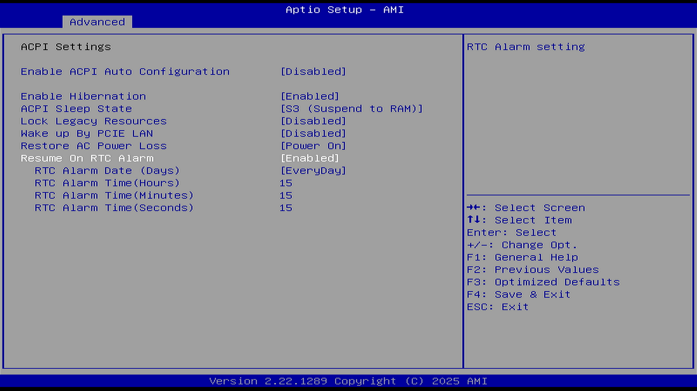

# ACPI Settings（ACPI 设置）

ACPI：Advanced Configuration and Power Interface，高级配置和电源接口。

## Enable ACPI Auto Configuration（启用 ACPI 自动配置）

选项：

Disable（禁用）

Enable（启用）

说明：

是否允许系统自动配置 ACPI，此选项决定了此页面全部选项。

### Enable Hibernation（启用休眠）

选项：

Disable（禁用）

Enable（启用）

是否允许系统进入休眠（操作系统 S4 睡眠状态）的功能。此选项还依赖操作系统的实现。

### ACPI Sleep State（ACPI 睡眠状态）

选项：

Suspend Disabled（关闭挂起）

S3（Suspend to RAM，S3 挂起到内存）

说明：

选择按下挂起（SUSPEND）按钮（睡眠键）时系统将进入的最高 ACPI 睡眠状态。

### Lock Legacy resources（锁定传统资源）

选项：

Disable（禁用）

Enable（启用）

说明：

防止操作系统更改串行、并行或磁盘控制器的资源。现代计算机可禁用此选项。

### Wake up By PCIE LAN（PCIE LAN 唤醒）

选项：

Disable（禁用）

Enable（启用）

说明：

Wake on LAN（WOL），网络唤醒功能。

### Restore AC Power Loss（交流电断电恢复）

选项：

Power Off：若系统电源中断后再次连接电源，计算机保持关机状态，不会自动开机。

Power On：若系统电源中断后再次连接电源，计算机会自动开机，不需要按压机箱上的开机键。

Last State：若系统电源中断后再次连接电源，计算机会恢复到关机前的状态。

说明：

用于控制当电源恢复时系统的启动行为的选项。若启用此功能，当电源中断后再次连接时，主板会自动恢复系统的运作，并自动重新启动。这对于在意外的停电或电源中断后迅速恢复系统运行很有用。

如果电源中断前系统处于开机、睡眠或休眠状态之一，那么电源中断后再次连接电源后，系统恢复至对应状态。

如果电源中断前，系统是关机状态，那么电源中断后再次连接电源后，系统状态还是关机状态。

选项设定的情境要求主板完全断电（建议等待 30 秒），在主板完全断电后再重新连接电源，以确保该功能生效。也就是说，断电后立即上电也许不会生效。

参见：华硕公司. [主板] BIOS 选项-Restore AC Power Loss 功能介绍[EB/OL]. (2023-07-27)[2024-01-15]. <https://www.asus.com.cn/support/faq/1049855/>.

### Resume On RTC Alarm（RTC 定时唤醒）

选项：

Disable（禁用）

Enable（启用）

说明：

RTC 是 BIOS 的实时时钟，用于存储时间数据。定时开机。

- RTC Alarm Date (Days)，选项：Everyday（每天），1-31 天。
- RTC Alarm Time (Hours) 小时
- RTC Alarm Time (Minutes) 分
- RTC Alarm Time (seconds) 秒

如设置 Everyday、13、14、15，那么设备则会在每日 13 时 14 分 15 秒开机。

部分平台在 RTC Alarm Power On 项额外提供 `By OS` 选项。选择 `By OS` 后，RTC 定时唤醒的具体时刻改由操作系统内的高级电源管理界面控制，BIOS 不直接接管 RTC Alarm 的日期与时间字段。

### Platform Power Management（平台电源管理）

选项：

Disable（禁用）

Enable（启用）

说明：

启用或禁用 ASPM（Active State Power Management，活动状态电源管理）功能。ASPM 通过控制 PCIe 链路的活动状态电源管理，在设备空闲时降低链路功耗。

### PEG ASPM（PEG 活动状态电源管理）

说明：

允许配置连接到 CPU PEG（PCI Express Graphics）总线的设备的 ASPM 模式。此项仅在 Platform Power Management 设置为 Enabled 时可配置。

### PCH ASPM（PCH 活动状态电源管理）

说明：

允许配置连接到芯片组 PCIe 总线的设备的 ASPM 模式。此项仅在 Platform Power Management 设置为 Enabled 时可配置。

### DMI ASPM（DMI 活动状态电源管理）

说明：

允许配置 DMI（Direct Media Interface，直接媒体接口）链路 CPU 侧和芯片组侧的 ASPM 模式。此项仅在 Platform Power Management 设置为 Enabled 时可配置。DMI 是 CPU 与 PCH 之间的专用链路。

### S3 Save Mode（S3 节能模式）

说明：

决定是否让系统在 S3 状态下进入节能模式。该选项仅特定型号支持。

### ErP（ErP 指令）

说明：

决定是否让系统在 S5（关机）状态下消耗最少功率。ErP 是欧盟“能源相关产品”指令，启用后系统待机功耗将符合 ErP 要求。注意：启用此项后，Resume by Alarm（定时唤醒）功能将不可用。

### RC6（Render Standby，渲染待机）

选项：

Disable（禁用）

Enable（启用）

说明：

决定是否让集成图形进入待机模式以降低功耗。RC6 即 Intel 集成图形的渲染待机状态。

## USB Keyboard/Remote Power On（USB 键盘/遥控器开机）

选项：

Disable（禁用）

Enable（启用）

说明：

允许通过 USB 键盘或 USB 遥控器触发系统开机。启用后，BIOS 向 USB 控制器配置对应的唤醒事件，使系统在 S5（关机）或 S3（挂起到内存）状态下响应 USB 键盘按键或遥控器信号。

## USB Mouse Power On（USB 鼠标开机）

选项：

Disable（禁用）

Enable（启用）

说明：

允许通过 USB 鼠标点击或移动触发系统开机。启用后，BIOS 向 USB 控制器配置对应的唤醒事件，使系统在 S5（关机）或 S3（挂起到内存）状态下响应 USB 鼠标事件。
