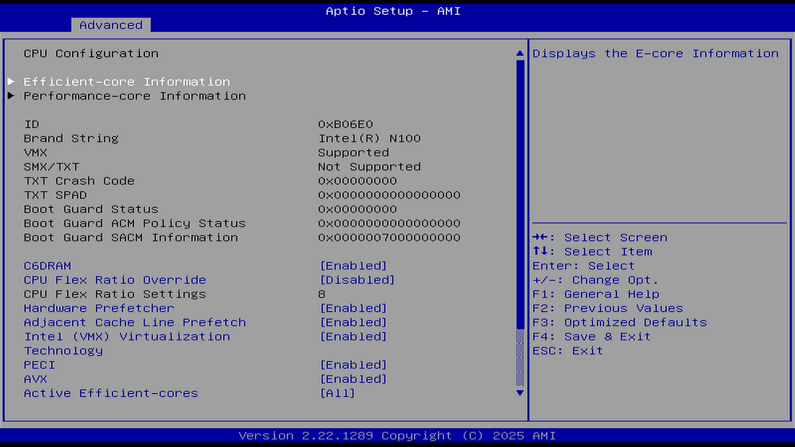
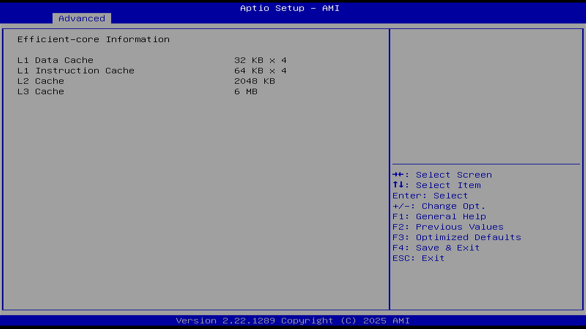
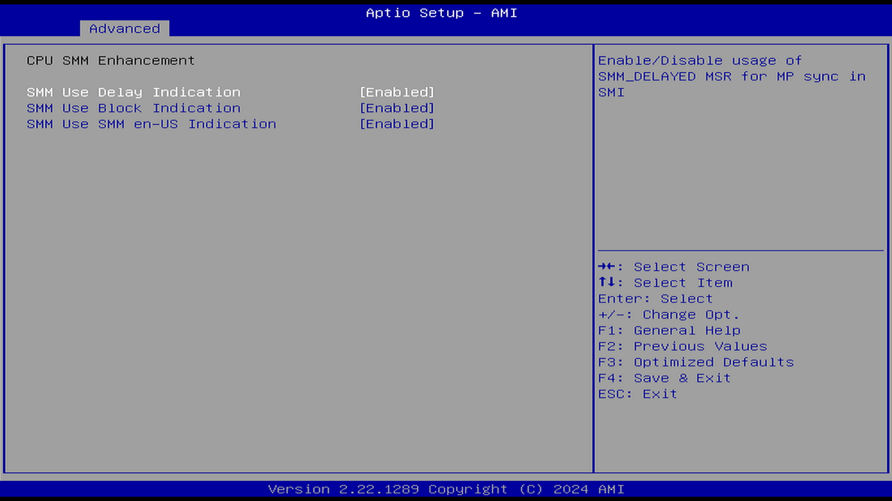

# CPU Configuration（CPU 配置）

## Efficient-core Information（能效核心信息）

| 英文选项 | 中文翻译 | 数值与单位（中英一致） |
| -------- | -------- | ---------------------- |
| Efficient-core Information | 能效核心信息 | — |
| L1 Data Cache | L1 数据缓存 | 32 KB × 4 |
| L1 Instruction Cache | L1 指令缓存 | 64 KB × 4 |
| L2 Cache | L2 缓存 | 2048 KB |
| L3 Cache | L3 缓存 | 6 MB |

能效核心（E 核心/小核）：

- 物理尺寸更小，多个小核封装只占用一个大核的物理空间。
- 旨在最大限度地提高 CPU 效率（以每瓦性能为衡量标准）。
- 小核与大核协同工作，用于加速计算资源消耗较大的任务（例如视频渲染）。
- 经过优化，可高效运行后台任务。简单的任务可以分载到小核上，例如处理 Discord 或杀毒软件，从而使大核能够自由发挥游戏性能。
- 每个能效核心只能运行单个软件线程。

参见英特尔. 什么是性能混合架构？[EB/OL]. (2024-12-16)[2026-03-26]. <https://www.intel.cn/content/www/cn/zh/support/articles/000091896/processors.html>. 详细介绍 Intel 性能混合架构的设计理念与优势。

## Performance-core Information（性能核心信息）

| 英文原文 | 中文翻译 |
| -------- | -------- |
| ID | ID（识别码） |
| Brand String | 品牌字符串 |
| VMX | 虚拟化技术（VMX） |
| SMX/TXT | 安全模式扩展 / 信任执行技术 |
| TXT Crash Code | TXT 崩溃代码 |
| TXT SPAD | TXT SPAD（特殊寄存器） |
| Boot Guard Status | 启动保护状态 |
| Boot Guard ACM Policy Status | 启动保护 ACM 策略状态 |
| Boot Guard SACM Information | 启动保护 SACM 信息 |

性能核心（P 核心/大核）：

- 物理尺寸上更大的高性能核心，专为在保持效率的同时实现原始速度而设计。
- 针对高睿频频率和高 IPC（每周期指令数）进行了调整。
- 非常适合处理许多游戏引擎需要的繁重单线程工作。
- 支持超线程，这意味着大核可同时运行两个软件线程（英特尔® Core™ Ultra 处理器（系列 2）除外）

参见英特尔. 什么是性能混合架构？[EB/OL]. (2024-12-16)[2026-03-26]. <https://www.intel.cn/content/www/cn/zh/support/articles/000091896/processors.html>. 详细介绍 Intel 性能混合架构的设计理念与优势。

## C6DRAM（C6 节能状态下的 DRAM 控制）

选项：

Disable（禁用）

Enable（启用）

说明：

本项是 C-state（C 状态）选项。

选择“启用”以在 CPU 进入 C6 状态时将处理器核心架构状态保存到片上 SRAM，并将 DRAM 置于自刷新（Self-Refresh）模式以保持内容。

C6 是一种深度休眠状态，此时 CPU 核心内部电压可降至极低甚至关闭，功耗可降至活跃状态（C0）的 5%～10%（即降低约 90%～95% 的功耗）。需要注意的是，C6 并非最深的休眠状态——在较早期的 45 nm 移动版 Core 2 Duo 处理器上 C6 曾是最深状态，但现代 Intel 处理器已支持 C7、C8、C9、C10 等更深的封装级休眠状态，在 C6 基础上进一步关闭缓存、移除电压甚至完全断电。据英特尔官方资料，C6 相较于 C4（Enhanced Deeper Sleep）模式可额外降低最高 75% 的功耗。参见：英特尔公司. Intel® Processor C-State Demo[EB/OL]. [2026-04-17]. <https://www.intel.com/content/www/us/en/support/articles/000056462/processors.html>.；AgileWatts 论文. An Energy-Efficient CPU Core Idle-State Architecture for Latency-Sensitive Server Applications[EB/OL]. arXiv:2203.02550, 2022. <https://arxiv.org/abs/2203.02550>.；英特尔公司. 12th Generation Intel® Core™ Processors Datasheet[EB/OL]. [2026-04-17]. <https://edc.intel.com/content/www/us/en/design/ipla/software-development-platforms/client/platforms/alder-lake-desktop/12th-generation-intel-core-processors-datasheet-volume-1-of-2/007/processor-ia-core-c-state-rules/>。

## SW Guard Extension（英特尔 SGX 技术）

选项：

Disable（禁用）

Enable（启用）

说明：

SW Guard Extension（SGX），即英特尔软件防护扩展，是一种可信计算技术（提出于 2013 年，逐步应用于 2015 年前后）。

SGX 能够在计算平台上提供一个可信的隔离空间，保障用户关键代码和数据的机密性和完整性。

要启用英特尔 SGX 选项，处理器必须先支持 SGX，内存条必须兼容（每个 CPU 插槽最少 8 个完全相同的内存条，在永久性内存配置上不受支持），必须在优化程序模式下设置内存操作模式，必须启用内存加密，并且必须禁用节点交叉存取。

参考文献：

- 英特尔公司. 英特尔® Software Guard Extensions（英特尔® SGX）[EB/OL]. (2024-01-15)[2024-01-15]. <https://www.intel.cn/content/www/cn/zh/products/docs/accelerator-engines/software-guard-extensions.html>. 介绍 SGX 可信执行环境的技术架构与应用场景。
- 王鹃, 樊成阳, 程越强, 等. SGX 技术的分析和研究[J]. 软件学报, 2018, 29(9): 2778-2798. <http://www.jos.org.cn/1000-9825/5594.htm>. 系统分析 SGX 的安全机制、攻击面与研究进展。

## CPU Flex Ratio Override（CPU 可变倍频覆盖）

选项：

Disable（禁用）

Enable（启用）

说明：

启用此选项才会出现：CPU Flex Ratio Settings（CPU 可变倍频设置）。

## CPU Flex Ratio Settings（CPU 可变倍频设置）

说明：

CPU Flex Ratio Settings（CPU 可变倍频设置）选项：

CPU 是按特定主频进行高低调节的（即有特定档位的变速，不是无级变速）。对于 Intel 来说，不带“K”的处理器，其倍频是锁定的，修改后亦无效。

CPU Flex Ratio Override 即 CPU 倍频设置，仅当此选项为 Enable 时，方可设置 CPU Flex Ratio Settings，即“手动设置 CPU 倍频”。

该数值必须介于低频模式（LFM，即最低主频）和硬件设定的最大非睿频比率（HFM，即默频）之间（最低主频 ≤ 设置的值 ≤ 默频）。

CPU 主频 = 基准时钟（Base Clock，即外频，BIOS 中通常为 100 MHz）× 倍频（Multiplier）。

例如，CPU 倍频为 46x，基本时钟速度为 100 MHz，则时钟速度为 4.6 GHz。

因此直接将倍频数值乘以 100 MHz 即可得到主频。

最高主频一般可通过官方 CPU 数据表查询，Intel 参见：英特尔公司. 产品规范[EB/OL]. [2026-03-26]. <https://www.intel.cn/content/www/cn/zh/ark.html#@Processors>.

一般 Intel 和 AMD 的最低主频均为 800 MHz（部分较新的 Intel 能效核心最低频率可达 600 MHz），可通过系统命令查询。参见：英特尔公司. 13th Generation Intel® Core™ Processors Datasheet[EB/OL]. [2026-04-17]. <https://edc.intel.com/content/www/us/en/design/products/platforms/details/raptor-lake-s/13th-generation-core-processors-datasheet-volume-1-of-2/>.；Geekbench. Intel N100 Benchmark[EB/OL]. [2026-04-17]. <https://browser.geekbench.com/v6/cpu/13682299>.；英特尔社区. i5-1335U P-core and E-core integer operations throughput[EB/OL]. [2026-04-17]. <https://community.intel.com/t5/Processors/i5-1335U-P-core-and-E-core-integer-operations-throughput/td-p/1622502>。

## Hardware Prefetcher（硬件预取）

选项：

Disable（禁用）

Enable（启用）

说明：

需要处理器支持才有此选项。

硬件预取技术，用于开启或关闭 MLC 流式预取器。在 CPU 处理指令或数据之前，它将这些指令或数据从内存预取到 L2 缓存中，借此减少内存读取的时间，帮助消除潜在的瓶颈。

## Adjacent Cache Line Prefetch（相邻的高速缓存行预先访存）

选项：

Disable（禁用）

Enable（启用）

说明：

需要处理器支持才有此选项。

可针对需要顺序内存访问高利用率的应用程序优化系统，能加快读取速度。如果该功能设置为 Disabled（禁用），CPU 将预取一个缓存行（64 字节）。如果设置为 Enabled（启用），CPU 将预取两个缓存行（共 128 字节）。

由于此选项在某些情况下会对性能造成负面影响（涉及 False Sharing，假共享），可对需要随机内存访问高利用率的应用程序（如数据库、科学计算等）禁用此选项。

## Intel (VMX) Virtualization Technology（Intel 虚拟化技术）

选项：

Disable（禁用）

Enable（启用）

说明：

需要处理器支持才有此选项。

该技术能使单个系统显示为软件中的多个独立系统。这能让多个独立的操作系统在单个系统上同时运行。

启用后，VMM 系统（虚拟机监控器）可以使用处理器对虚拟化的支持（虚拟机扩展 VMX），并利用 Vanderpool 技术（VT）硬件所提供的附加功能。

## PECI（英特尔平台环境控制接口）

选项：

Disable（禁用）

Enable（启用）

说明：

PECI，Platform Environment Control Interface，英特尔平台环境控制接口。

PECI 是英特尔专有接口，提供英特尔处理器和外部组件如超级 IO（SIO）和嵌入式控制器（EC）之间的通信通道，以提供处理器温度、睿频、可配置 TDP 和内存节流控制机制及许多其他服务。PECI 用于平台热管理以及处理器功能和性能的实时控制和配置。

## AVX（Intel 高级矢量扩展）

选项：

Disable（禁用）

Enable（启用）

说明：

Intel 高级矢量扩展（Advanced Vector Extensions，AVX）是一组指令集。可以加速工作负载和用例的性能，如科学模拟、金融分析、人工智能（AI）/深度学习、3D 建模和分析、图像和音频/视频处理、密码学和数据压缩等。

## Active Performance-cores（激活的性能核心）

选项：

ALL（全部）

说明：

每个处理器封装中要启用的 P-core（性能核心）数量。注意：会同时考虑 P 核心和 E 核心的数量。当两者都设置为 0 时，BIOS 会启用所有核心。

## Active Efficient-cores（激活的能效核心）

选项：

ALL（全部）

3

2

1

说明：

每个处理器封装中要启用的 E-core（能效核心/小核）数量。如果用户仅有大核，可完全关闭该选项（即不使用小核）。

但部分处理器仅包含能效核心。

注意：该设置会同时考虑 P 核心和 E 核心的数量。当两者都设置为 0 时，BIOS 会启用所有核心。

## Hyper-Threading（英特尔® 超线程技术/英特尔® HT 技术）

选项：

Disable（禁用）

Enable（启用）

说明：

英特尔® 超线程技术是一项硬件创新，能在每个内核上都运行多个线程。可使一个物理内核表现得如同两个“逻辑内核”一样。

参见英特尔公司. 什么是超线程？[EB/OL]. [2026-03-26]. <https://www.intel.cn/content/www/cn/zh/gaming/resources/hyper-threading.html>.

## BIST（内置自检程序）

选项：

Disable（禁用）

Enable（启用）

说明：

Built-in Self Test（BIST），内置自检程序。

## AP threads Idle Manner（AP 线程空闲模式）

选项：

HALT Loop

MWAIT Loop

RUN Loop

说明：

选择相应选项以配置 AP 线程的空闲模式。

HALT Loop：让 CPU 进入 C1/C1E 休眠状态，但是不再继续进入更深的休眠状态

MWAIT Loop：MWAIT 指令让 CPU 停止执行，直到被监控的内存区域开始写入

RUN Loop：确保 CPU 始终处于运行状态，不进入空闲循环

该项用于配置 AP 线程的待机行为，即等待运行信号。

C 状态相关设置。应用处理器（Application Processor，AP）。在计算机系统中，除引导处理器外的所有其他处理器都称为应用处理器。参见：UEFI 论坛. UEFI Specs[EB/OL]. [2026-03-26]. <https://uefi.org/specs/PI/1.8/V2_DXE_Boot_Services_Protocols.html>.

## AES（AES 加密）

选项：

Disable（禁用）

Enable（启用）

说明：

AES（Advanced Encryption Standard，高级加密标准），AES 被广泛接受为政府和行业应用的标准，并广泛部署在各种协议中。

此处是指 CPU 指令集。启用后（Enabled），将通过硬件支持安全加密方法 AES（高级加密标准），从而加快加密与解密的速度。

## MachineCheck（机器检查）

选项：

Disable（禁用）

Enable（启用）

说明：

这是调试选项。

MCE，Machine Check Exception，机器检查

MCE 是用来报告内部错误的一种硬件方式。提供能够检测和报告硬件（机器）的错误机制，如系统总线错误、ECC 错误、奇偶校验错误、缓存错误、TLB 错误等。当发现错误时，拒绝机器重启以收集相关信息进行排错。参见：chen. x86 服务器 MCE（Machine Check Exception）问题[EB/OL]. [2026-03-26]. <https://web.archive.org/web/20241229090558/https://ilinuxkernel.com/?p=303>.

## MonitorMwait（Monitor/Mwait 指令）

选项：

Disable（禁用）

Enable（启用）

说明：

启用或禁用 Monitor/Mwait 指令。

Monitor 指令用于监控某个内存区域的写入操作，而 MWait 指令则让 CPU 停止运行，直到该监控区域开始被写入。

该选项配合上述 AP threads Idle Manner（AP 线程空闲模式）一起使用。增强型 vMotion 兼容性（Enhanced vMotion Compatibility，EVC）也需要开启该选项。

## Intel® Trusted Execution Technology（英特尔可信执行技术/TXT）

选项：

Disable（禁用）

Enable（启用）

说明：

要启用此英特尔 TXT 选项，必须启用虚拟化技术以及进行预启动测量的 TPM 安全保护。

Intel® Trusted Execution Technology，英特尔® TXT。一种非常老（2006）的可信计算技术，参见 SW Guard Extension（英特尔 SGX 技术）。

参见英特尔公司. 英特尔® Trusted Execution Technology（英特尔® TXT）概述[EB/OL]. [2026-03-26]. <https://www.intel.cn/content/www/cn/zh/support/articles/000025873/processors.html>.

## Alias Check Request（别名检查请求）

选项：

Disable（禁用）

Enable（启用）

说明：

此项可以启用英特尔® TXT Alias 测试。如果系统没有启用 TXT，这些更改将不会起作用。

## DPR Memory Size (MB)（DMA 内存受保护范围）

值：

0-255，步进 1

说明：

DPR（DMA Protected Range）：内核直接内存访问受保护范围。

DMA 受保护范围（DPR）是一段连续的物理内存区域，其最后一个字节位于 TXT 段（TSEG）起始地址之前一个字节的位置，并且该区域受到所有 DMA 访问的保护。

参见：英特尔社区. Where to read about DMA Protected Range (DPR)?[EB/OL]. [2026-03-26]. <https://community.intel.com/t5/Software-Archive/Where-to-read-about-DMA-Protected-Range-DPR/td-p/922654>.

## Reset AUX Content（重置 AUX 内容）

选项：

Yes（是）

No（否）

说明：

使用此功能来重置 TPM 辅助内容。重置 AUX 内容后，英特尔® TXT 可能无法正常工作。

## CPU SMM Enhancement（CPU SMM 增强）

SMM 代码访问是一种特殊的操作模式，由 BIOS 用于处理电源和硬件管理功能。

SMM，即 System Management Mode 系统管理模式，SMM 模式具有比内核模式更高的特权级别，是 CPU 的最高运行权限，运行在内核模式下的内核驱动程序只能通过 SMI 中断来访问运行在 SMM 模式下的 UEFI 固件运行时服务。参见：安全内参. 以 Protocol 为中心的 UEFI 固件 SMM 提权漏洞静态检测[EB/OL]. [2026-03-26]. <https://www.secrss.com/articles/53078>.

### SMM Use Delay Indication（SMM 使用延迟指示）

选项：

Disable（禁用）

Enable（启用）

说明：

启用 SMM 使用延迟指示，以检查线程在进入 SMM 时是否会被延迟。

进入系统管理模式（SMM）会发生在指令边界处。当一个逻辑处理器正在执行包含大量内部操作流程的指令时，该处理器对 SMI（系统管理中断）的响应将会被延迟。参见：英特尔公司. 34.17.2 SMI Delivery Delay Reporting[EB/OL]. [2026-03-26]. <https://xem.github.io/minix86/manual/intel-x86-and-64-manual-vol3/o_fe12b1e2a880e0ce-1280.html>.

### SMM Use Block Indication（SMM 使用阻塞指示）

选项：

Disable（禁用）

Enable（启用）

说明：

检查某个线程是否被阻止进入 SMM。

### SMM Use SMM en-US Indication（使用美式英语显示 SMM 指示）

选项：

Disable（禁用）

Enable（启用）

说明：

用美式英语表达或说明 SMM 指示的用法。

## AC Split Lock（AC 对 Split-Lock 的处理）

选项：

Disable（禁用）

Enable（启用）

说明：

Split Lock 指跨越两个 cache line 的原子操作（如 lock add，xchg 等），在传统机制下会锁住整个总线，导致性能显著下降。

启用后，当检测到 split-lock 操作时，会触发对齐异常，而不是锁总线。这对实时性能或云平台尤为重要。

## Total Memory Encryption（英特尔总内存加密技术）

选项：

Disable（禁用）

Enable（启用）

说明：

配置英特尔总内存加密（TME），以防止物理攻击对 DRAM 数据的侵害。

启用或禁用英特尔总内存加密（TME）和多租户（英特尔®TME-MT）。当选项设置为禁用时，BIOS 将同时禁用 TME 和 TME-MT 技术。

### Enhanced Multi-Core Performance（增强多核性能）

选项：

Disable（禁用）

Enable（启用）

说明：

决定是否将最高睿频倍频应用到所有 CPU 核心。启用后，所有核心均可达到最高睿频倍频，而非仅限于少量核心。该选项属于性能混合架构平台（Arrow Lake 及更新平台）特有的配置项。

### Performance CPU Clock Ratio（性能核心时钟倍频）

说明：

允许用户修改已安装性能核心（P 核心）的时钟倍频。可调范围取决于所安装的 CPU。CPU 主频 = 基准时钟（Base Clock，通常为 100 MHz）× 倍频。

### Efficiency CPU Clock Ratio（能效核心时钟倍频）

说明：

允许用户修改已安装能效核心（E 核心）的时钟倍频。可调范围取决于所安装的 CPU。该选项允许 P 核心与 E 核心设置不同的倍频，是性能混合架构平台的特性。

### Max Ring Ratio（最大环形总线倍频）

说明：

允许设置 CPU Uncore（非核心）的最大倍频。可调范围取决于所使用的 CPU。Uncore 即处理器封装内除核心之外的部分，包括环形总线、内存控制器、PCIe 控制器等，其频率独立于核心频率。

### Min Ring Ratio（最小环形总线倍频）

说明：

允许设置 CPU Uncore（非核心）的最小倍频。可调范围取决于所使用的 CPU。

### IGP Ratio（核显倍频）

说明：

允许设置图形倍频，即集成图形处理器（IGP）的工作倍频。

### NGU Ratio（NGU 倍频）

说明：

允许设置 NGU 时钟工作倍频。NGU 即 NPU（神经网络处理单元）相关单元，该选项为 Panther Lake 平台（Core Ultra 300 系列，采用 Cougar Cove 性能核 + Darkmont 能效核 + Intel 18A 制程）引入的新配置项，用于控制 NPU 的工作频率。参见：英特尔公司. 英特尔 Panther Lake 处理器入门指南（2026 年版）[EB/OL]. [2026-07-22]. <https://www.intel.com/content/www/us/en/products/docs/processors/core-ultra/core-ultra-300-series-mobile-processors.html>。

### CPU D2D Ratio（CPU Die-to-Die 倍频）

说明：

允许设置 CPU D2D（Die-to-Die，裸片间）倍频。该选项为采用多裸片封装（Multi-Die Package）架构的平台引入，用于控制处理器内部不同裸片之间互联链路的工作频率。Arrow Lake-S/Refresh（LGA 1851）和 Panther Lake 均采用此类先进封装架构。

### Core Minimum Ratio（核心最小倍频）

说明：

允许设置核心最小倍频，即 CPU 核心允许降至的最低工作倍频。

### BCLK Output Source（基准时钟输出源）

说明：

允许选择 BCLK（Base Clock，基准时钟）输出源。基准时钟是 CPU 主频、内存频率、PCIe 频率等的基础参考时钟，选择不同的输出源可改变整条时钟链路的参考频率。

### CPU Cores Enabling Mode（CPU 核心启用模式）

说明：

允许选择 CPU 核心的启用方式。

#### No. of CPU P-Cores Enabled（启用的性能核心数量）

说明：

允许选择要启用的 CPU P 核心数量（核心数量可能因 CPU 而异）。此项仅在 CPU Cores Enabling Mode 设置为 Random Mode 时可配置。Auto 选项让 BIOS 自动配置此项。

#### No. of CPU E-Cores Enabled（启用的能效核心数量）

说明：

允许选择要启用的 CPU E 核心数量（核心数量可能因 CPU 而异）。此项仅在 CPU Cores Enabling Mode 设置为 Random Mode 时可配置。Auto 选项让 BIOS 自动配置此项。

#### Active P-Core/E-Core（激活的 P 核心/E 核心）

说明：

允许选择要启用的具体 CPU 核心。此项仅在 CPU Cores Enabling Mode 设置为 Selectable Mode 时可配置。Auto 选项让 BIOS 自动配置此项。

### CPU Over Temperature Protection（CPU 过温保护）

说明：

允许微调 TJ Max（最高结温）偏移值。TJ Max 是处理器允许的最高工作温度，超过该温度将触发热保护机制。

### Tcc Activation Offset（TCC 激活偏移）

说明：

允许设置 TCC（Thermal Control Circuit，热控制电路）激活偏移值。TCC 激活温度是处理器开始自我调节温度的保护阈值。

### Tcc Offset Time Window（TCC 偏移时间窗口）

说明：

允许设置 TCC 偏移时间窗口，用于 RALT（Running Average Temperature Limit，运行平均温度限制）功能。

## CEP（Current Excursion Protection，电流漂移保护）

说明：

允许配置电流过载保护功能。可手动设置 IA CEP（核心域电流漂移保护）、GT CEP（图形域电流漂移保护）和 SA CEP（系统代理域电流漂移保护）。

## Core Ratio Extension Mode（核心倍频扩展模式）

选项：

Disable（禁用）

Enable（启用）

说明：

允许启用或禁用“核心倍频超过 85 扩展模式”。启用时，OCMB 0x1 命令指定的最大超频倍频上限为 120；禁用时，该上限为 85。

### Frequency Clipping TVB（热感知睿频频率裁剪）

选项：

Disable（禁用）

Enable（启用）

说明：

允许启用或禁用由 TVB（Thermal Velocity Boost，热感知睿频加速）发起的自动 CPU 频率降低。Auto 选项让 BIOS 自动配置此项。

### Enhanced TVB（增强型热感知睿频加速）

选项：

Disable（禁用）

Enable（启用）

说明：

启用或禁用增强型 TVB 功能。Auto 选项让 BIOS 自动配置此项。

### Voltage Reduction Initiated TVB（热感知睿频电压降低）

选项：

Disable（禁用）

Enable（启用）

说明：

允许启用或禁用由 TVB（热感知睿频加速）发起的自动 CPU 电压降低。Auto 选项让 BIOS 自动配置此项。

### Intel(R) Innovation Platform Framework（英特尔创新平台框架）

选项：

Disable（禁用）

Enable（启用）

说明：

启用或禁用 Intel® IPF（Innovation Platform Framework，创新平台框架）。该框架是 Intel 平台的统一管理架构，用于协调处理器、芯片组与固件之间的资源调度。
