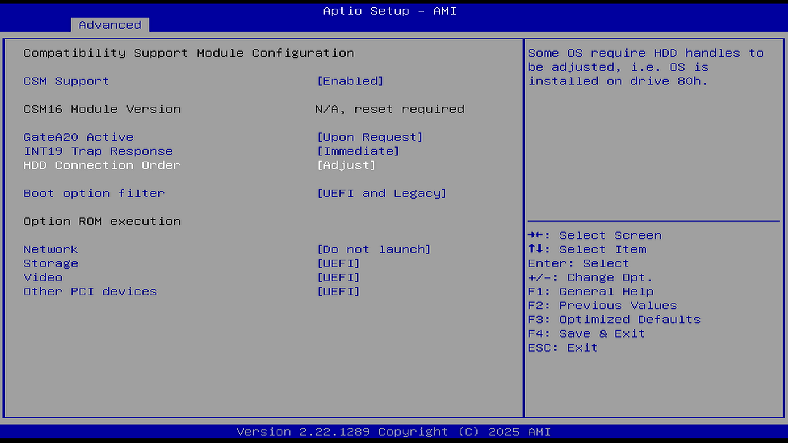

# CSM Configuration（CSM 配置）

CSM：Compatibility Support Module，兼容性支持模块。

Intel 500 系列及更新芯片组（第 11 代及后续处理器）不支持使用 VBIOS 的显示适配器，导致内置核显不支持 legacy boot，因此其 CSM 选项是灰色的。必须使用有支持 VBIOS 的外置独显才能进行配置。参见：华硕公司. Intel 500 系列开始，在 BIOS 中的 CSM 选项无法选用问题？[EB/OL]. [2026-03-26]. <https://www.asus.com.cn/support/faq/1045467/>。

## CSM Support（CSM 支持）

选项：

Disable（禁用）

Enable（启用）

说明：

兼容模式支持开关设置，UEFI 兼容性支持模块，对不支持 UEFI 的操作系统提供兼容性支持。

该选项决定了以下选项：

### GateA20 Active（A20 地址线激活）

选项：

Upon Request：基于需要

Always：始终

说明：

A20 地址线的控制模式设置。

A20 是一根地址线，这根地址线控制系统对于 1 MB 以上的那部分内存空间如何进行访问。控制是否允许 CPU 访问 1 MB 以上的内存区域。

### INT19 Trap Response（INT19 中断捕获响应）

选项：

Immediate：立即响应

Postponed：推迟响应

说明：

中断、捕捉信号响应设置。BIOS 通过可选 ROM 对 INT19 trapping 作出的响应。

当选项 ROM 捕获 INT 19h 中断时，BIOS 会立即执行该中断请求。这意味着设备的启动代码会在 BIOS 处理其他启动选项之前被执行。

当选项 ROM 捕获 INT 19h 中断时，BIOS 会将该请求延迟到传统启动阶段（Legacy Boot）期间再执行。这通常用于 RAID 控制器、网络适配器等设备，以便在操作系统加载之前初始化硬件。

如果在启动过程中遇到设备初始化问题，尝试将此选项设置为 Postponed，以延迟设备初始化。

### HDD Connection Order（机械硬盘连接顺序）

选项：

Adjust（调整）

Keep（保持）

说明：

此选项依赖 Boot option filter（启动选项过滤）

“80h”是传统 BIOS 中代表第一块硬盘（通常是主启动盘）的编号。

某些操作系统需要调整硬盘驱动器的句柄，例如操作系统安装在 80h 号驱动器上。

### Boot option filter（启动选项限制）

选项：

UEFI Only：UEFI 模式

Legacy Only：传统模式

UEFI and Legacy：UEFI 和传统模式并存

说明：

启动模式设置，用于控制设备采用 Legacy 或 UEFI 模式进行启动。

### Option ROM execution（可选 ROM 执行）

选项：

Manual：手动

Auto：自动

说明：

Option ROM 执行策略。该选项用于控制系统中 Legacy Option ROM 与 UEFI Option ROM 的优先级。

Option ROM 是一种嵌入在主板或扩展设备（如显卡、网卡、RAID 控制器）上的固件程序。

当该选项设置为 Auto 时，UEFI Option ROM 会在 UEFI 模式下运行，Legacy Option ROM 会在 Legacy 模式下运行。

当该选项设置为 Manual 时，用户可以根据需要选择运行 UEFI Option ROM 或 Legacy Option ROM；若设置不当，可能导致某些 Option ROM 无法运行。

建议该选项设置为 Auto 模式。

决定了以下选项：

#### Network（网络）

选项：

Do not launch：不执行

Legacy：Legacy 模式，加载网卡的 Legacy Option ROM

UEFI：UEFI 模式，加载网卡的 UEFI Option ROM

说明：

网卡 Option ROM 执行方式设置。

#### Storage（存储）

存储设备 Option ROM 执行方式设置，选项参数同上。

#### Video（显卡）

显卡设备 Option ROM 执行方式设置，选项参数同上。

#### Other PCI devices（其他 PCI 设备）

其他 PCI 设备的 Option ROM 执行方式设置，选项参数同上。
