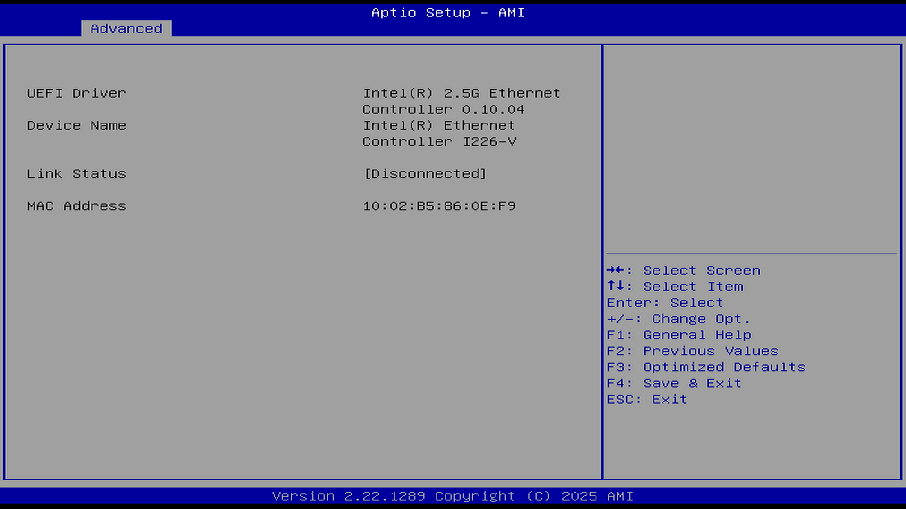

# Intel(R) Ethernet Controller I226-V - 10:02:B5:86:0E:F9（Intel 以太网控制器）

显示以太网卡相关信息。

| 英文 | 中文 | 值 |
| ---- | ---- | -- |
| UEFI Driver | UEFI 驱动 | Intel(R) 2.5 G Ethernet Controller 0.10.04 |
| Device Name | 设备名称 | Intel(R) Ethernet Controller I226-V |
| Link Status | 链路状态 | [Disconnected]（未连接） |
| MAC Address | MAC 地址 | 10:02:B5:86:0E:F9 |
