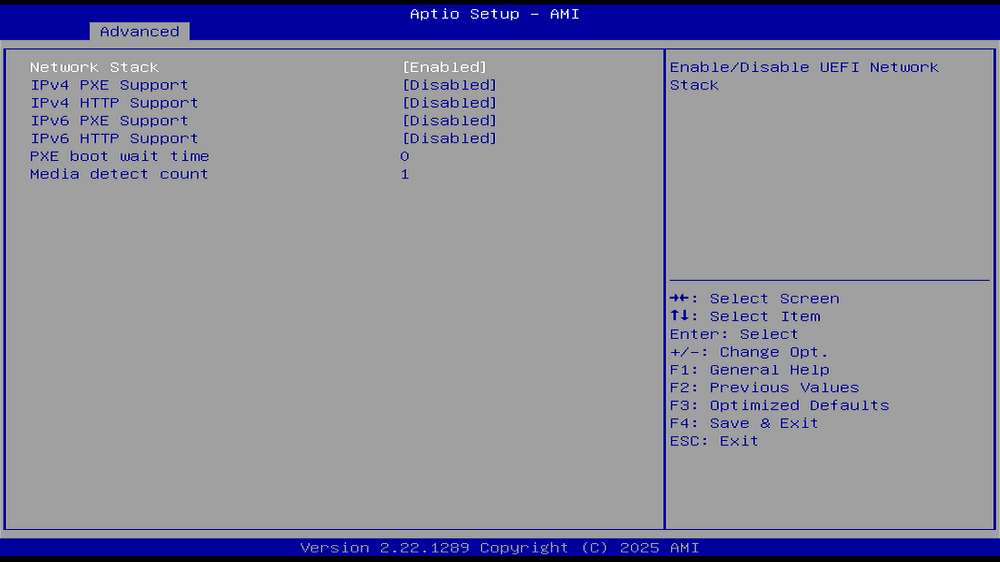

# Network Stack configuration（网络堆栈设置）

## Network Stack（网络堆栈）

选项：

Disable（禁用）

Enable（启用）

说明：

网络启动相关设置。

指定是否启用（Enabled）UEFI 网络栈以允许通过 UEFI 进行网络访问。当设置为 Disabled 时，将无法通过 PXE 使用 UEFI 进行系统安装。

此选项决定了以下选项：

### Ipv4 PXE Support（Ipv4 PXE 启动支持）

选项：

Disable（禁用）

Enable（启用）

说明：

PXE（预启动执行环境）是一项由 Intel 开发的网络启动协议，它能让计算机通过网络从远程服务器获取操作系统并进行引导安装。这是 PXE 协议，是传统的网络启动方法。

### Ipv4 HTTP Support（Ipv4 HTTP 启动支持）

选项：

Disable（禁用）

Enable（启用）

说明：

如果禁用，将不会创建 IPv4 HTTP 启动选项。这是 HTTP 协议，是新的网络启动方法。

### IPv6 PXE Support（IPv6 PXE 启动支持）

同上。

### IPv6 HTTP Support（IPv6 HTTP 启动支持）

同上。

### PXE boot wait time（PXE 启动等待时间）

值：0-5 秒。

等待按 ESC 键取消 PXE 启动的时间设置。

也就是说，如果设置为 5，则必须在 5 秒内按 ESC 键终止 PXE 启动流程，超过 5 秒就启动 PXE 了。

### Media detect count（介质检测数）

值：1-50

检测介质存在次数。

在启动过程中，系统会多次检查启动设备（如硬盘、光驱或网络介质）是否已连接或准备就绪。
