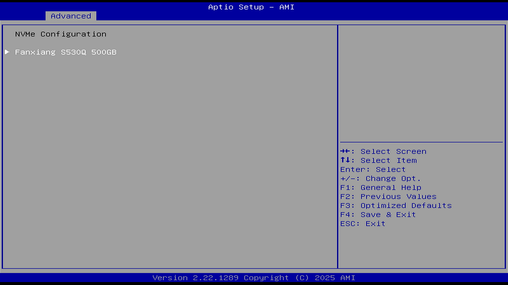
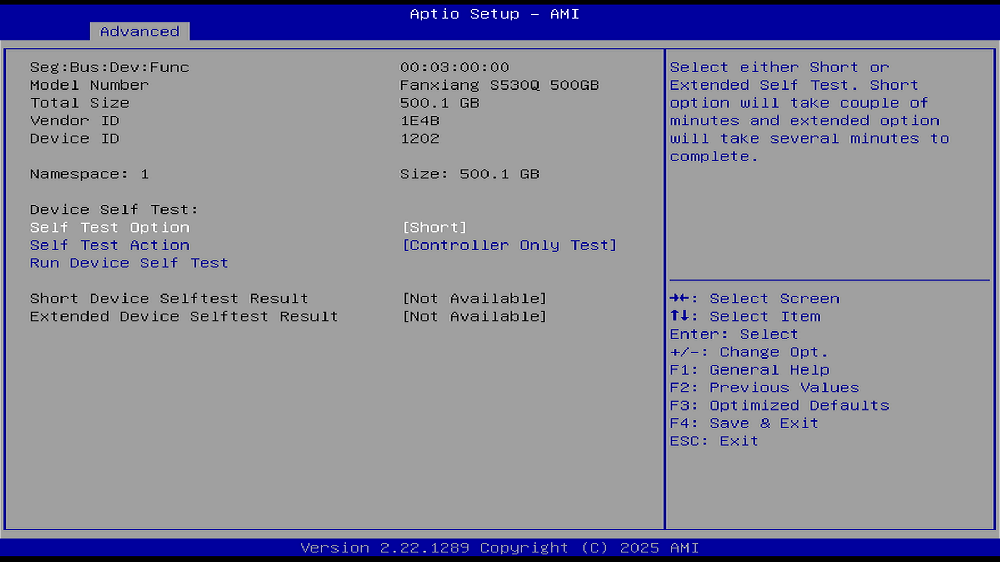

# NVMe configuration（NVMe 配置）

## Self Test Option（自我测试选项）

选项：

Short（短自检）

Extended（扩展自检）

说明：

此选项和 Run Device Self Test（运行设备自我测试）有关。

请选择执行短自检（Short Self Test）或扩展自检（Extended Self Test）。

短自检大约需要几分钟完成，而扩展自检则需要更长时间。

## Self Test Action（自我测试行为）

选项：

Controller Only Test（仅控制器测试）

Controller and NameSpace test（控制器和命名空间测试）

说明：

此选项和 Run Device Self Test（运行设备自我测试）有关。

控制器和命名空间测试要更长时间才能完成。

## Run Device Self Test（运行设备自我测试）

此选项依赖 Self Test Option（自我测试选项）和 Self Test Action（自我测试行为）。

执行用户选择的“选项”和“操作”对应的设备自检程序。按下 Esc 键可中止测试。下面显示的结果为设备中最近一次自检的记录。

### Short Device Selftest Result（短自检）

Not Available：不可用，即未测试过。

### Extended Device Selftest Result（扩展自检）

Not Available：不可用，即未测试过。

## VMD Setup（VMD 卷管理设备设置）

VMD（Volume Management Device，卷管理设备）是 Intel 平台引入的硬件技术，提供对 NVMe SSD 的统一管理，并支持从 NVMe RAID 卷启动。该子菜单允许配置 VMD 控制器。

### Enable VMD Controller（启用 VMD 控制器）

选项：

Disable（禁用）

Enable（启用）

说明：

启用或禁用 VMD 控制器。创建 RAID 配置时，需将此项设置为 Enabled。

### Enable VMD Global Mapping（启用 VMD 全局映射）

选项：

Disable（禁用）

Enable（启用）

说明：

启用或禁用 VMD 全局映射。创建 RAID 配置时，需将此项设置为 Disabled，然后将对应的 SATA/M.2 接口下“Map this Root Port under VMD”项设置为 Enabled。

### Map this Root Port under VMD（在 VMD 下映射此根端口）

选项：

Disable（禁用）

Enable（启用）

说明：

根据所使用的 SATA/M.2 接口，将对应根端口映射到 VMD 下。此项仅在 Enable VMD Controller 设置为 Enabled 且 Enable VMD Global Mapping 设置为 Disabled 时可配置。
