# Power & Performance（电源与性能）

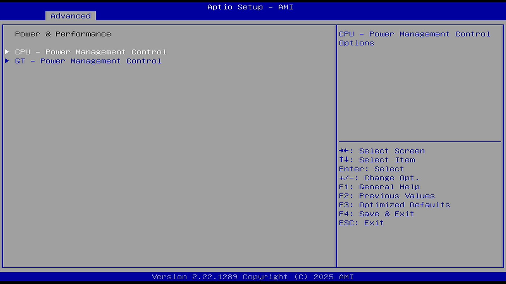

| 英文术语 | 中文翻译 |
| -------- | -------- |
| CPU - Power Management Control | CPU 电源管理控制 |
| GT - Power Management Control | 核显电源管理控制（GT 电源管理控制） |

## CPU - Power Management Control（CPU 电源控制管理）

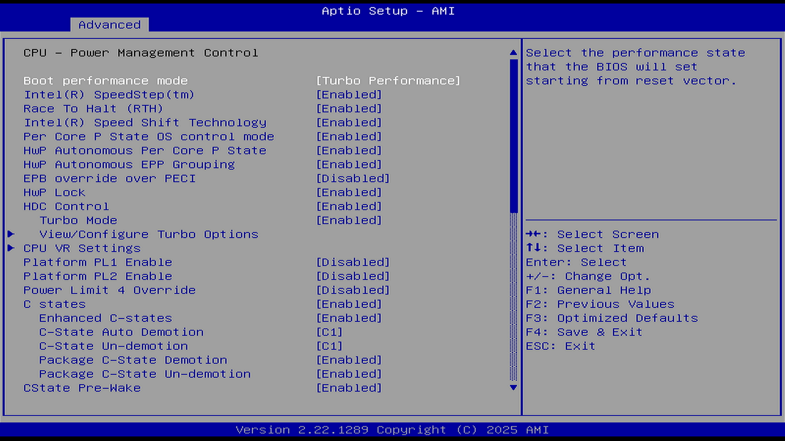

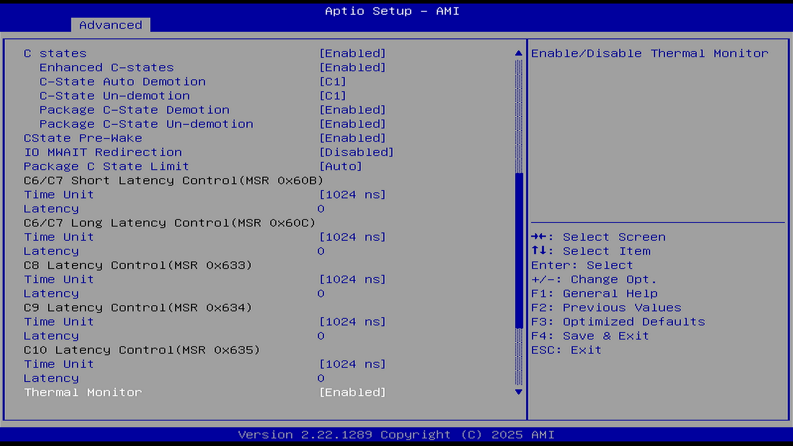

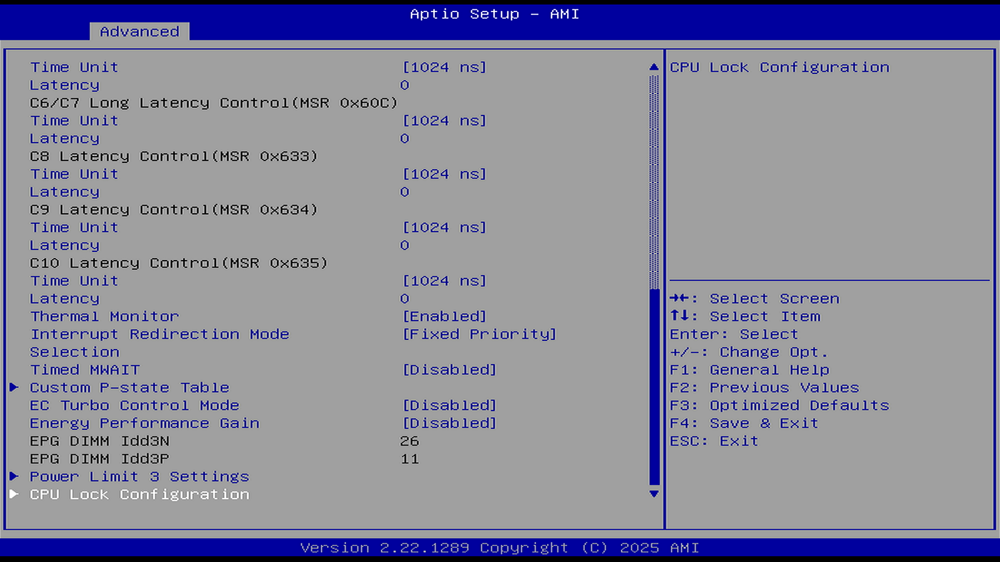

### Boot performance mode（引导性能模式）

选项：
Max Battery（节能模式）

Max Non-Turbo Performance（最大非睿频性能模式）

Turbo Performance（睿频性能模式）

说明：

在进入操作系统前选择 CPU 的性能状态。

选择 BIOS 在从复位向量（CPU 用来开始执行指令的固定内存地址）开始时设置的性能状态。

最大非睿频性能模式，能使 CPU 运行于固定的时钟频率，从而提供更稳定、更可预测的结果，有助于改善实时性。

### Intel(R) SpeedStep(tm)（英特尔 SpeedStep 技术）

选项：

Disable（禁用）

Enable（启用）

说明：

Intel SpeedStep 技术可使系统自动调节处理器电压和核心频率（允许操作系统控制和选择 P 状态），以降低功耗和散热需求。开启后可固定 CPU 睿频倍频。

让处理器在多个频率和电压点之间切换。在禁用的情况下，CPU 会按照最高频率和电压运行，避免 CPU 频率变化，有助于改善实时性。

### Race To Halt (RTH)（一种快速休眠技术）

选项：

Disable（禁用）

Enable（启用）

说明：

启用或禁用 Race to Halt（RTH）功能。RTH 会动态提高 CPU 频率，以更快进入封装级 C 状态，从而降低整体功耗。（RTH 通过 MSR 寄存器 1FC 的第 20 位控制）

是否启动 CPU 省电功能。当 CPU 有任务时全速运行，完成后进入极低功耗状态。

### Intel(R) Speed Shift Technology（一种极速变频技术）

选项：

Disable（禁用）

Enable（启用）

说明：

启用后将开放 CPPC v2 接口，允许硬件控制 P 状态。

该技术通过硬件控制的 P 状态使处理器能更快地选择其最佳工作频率和电压以实现最佳性能和能效。此功能可让用户更精准地控制 CPU 的频率，使其能够迅速跃升至最大时钟速度。

若要支持 Intel Turbo Boost Max（ITBMT，英特尔睿频加速 Max）3.0 技术，则必须开启此项。若处理器不支持 ITBMT 3.0，此项将呈现灰色，不可设定状态。

ITBMT 3.0 能识别处理器上性能最佳的内核，同时通过提高利用电源和散热器空间时所必需的频率，提高这些内核的性能。由于生产差异，处理器内核的最大潜在频率各不相同。ITBMT 3.0 可识别 CPU 上最多两个速度最快的内核，称为“青睐的内核”。然后，它会对这些内核（或该内核）应用频率提升，并将关键工作负载分配到它们。ITBMT 3.0 旨在充分利用每个内核的最高频率，参见：英特尔公司. 英特尔® 睿频加速 Max 技术 3.0 技术常见问题解答[EB/OL]. [2026-03-26]. <https://www.intel.cn/content/www/cn/zh/support/articles/000021587/processors.html>.

关闭该功能有助于改善实时性，此时 CPU 频率和电压不会被动态调整。

### Per Core P state OS control mode（每核心 P 状态控制）

选项：

Disable（禁用）

Enable（启用）

说明：

如果启用，频率将是动态调整的；如果禁用，所有核心都将随最忙的核心一道全速运行。

使用此功能可启用或禁用每个核心 P 状态的操作系统控制模式。

禁用时将设置命令 0x06 的第 31 位为 1，当该位被设置后，所有核心将采用最高核心（最忙碌的那个）的请求作为统一的电压频率请求。

当启用时，每个物理 CPU 核心可以以不同的频率运行。

如果禁用，处理器封装内的所有核心将以所有活动线程中解析出的最高频率运行。

### HwP Autonomous Per Core P State（HwP 自动控制下的每核心性能状态）

选项：

Disable（禁用）

Enable（启用）

说明：

这是 Intel 第 6 代（Skylake）及以后处理器配备的技术。

禁用每核心自主 P 状态（Autonomous PCPS）后，所有核心将始终请求相同的性能状态值。HWP（Hardware Controlled Performance States，硬件性能状态）可让操作系统通过 MSR 中的能效偏好字段（EPP）设置其对性能或节能的偏好。启用 HWP 后，处理器将自行根据工作负载的需求，独立选择最合适的性能状态。参见 Intel. Empowering Mixed-criticality Industrial Realtime Computing on Performance Hybrid Architecture with Intel's Dynamic Frequency Scaling Evolution[EB/OL]. [2026-03-26]. <https://builders.intel.com/docs/networkbuilders/empowering-mixed-criticality-industrial-real-time-computing-with-intel-s-dvfs-evolution-1712135964.pdf>.

对性能一致性有要求的用户（如实时计算等）可能需要关闭此选项。

### HwP Autonomous EPP Grouping（HwP 自动控制下的 EPP 分组）

选项：

Disable（禁用）

Enable（启用）

说明：

此选项依赖“HwP Autonomous Per Core P State（硬件自动控制的每核心性能状态）”，HwP Autonomous Per Core P State 开启时设置本选项才有意义。

启用 EPP 分组自主功能后，所有具有 EPP 的核心将请求相同的性能偏好值。

禁用 EPP 分组自主功能后，具有 EPP 的各个核心将不一定会请求相同的性能偏好值。

对性能一致性有要求的用户（如实时计算等）可能需要禁用此选项。

### EPB override over PECI（通过 PECI 覆盖 EPB 设置）

选项：

Disable（禁用）

Enable（启用）

说明：

此选项依赖于 PECI（平台环境控制接口）。

EPB，Performance and Energy Bias Hint：性能与能耗偏好提示能让软件指定其对处理器中性能与功耗权衡的偏好。

参见：Linux 内核文档团队. Intel Performance and Energy Bias Hint[EB/OL]. [2026-03-26]. <https://docs.kernel.org/admin-guide/pm/intel_epb.html>.

是否允许系统通过 PECI 接口修改处理器的 EPB 设置，从而实现更精确的能效控制。

启用时会发送 pcode 命令 0x2b，子命令 0x3 设置为 1。此功能允许通过 OOB（带外）方式控制 EPB 的 PECI 覆盖。

### HwP Lock（HwP 锁定）

选项：

Disable（禁用）

Enable（启用）

说明：

保护硬件性能状态设置不被外部修改的开关。

### HDC Control（HDC 控制）

选项：

Disable（禁用）

Enable（启用）

说明：

HDC，Hardware Duty Cycling，英特尔硬件占空比调节技术。

开启可通过硬件自动调节占空比以节能，关闭功耗增加但性能可能更稳定。

开启：需要操作系统本身支持才生效。

### Turbo mode（睿频模式）

选项：

Disable（禁用）

Enable（启用）

说明：

允许 CPU 在节能模式下，仍然能短时提升性能。

### View/Configure Turbo Options（查看/配置睿频选项）

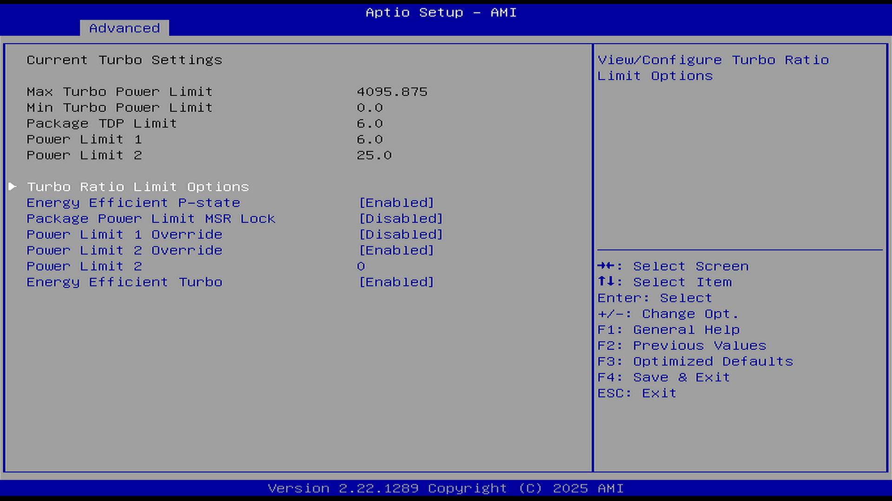

当前睿频设置：

| 项目 | 数值 |
| ---- | ---- |
| 最大睿频功率限制 | 4095.875 |
| 最小睿频功率限制 | 0.0 |
| 封装 TOP 限制 | 6.0 |
| 功率限制 1 | 6.0 |
| 功率限制 2 | 25.0 |

#### Turbo Ratio Limit Options（睿频倍率限制选项）

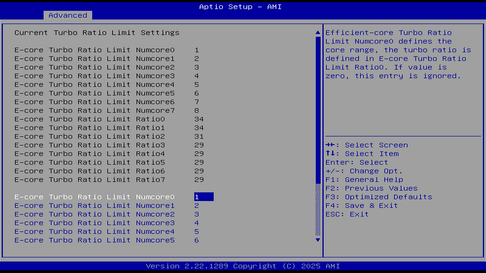

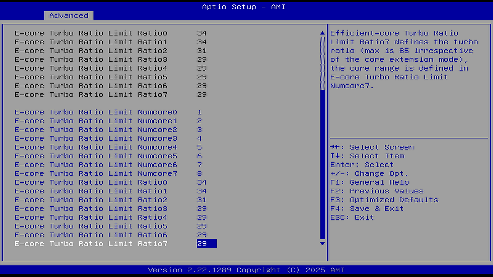

当前睿频倍率限制设置。E 核心即小核，能效核心。

`NumcoreX` 定义核心范围后，对应的 `RatioX` 生效。按活跃核心数独立配置睿频限制。

E-core Turbo Ratio Limit Numcores：能效核心睿频限制。在启用睿频时，E 核支持的最大活动核心数量。如果设置为 2，则最多支持 2 个小核同时进行睿频；如果值为零，则忽略此条目。

E-core Turbo Ratio Limit Ratio：能效核心睿频限制。此选项依赖于 E-core Turbo Ratio Limit Numcores。为不同数量的活动 E 核设置最大加速倍频。1 个 E 核多少倍频，2 个 E 核多少倍频，以此类推。最大值固定为 85，与核心扩展模式无关。

#### Energy Efficient P-state（节能 P 状态）

选项：

Disable（禁用）

Enable（启用）

说明：

当 P-state 功能设置为 0 时：

- 将禁用对 ENERGY_PERFORMANCE_BIAS MSR 的访问；
- CPUID 的 Function6 的 ECX 寄存器第 3 位将为 0，表示系统不支持能源效率策略设置。

当设置为 1 时：

- 将开启对 ENERGY_PERFORMANCE_BIAS MSR 的访问，允许系统设置和读取能源性能偏好值。

- 0 → 禁用能源效率策略相关接口，不支持节能偏好设置。
- 1 → 启用 ENERGY_PERFORMANCE_BIAS 接口，可以调整节能与性能之间的偏好。

#### Package Power Limit MSR Lock（封装功耗限制寄存器锁定）

选项：

Disable（禁用）

Enable（启用）

说明：

启用此功能后，`PACKAGE_POWER_LIMIT` 寄存器（MSR）将被锁定，若需解锁该寄存器，必须重启系统。

启用将不允许系统或软件在运行时修改功耗限制；禁用将允许动态修改功耗限制参数。

#### Power Limit 1 Override（功耗限制 1 覆盖）

选项：

Disable（禁用）

Enable（启用）

说明：

此选项依赖 Platform PL1 Enable（启用平台 PL1）。

如果此选项被禁用，BIOS 将会使用默认值来配置功耗限制 1（Power Limit 1）和功耗限制 1 时间窗口（Power Limit 1 Time Window）。该选项可用于解锁功耗墙。

#### Power Limit 1（PL1，功耗限制 1）

该选项依赖于 Power Limit 1 Override（功耗限制 1 覆盖）。

请注意单位：1 W \= 1000 mW。如 5 W 应设置此选项为 5000。如果设置为 `0`，表示不启用自定义功耗限制，BIOS 将保留默认值。Platform Power Limit 1（平台功耗限制 1），单位为毫瓦（mW）。BIOS 在设置时会四舍五入到最接近的 1/8 瓦（0.125 W）。

当超出限制时，CPU 的倍频会在经过一段时间后降低。下限可保护 CPU 并节省功耗，而上限则有助于提升性能。

PL1 是平均功耗的限制阈值，不会被超过——英特尔推荐设置为等于处理器的基础功耗（TDP）。PL1 不应高于散热方案的散热能力上限。参见：英特尔公司. 12th Generation Intel® Core™ Processors[EB/OL]. [2026-03-26]. <https://edc.intel.com/content/www/us/en/design/ipla/software-development-platforms/client/platforms/alder-lake-desktop/12th-generation-intel-core-processors-datasheet-volume-1-of-2/011/package-power-control/>.

实现 Intel® Turbo Boost 技术 2.0 通常只需正确配置 PL1、PL2 和 Tau 参数。

#### Power Limit 1 Time Window（功耗限制 1 时间窗口）

选项：

单位是秒。0-128 秒可选，0 表示使用默认值。

该值的范围可以是 0 到 128。

说明：

PL 1 是长期的功耗限制。

此设置表示在多长的时间窗口内，应维持平台的 TDP（热设计功耗）值。

#### Power Limit 2 Override（功耗限制 2 覆盖）

选项：

Disable（禁用）

Enable（启用）

说明：

此选项依赖 Platform PL2 Enable（启用平台 PL2）。

如果此选项被禁用，BIOS 将会使用默认值来配置功耗限制 2（Power Limit 2）。该选项可用于解锁功耗墙。

#### Power Limit 2（PL2，功耗限制 2）

选项：

请注意单位：1 W \= 1000 mW。如 5 W 应设置此选项为 5000。如果设置为 `0`，表示不启用自定义功耗限制，BIOS 将保留默认值。PL2 单位为毫瓦（mW）。BIOS 在设置时会四舍五入到最接近的 1/8 瓦（0.125 W）。

说明：

该选项依赖于 Power Limit 2 Override（功耗限制 2 覆盖）。

Power Limit 2（PL2）是短时功耗限制，用于允许 CPU 在短时间内突破 PL1，从而提供更高性能。一旦超过该阈值，PL2 快速功耗限制算法将尝试限制超过 PL2 的功耗峰值。PL2 的单位为毫瓦（mW），设定的是 CPU 在短时间内允许达到的最大功耗峰值。

#### Energy Efficient Turbo（睿频节能）

选项：

Disable（禁用）

Enable（启用）

说明：

该功能会在合适的时候主动降低睿频频率以提升能效。建议仅在需要保持睿频频率恒定的超频场景下禁用，其他情况下请保持启用。

### CPU VR Settings（CPU 电压调节器设置）

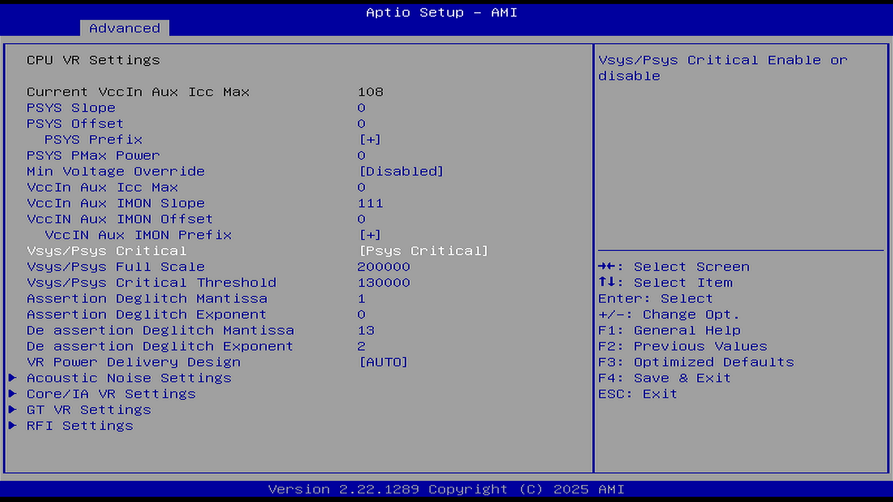

Current VccIn Aux Icc Max（CPU 输入电压辅助最大电流）：108

#### PSYS Slope（PSYS 平台电源变化率）

PSYS 平台电源变化率以 1/100 为单位定义，范围为 0 到 200。

例如，要设置变化率为 1.25，输入 125。设置为 0 表示自动（AUTO）。该设置通过 BIOS VR mailbox 命令 0x9 进行控制。

参见：英特尔公司. 第 10 代英特尔®酷睿™处理器系列[EB/OL]. [2026-03-26]. <https://www.intel.cn/content/dam/www/public/cn/zh/documents/datasheets/10th-gen-core-families-datasheet-vol-1-datasheet.pdf>.

#### PSYS Offset（PSYS 平台电源偏移量）

PSYS 平台电源偏移量以 1/1000 为单位定义，范围为 0 到 63999。例如，要设置偏移量为 25.348，输入 25348。该设置通过 BIOS VR mailbox 命令 0x9 进行控制。

#### PSYS Prefix（PSYS 平台电源前缀）

选项：

`+`

`-`

设置前缀，可以为正值或负值。

此项是搭配 PSYS Offset（PSYS 平台电源偏移量）使用的，用于指定是加上偏移量还是减去偏移量。

#### PSYS Pmax Power（PSYS 平台电源最大功率）

PSYS 平台电源最大功率（Pmax）以 1/8 瓦为单位定义，范围为 0 到 8192。

例如，要设置最大功率为 125 瓦，输入 1000（即 1000 × 1/8 \= 125 瓦）。设置为 0 表示自动（AUTO）。该设置通过 BIOS VR mailbox 命令 0xB 进行控制。

其具体作用在公开文档中未有明确说明。

#### Min Voltage Override（覆盖最低电压）

选项：

Disable（禁用）

Enable（启用）

说明：

覆盖当前的最低电压。启用后，可在运行时和 C8 节能状态中覆盖最低电压限制。

#### Min Voltage Runtime（运行时的最低电压）

此选项依赖 Min Voltage Override（覆盖最低电压）。

运行时最低电压。范围为 0 至 1999 mV，以 1/128 伏为增量单位。输入单位为毫伏 (mV)。

#### Min Voltage C8（C8 节能状态的最低电压）

此选项依赖 Min Voltage Override（覆盖最低电压）。

C8 节能状态的最低电压。范围为 0 至 1999 mV，以 1/128 伏为增量单位。输入单位为毫伏 (mV)。

#### VccIn Aux Icc Max（CPU 输入电压辅助最大电流）

此选项用以调整 VccIn Aux 供电轨的最大电流限制，可用于超频或高负载机器。

设置 VccIn Aux（CPU 输入电压辅助最大电流）的最大 Icc 值，以 1/4 A 为增量单位。范围为 0 至 512。

例如：若要设置 Icc Max 为 32 A，则输入 128（32 × 4）。

#### VccIn Aux IMON Slope（CPU 输入电压辅助电流检测变化率）

该选项影响系统读取电流值的准确性和调控精度。

IMON 即电流检测。该功能是一项电源管理特性，能让处理器通过 SVID 接口、借助 IMVP9.1 控制器读取 VCCIN Aux 的平均电流。

VCCIN AUX IMON 变化率，以 1/100 为增量单位。范围为 0-200。例如：若要设置 1.25 的变化率，则输入 125。输入 0 表示自动（AUTO），使用 BIOS VR mailbox 命令 0x18。

#### VccIn Aux IMON Offset（CPU 输入电压辅助电流检测偏移量）

用于修正或校准 CPU 电源轨（VCCIN Aux）上读取到的平均电流值。

VCCIN Aux IMON 偏移量，以 1/1000 为增量单位。范围为 0-63999。例如：若要设置 25.348 的偏移量，则输入 25348。IMON 使用 BIOS VR mailbox 命令 0x18。

#### VccIn Aux IMON Prefix（CPU 输入电压辅助电流检测前缀）

选项：

`+`

`-`

说明：

此选项和 VccIn Aux IMON Offset（CPU 输入电压辅助电流检测偏移量）相关。

设置前缀，可以为正值或负值。

用于指定对测量值是加上偏移量还是减去偏移量。

#### Vsys/Psys Critical（系统电压/平台功耗临界功能）

选项：

Disabled（禁用）

Psys Critical（平台功耗临界）

Vsys Critical（系统电压临界）

说明：

该功能用于启用 Vsys/Psys Critical（临界）监控功能。当启用此功能时，系统会根据设定的阈值监控平台电源状态，以便在电压或功耗超过安全范围时采取保护措施（例如限制性能、触发告警、避免过载等）。

#### 详细说明

### Vsys/Psys Full Scale（Vsys/Psys 满量程值）

此选项依赖 Vsys/Psys Critical（系统电压/平台功耗临界功能）。

需要 Vsys/Psys 的满量程数值。

Vsys/Psys 临界值 \= 临界阈值 ÷ 满量程值。

Vsys 的输入单位为毫伏（mV），Psys 的输入单位为毫瓦（mW），或在 ATX12VO 电源架构下为百分比（%）。

#### Vsys/Psys Critical Threshold（Vsys/Psys 临界阈值）

此选项依赖 Vsys/Psys Critical（系统电压/平台功耗临界功能）。

需要输入 Vsys/Psys 的临界阈值。

Vsys/Psys 临界比值 = 临界阈值 ÷ 满量程值。

Vsys 的输入单位为毫伏（mV），Psys 的输入单位为毫瓦（mW），或在 ATX12VO 架构下为百分比（%）。

#### Assertion Deglitch Mantissa（断言消隐尾数）

主要用于控制信号“断言”（assertion）过程中的消隐（deglitch）行为。用以设置断言信号消隐时间，作用是平衡电路中的噪声抑制与信号响应速度。

断言消隐尾数 0x4F[7-3]（存储在 MSR/寄存器地址 0x4F 的第 7 至第 3 位）。断言消隐 = 2µs × 尾数 × 2^(指数)

#### Assertion Deglitch Exponent（断言消隐指数）

此选项需搭配选项 Assertion Deglitch Mantissa（断言消隐尾数）使用。

断言消隐指数 0x4F[3-0]（存储在 MSR/寄存器地址 0x4F 的第 3 至第 0 位）。断言消隐 = 2µs × 尾数 × 2^(指数)。

#### De-assertion Deglitch Mantissa（解除消隐尾数）

信号解除激活时的消隐时间计算参数。类似上方的断言消隐。

解除消隐尾数 0x49[7-3]（存储在 MSR/寄存器地址 0x49 的第 7 至第 3 位）。解除消隐 = 2µs × 尾数 × 2^(指数)

#### De-assertion Deglitch Exponent（解除消隐指数）

解除消隐指数 0x49[3-0]（存储在 MSR/寄存器地址 0x49 的第 3 至第 0 位）。解除消隐 = 2µs × 尾数 × 2^(指数)。

#### VR Power Delivery Design（电源调节器供电架构设计）

选项：

AUTO (0)：使用主板 ID 自动确定主板设计。

其他值：将覆盖主板 ID 逻辑，强制指定设计配置。

说明：

自定义 VR 供电设计值，此选项主要用于验证场景。

该功能用于控制用于 VR 设置覆盖值的 ADL 台式机主板设计。此选项将根据主板 ID 来判断使用哪种主板设计。

#### Acoustic Noise Settings（声学噪声设置）

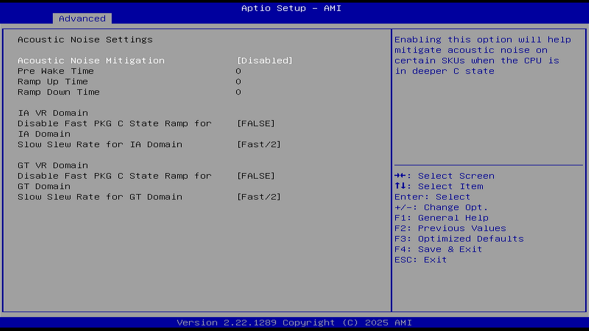

选项：

Disable（禁用）

Enable（启用）

说明：

Acoustic Noise Mitigation（噪声抑制功能）：启用此选项可减轻部分 CPU 在深度 C 状态下可能出现的噪声问题。

开启此选项，方可设置下方选项：

- Pre Make Time（预触发时间）：设置最大预触发随机化时间（微刻度单位）。范围为 0-255。该参数用于声学噪声抑制的动态周期调整（DPA）调校。
- Ramp Up Time（上沿时间）：指 CPU 或电源性能从低到高的过渡时间。设置最大上升沿随机化时间（微刻度单位）。有效范围 0-255。该参数用于声学噪声抑制的动态周期调校（DPA）优化。
- Ramp Down Time（下沿时间）：指 CPU 或电源性能从高到低的过渡时间。设置最大下降沿随机化时间（微刻度单位）。有效范围 0-255。该参数用于声学噪声抑制的动态周期调校（DPA）优化。
- IA VR Domain（Intel Architecture Voltage Regulator，处理器计算核心电压调节域）

- Disable Fast PKG C State Ramp for VccIn Domain（禁用快速 PKG C 状态切换），选项为 FALSE/TRUE。FALSE: 在深度 C 状态下启用快速切换；TRUE: 在深度 C 状态下禁用快速切换
- Slow Slew Rate for IA Domain（处理器核心电压调节域慢速压摆率），选项为 Fast/2、Fast/4、Fast/8、Fast/16。设置深度封装 C 状态切换的 VR VccIn（CPU 主供电输入电压）慢速压摆率。慢速压摆率 \= 快速模式压摆率 / 等分系数（可选 2/4/8/16），通过降低压摆率减轻声学噪声。

- GT VR Domain（Graphics Technology Voltage Regulator，核显电压调节域）

- Disable Fast PKG C State Ramp for VccIn Domain（禁用快速 PKG C 状态切换）：选项：FALSE/TRUE。FALSE: 在深度 C 状态下启用快速切换；TRUE: 在深度 C 状态下禁用快速切换
- Slow Slew Rate for GT Domain（核显电压调节域慢速压摆率设置）：选项：Fast/2、Fast/4、Fast/8、Fast/16。设置深度封装 C 状态切换的 VR GT（核显电压调节域）慢速压摆率。慢速压摆率 \= 快速模式压摆率 / 等分系数（可选 2/4/8/16），通过降低压摆率减轻声学噪声。

#### Core/IA VR Settings（核心/英特尔架构电压调节设置）

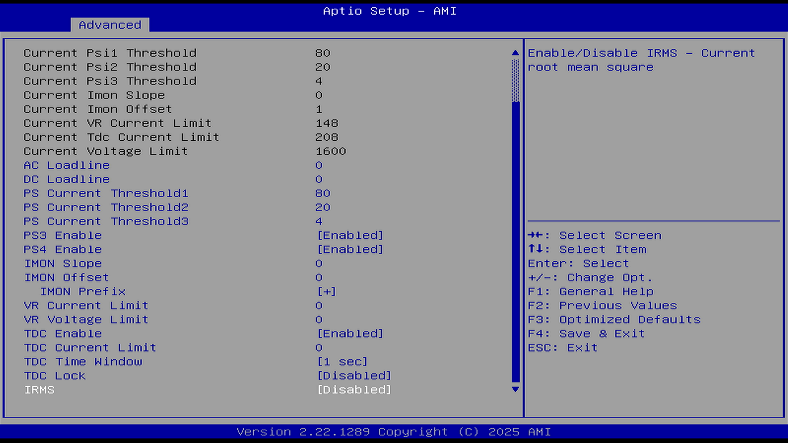

| 英文参数 | 中文参数 | 数值 |
| -------- | -------- | ---- |
| VR Config Enable | 启用电压调节配置 | Enabled |
| Current AC Loadline | 当前 AC 负载线 | 500 |
| Current DC Loadline | 当前 DC 负载线 | 500 |
| Current Psi1 Threshold | 当前 PSI1 阈值 | 0 |
| Current Psi2 Threshold | 当前 PSI2 阈值 | 20 |
| Current Psi3 Threshold | 当前 PSI3 阈值 | 4 |
| Current Imon Slope | 当前电流检测变化率 | 0 |
| Current Imon Offset | 当前电流检测偏移量 | 1 |
| Current VR Current Limit | 当前电压调节器限制 | 148 |
| Current Tdc Current Limit | 当前热设计电流限制 | 208 |
| Current Voltage Limit | 当前电压限制 | 1600 |

VR Config Enable（启用电压调节配置）

选项：

Disable（禁用）

Enable（启用）

是以下选项存在的先决条件。

- AC Loadline（AC 负载线）：AC 负载线以 0.01 毫欧（1/100 mOhms）为单位定义（取值范围：0–6249（对应 0–62.49 毫欧）。该配置通过 BIOS mailbox 命令 0x2 实现。数值换算关系：

- `100` \= 1.00 毫欧（mOhm）
- `1255` \= 12.55 毫欧（mOhm）
-`0` 表示自动/硬件默认值（AUTO/HW default）

因为直流电压降（电路长度愈增加，其电压会愈下降，导致其两端电压不同）问题，英特尔将主板到 CPU 之间的物理电阻抽象为虚拟电阻（即 AC/DC Loadline），即不考虑实际物理电阻的实现究竟是多少（每块主板都不同），来拟合 CPU 倍频所需的电压功率，这样不同的主板的主板供电模块的掉压行为就是一致的。AC Loadline 是升压负载线，DC 是降压负载线。

负载线（AC/DC）应通过 VRTT 工具进行测量，并通过 BIOS 的负载线覆盖设置选项进行相应配置。AC 负载线会直接影响工作电压（AC），DC 负载线则会影响功率测量（DC）。与按 POR 阻抗设计的主板相比，采用较低 AC 负载线的优秀主板设计能够在功耗、性能和散热方面实现改进。参见：Intel. VCCCORE DC Specifications[EB/OL]. [2026-03-26]. <https://edc.intel.com/content/www/de/de/design/products/platforms/details/raptor-lake-s/13th-generation-core-processors-datasheet-volume-1-of-2/vcccore-dc-specifications/>.；巴哈姆特. Intel CPU AC/DC Loadline、防掉壓 CEP 觀念原理一次講完[EB/OL]. [2026-03-26]. <https://forum.gamer.com.tw/C.php?bsn=60030&snA=644011>.；百度贴吧. 从头开始讲 Loadline[EB/OL]. [2026-03-26]. <https://tieba.baidu.com/p/8328546013>。

Intel 建议 AC Loadline 与 DC Loadline 取值一致（AC = DC）。警告：一般不建议修改 AC/DC Loadline。

- DC Loadline（DC 负载线）：DC 负载线以 0.01 毫欧（1/100 mOhms）为单位定义（取值范围：0–6249（对应 0–62.49 毫欧）。该配置通过 BIOS mailbox 命令 0x2 实现。数值换算关系：

- `100` \= 1.00 毫欧（mOhm）
- `1255` \= 12.55 毫欧（mOhm）
- `0` 表示自动/硬件默认值（AUTO/HW default）

- PS Current Threshold1（即 Power Stage Current Threshold1，电源阶段电流阈值 1）：此值以每 1/4 安培为单位递增，例如设置为 400 表示电流阈值为 100 安培（400 × 0.25 A）。其取值范围为 0 到 512，对应实际电流为 0 到 128 安培。设置为 0 表示启用自动模式（AUTO）。该参数通过 BIOS VR mailbox 命令 0x3 进行设置。

- PS Current Threshold2（即 Power Stage Current Threshold2，电源阶段电流阈值 2）：此值以每 1/4 安培为单位递增，例如设置为 400 表示电流阈值为 100 安培（400 × 0.25 A）。其取值范围为 0 到 512，对应实际电流为 0 到 128 安培。设置为 0 表示启用自动模式（AUTO）。该参数通过 BIOS VR mailbox 命令 0x3 进行设置。
- PS Current Threshold3（即 Power Stage Current Threshold3，电源阶段电流阈值 3）：此值以每 1/4 安培为单位递增，例如设置为 400 表示电流阈值为 100 安培（400 × 0.25 A）。其取值范围为 0 到 512，对应实际电流为 0 到 128 安培。设置为 0 表示启用自动模式（AUTO）。该参数通过 BIOS VR mailbox 命令 0x3 进行设置。
- PS3 Enable（Power Stage 3，电源阶段 3）：启用/禁用。该配置通过 BIOS 电压调节器 mailbox 命令 0x3 实现。
- PS4 Enable（Power Stage 4，电源阶段 4）：启用/禁用。该配置通过 BIOS 电压调节器 mailbox 命令 0x3 实现。
- IMON Slope（电流检测变化率）：此值以 1/100 为增量单位定义，取值范围为 0 到 200。例如，要设置变化率为 1.25，则输入 125。设置为 0 表示自动模式（AUTO）。此参数通过 BIOS VR mailbox 命令 0x4 进行配置。用于高精度电源校准。
- IMON Offset（电流检测偏移量）：此值以 1/1000 为单位定义，取值范围为 0 到 63999。例如，如果要设置偏移量为 25.348，则应输入数值 25348。此参数通过 BIOS VR mailbox 命令 0x4 进行配置。用于微调 VR（电压调节器）的电流感应值，以提高功耗报告的准确性或满足电源调校需求。

- IMON Prefix（电流检测前缀）：`+`/`-`。用设置加/减电流检测偏移量。

- VR Current Limit（电压调节器当前限制）：电压调节器电流限制（IccMax）代表允许 CPU 在任意时刻瞬间拉取的最大电流。该值以 1/4 安培（A）为单位定义，例如输入 `400` 表示 100 A（400 × 0.25 A）。取值范围为 0–512，对应实际电流 0–128 A；输入 `0` 表示启用自动模式。该设置通过 BIOS VR mailbox 命令 `0x6` 进行控制。
- VR Voltage Limit（电压调节器电压限制）：Voltage Limit（VMAX）：用于设置电压调节器（VR）允许的最大瞬时输出电压。单位为毫伏（mV）。其取值范围为 0–7999 mV。此设置通过 BIOS VR mailbox 命令 0x8 进行控制。
- TDC Enable（Thermal Design Current，热设计电流）：CPU 平均 *电流* 不能超过此值。选项：Disable（禁用）/Enable（启用）。此选项决定了：

- TDC Current Limit（热设计电流当前限制）：以 1/8 安培（A）为递增单位定义，取值范围为 0–32767。例如，如果要设置最大瞬时电流为 125 A，应输入 1000（1000 × 0.125 A \= 125 A）。输入 `0` 表示设置为自动模式（0 A）。该参数通过 BIOS 的 VR mailbox 命令 `0x1A` 进行配置。
- TDC Time Window（热设计电流时间窗口）：值：1-448。电压调节器热设计电流时间窗口限制。是指在特定时间内，CPU 可承受的最大电流（TDC Current Limit）所允许的持续时间。其单位为毫秒（ms），用于控制 CPU 在高负载下的电流限制响应时间。
- TDC Lock（锁定热设计电流）:启用/禁用。可锁定持续电流上限，防止损坏芯片。

- IRMS：启用/禁用。IRMS \= 电流（电流的符号是 I）有效值（Current Root Mean Square），实时电流有效值监测。

#### GT VR Settings（核显电压调节设置）

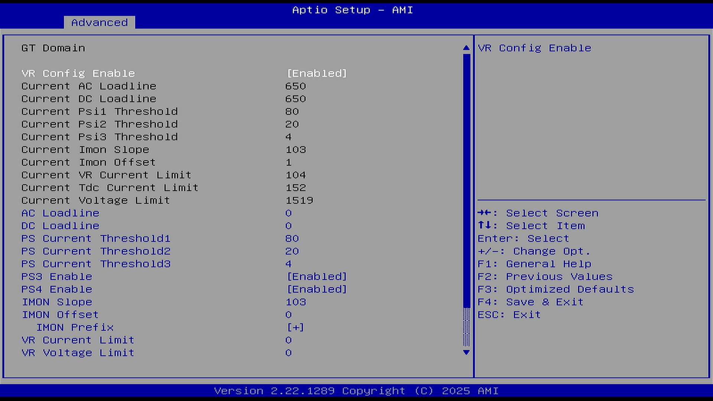

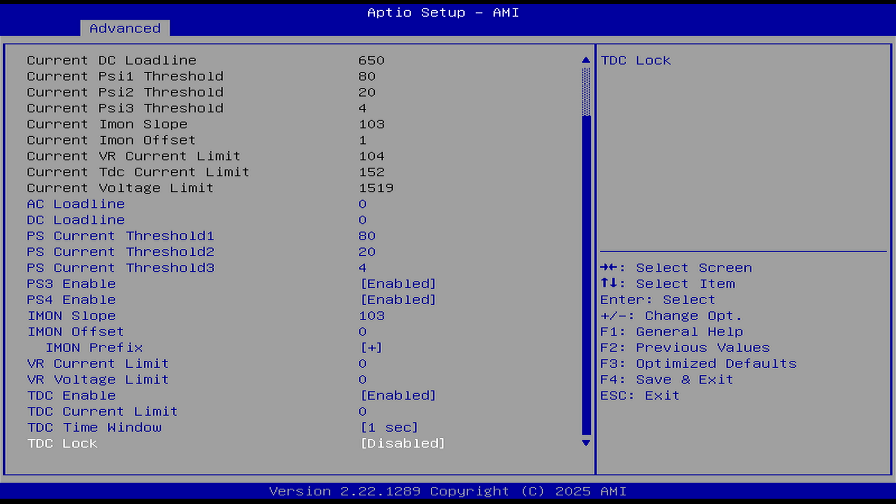

所有选项均参见 Core/IA VR Settings（核心/英特尔架构电压调节设置）。

#### RFI Settings（Radio Frequency Interference，射频干扰设置）

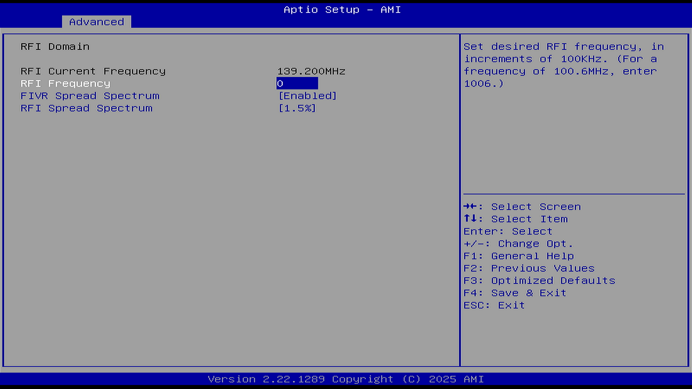

RFI Current Frequency（当前 RFI 频率）：139.200 MHz

- RFI Frequency（RFI 频率）：设置目标 RFI 频率（Set desired RFI Frequency）

- 调节单位：以 100 千赫兹（100 kHz）为步进
- 频率范围：130 MHz 至 160 MHz
- 默认硬件频率：139.6 MHz
- 输入值 = 目标频率（MHz）× 10（例如：需设置 139.6 MHz 时 → 输入 1396）

- RIVR Spread Spectrum（Fully Integrated Voltage Regulator，全集成电压调节器）：启用/禁用。全集成电压调节器展频。可降低峰值辐射强度，减少对特定频率的干扰。

- RFI Spread Spectrum（RFI 射频展频）。0.5%-6%。用于缓解电磁干扰（EMI）。

### Platform PL1 Enable（启用平台 PL1 / PsysPL1）

选项：

Disable（禁用）

Enable（启用）

说明：

这是是否允许修改 PL1 的总开关。是启用/禁用平台功耗限制 1（Platform Power Limit1，PL1）的编程设置。

启用（Enabled）：BIOS 会激活并写入 PL1 值，处理器会在指定时间窗口内以该值限制平均功耗。

禁用（Disabled）：BIOS 不编程 PL1，此时处理器将使用默认或平台固件设定的限制值。

处理器引入了 Psys（平台功耗）机制，以增强对处理器功耗的管理。Psys 信号需要来自兼容的充电电路，并接入 IMVP9（电压调节器）。该信号将通过 SVID 向处理器提供整个平台的热相关总功耗信息（包括处理器及平台其余部分）。

### Platform PL1 Power（平台 PL1 / PsysPL1 功耗）

说明：

此选项依赖 Platform PL1 Enable（启用平台 PL1），这是 BIOS 存储的待生效 PL1 值（可能执行）。实际执行的是 Power Limit 1（如已设置）。

平台功耗限制 1（Platform Power Limit1，简称 PL1）以毫瓦（mW）为单位设置。BIOS 在编程时会将其四舍五入到最接近的 1/8 瓦。可以在由 `PACKAGE_POWER_SKU_MSR` 指定的最小功耗限制和最大功耗限制之间设置任意值。例如，设置为 12.50 瓦，输入 `12500`。该设置会成为处理器 RAPL 算法（用于监控功耗并控制频率和电压的闭环控制算法）中的新 PL1 值。

此值是平台平均功耗不会被超过的阈值——英特尔推荐设置为等于平台的散热能力。参见：英特尔公司. Platform Power Control[EB/OL]. [2026-03-26]. <https://edc.intel.com/content/www/us/en/design/ipla/software-development-platforms/client/platforms/alder-lake-desktop/12th-generation-intel-core-processors-datasheet-volume-1-of-2/011/platform-power-control/>.

### Platform PL1 Time Window（平台 PL1 / PsysPL1 窗口时间）

说明：

此选项依赖 Platform PL1 Enable（启用平台 PL1）。

平台功耗限制 1 时间窗口，单位为秒。该值的范围为 0 到 128。0 表示使用默认值。该选项用于指定平台 TDP（热设计功耗）应当维持的时间窗口。

### Platform PL2 Enable（启用平台 PL2 / PsysPL2）

选项：

Disable（禁用）

Enable（启用）

说明：

这是是否允许修改 PL2 的总开关。是启用/禁用平台功耗限制 2（Platform Power Limit2，PL2）的编程设置。一旦功耗超过该阈值，PsysPL2 快速功耗限制算法将尝试限制超出 PsysPL2 的功耗峰值。

启用（Enabled）：BIOS 会激活并写入 PL2 值，处理器会在指定时间窗口内以该值限制平均功耗。

禁用（Disabled）：BIOS 不编程 PL2，此时处理器将使用默认或平台固件设定的限制值。

### Platform PL2 Power（平台 PL2 / PsysPL2 功耗）

说明：

此选项依赖 Platform PL2 Enable（启用平台 PL2），这是 BIOS 存储的待生效 PL2 值（可能执行）。实际执行的是 Power Limit 2（如已设置）。
平台功耗限制 2（Platform Power Limit2，简称 PL2）以毫瓦（mW）为单位设置。BIOS 在编程时会将其四舍五入到最接近的 1/8 瓦。可以在由 `PACKAGE_POWER_SKU_MSR` 指定的最小功耗限制和最大功耗限制之间设置任意值。例如，设置为 12.50 瓦，输入 `12500`。该设置会成为处理器 RAPL 算法（用于监控功耗并控制频率和电压的闭环控制算法）中的新 PL2 值。

### Power Limit 4 Override（PL4 覆盖，功耗限制 4 覆盖）

Power Limit 4（功耗限制 4），单位为毫瓦（mW）。BIOS 在编程时会四舍五入到最接近的 1/8 瓦。例如：如果要设置为 12.50 W，应输入 12500。如果该数值设置为 0，BIOS 将保留默认值。

### Power Limit 4（PL4，功耗限制 4）

Power Limit 4（功耗限制 4），单位为毫瓦（mW）。BIOS 在编程时会四舍五入到最接近的 1/8 瓦。例如：如果要设置为 12.50 W，应输入 12500。如果该数值设置为 0，BIOS 将保留默认值。

PL4 是一个理论上不允许被超过的功耗限制。PL4 功耗限制算法会提前限制频率，以防止功耗峰值超过 PL4。

### Power Limit 4 Lock（PL4，锁定功耗限制 4）

选项：

Disable（禁用）

Enable（启用）

说明：

是否允许在操作系统中动态修改 PL4 设置。Power Limit 4 MSR 601h Lock（功耗限制 4 锁定寄存器）

当启用此选项时，PL4（功耗限制 4）配置将在操作系统运行期间被锁定，不可更改；当禁用此选项时，操作系统运行期间仍可以更改 PL4 配置。

启用表示锁定；禁用表示可调整。

### C states（C 状态）

选项：

Disable（禁用）

Enable（启用）

说明：

英特尔开发的处理器电源管理机制——C 状态架构，可以在基本的 C1（停止状态，阻断 CPU 时钟周期）基础上进一步降低功耗。

当启用时，所有 CPU 核心进入 C 状态（空闲状态）时，CPU 会自动切换到最低运行频率以降低功耗。

该选项允许在 CPU 并未 100% 利用时，让其进入 C 状态（低功耗空闲状态），以降低整体功耗。

注：代表 CPU/封装睡眠状态。

- C0 - 活动：CPU 打开并运行。
- C1 - 自动停止：内核时钟已关闭。处理器没有执行指令，但几乎可以立即返回到执行状态。某些处理器还支持增强型 C1 状态（C1E），以降低功耗。
- C2 - 停止时钟：内核时钟和总线时钟已关闭。该处理器保持所有软件可见状态，但可能需要更长的时间才能唤醒。
- C3 - 深度睡眠：时钟生成器已关闭。处理器无需保持其高速缓存一致性，但能保持其他状态。某些处理器具有 C3 状态（深度睡眠）的不同变体与唤醒处理器所需的时间不同。
- C4 - 更深度的睡眠：降低 VCC
- DC4 - 更深度的 C4 睡眠：进一步减少 VCC

参见：英特尔公司. 处理器深度和深度睡眠状态之间的差异[EB/OL]. [2026-03-26]. <https://www.intel.cn/content/www/cn/zh/support/articles/000006619/processors/intel-core-processors.html>.

该选项决定了以下选项：

#### Enhanced C-states（增强型 C 状态，即 C1E）

选项：

Disable（禁用）

Enable（启用）

说明：

开启增强型 C1 电源状态，可在部分场景下改善能效与响应性能。

当启用时，所有 CPU 核心进入 C 状态（空闲状态）时，CPU 会自动切换到最低运行频率以降低功耗。

#### C-State Auto Demotion（C 状态自动降级）

选项：

Disable（禁用）

C1

说明：

当本项启用时，CPU 将根据非处理器核心（Uncore）自动降级信息有条件地降低 C 状态。

使用此功能可以防止 CPU 频繁进入 C 状态，从而改善延迟表现。意味着当 CPU 处于深度 C 状态（如 C6 或更深）时，如果系统认为需要更快地响应，CPU 会自动降级到 C1 状态。

#### C-State Un-demotion（C 状态取消降级）

选项：

Disable（禁用）

C1

说明：

当处理器在检测到先前的 C 状态降级决策不合适时，自动恢复到原本请求的更深 C 状态。配置处理器 C 状态不自动降级。

#### Package C-State Demotion（封装 C 状态自动降级）

选项：

Disable（禁用）

Enable（启用）

说明：

当启用此项时，CPU 将有条件地从已降级的 C3 或 C1 状态提升到更高的 C 状态。

当一颗 CPU 的所有核心进入深度 C 状态时，那么整个 CPU 的 package（CPU 封装，指整块 CPU）就可以进入这些状态。

#### Package C-State Un-demotion（封装 C 状态取消降级）

选项：

Disable（禁用）

Enable（启用）

说明：

配置 CPU 封装 C 状态不自动降级。

### CState Pre-Wake（C 状态预唤醒）

选项：

Disable（禁用）

Enable（启用）

说明：

其作用是减少 CPU 从深度 C 状态（如 C6、C7）恢复时的延迟。启用此功能时，系统会在 CPU 进入深度空闲状态之前，提前进行一些准备工作，以便在需要时能够更快地恢复到活动状态。
若禁用：会将 POWER_CTL 寄存器（MSR 0x1FC）的第 30 位设置为 1，从而禁用 C 状态预唤醒（Cstate Pre-Wake）功能。

### IO MWAIT Redirection（IO MWAIT 重定向）

选项：

Disable（禁用）

Enable（启用）

说明：

设置后，系统将把发送到 I/O 寄存器的 IO_read 指令重定向到 MWAIT。映射地址为 PMG_IO_BASE_ADDRBASE + 偏移量。

通过将 I/O 读操作重定向到 MWAIT，系统可以在等待 I/O 操作完成时降低功耗，提升能效。

开启后，处理器将进入最低功耗的空闲状态，直到发生指定的事件。

### Package C State Limit（封装 C 状态限制）

选项：

C0 / C1 / C2 / C3 / C6 / C7 / C7S / C8 / C9 / C10 / Cpu Default（处理器默认）/ Auto（自动）

说明：

最大封装 C 状态限制设置。

指定处理器在空闲时可以进入的最深电源管理状态。该设置影响整个处理器包（Package）的电源管理行为，而不仅仅是单个核心。

对 CPU、PCIe、内存、显卡的 C 状态支持。

CPU 默认：保持出厂默认值；

自动：AMI BIOS 将自动设置 C 状态封装寄存器的限制。初始化为可用的最深封装 C 状态限制。

### Package C State Workaround（封装 C 状态变通解决方案）

选项：

Disable（禁用）

Enable（启用）

说明：

启用此功能可修复旧的机械硬盘在进入封装 C 状态时出现的问题。

### C6/C7 Short Latency Control (MSR 0x60B)（C6/C7 短时延迟控制）

快速中断响应

- Time Unit：时间单位：用于 IRTL（Interrupt Response Time Limit，中断响应时间限制）值的第 12 到第 10 位的度量单位。这是一种用于设置响应中断最大允许延迟的机制。单位 ns 代表纳秒。
- Latency：中断响应时间限制值（IRTL）的第 [9:0] 位，输入范围为 0 到 1023。配合上面设定的“时间单位”，来确定 CPU 从进入低功耗状态（如 C-state）到能够响应中断的最大延迟时间。

### C6/C7 Long Latency Control (MSR0x60C)（C6/C7 长时延迟控制）

深度休眠后的中断响应

选项同上。

### C8 Latency Control (MSR 0x633)（C8 延迟控制）

选项同上。

### C9 Latency Control (MSR 0x634)

C9 延迟控制

选项同上。

### C10 Latency Control (MSR 0x635)（C10 延迟控制）

选项同上。

### Thermal Monitor（热量监控程序）

选项：

Disable（禁用）

Enable（启用）

说明：

此选项和 PECI 相关设置存在关联。

Intel CPU 热量监控程序/过温防护功能。当温度过高时会对 CPU 进行降频降速以降温。

### Interrupt Redirection Mode Selection（选择逻辑中断的重定向模式）

选项：

Fixed Priority（固定优先级）

Round robin（轮询）

Hash Vector（哈希向量）

No Change（不改变）

说明：

- Fixed Priority 为固定优先级，中断固定重定向到特定处理器核心，适合高确定性任务。

- Round robin 为轮询，中断在多个处理器间轮流分配。

- Hash Vector 利用哈希算法将中断分布到多个 CPU（适合多队列网卡）

- No Change 保留现有设置，不更改中断路由策略

### Timed MWAIT（定时 MWAIT）

选项：

Disable（禁用）

Enable（启用）

说明：

此选项和 MWAIT 相关设置有关。

是否允许操作系统使用带定时功能的 MWAIT 进入深度空闲状态。若禁用则采用普通中断。

### Custom P-state Table（添加自定义 P 状态表）

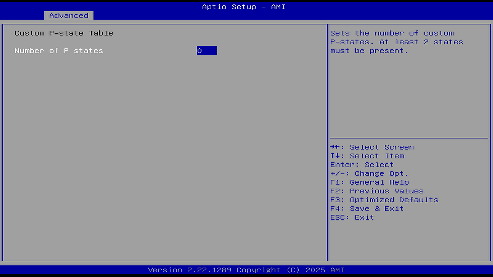

#### Number of custom P states

设置自定义 P 状态（性能状态）的数量。至少必须存在 2 个状态。P 状态越多频率调节越精细化。

0 代表禁用此选项。

### EC Turbo Control Mode（EC 睿频控制模式）

选项：

Disable（禁用）

Enable（启用）

#### AC Brick Capacity（交流电源适配器容量）

选项：

90 W AC Brick

65 W AC Brick

75 W AC Brick

说明：

指定交流电源适配器（AC 适配器）容量，即交流电源适配器（AC Brick）的额定功率容量（W）

#### EC Polling Period（嵌入式控制器 EC 轮询周期）

查询（轮询）EC 状态或数据的时间间隔

数值从 1 到 255，对应时间范围为 10 毫秒到 2.55 秒（1 个计数单位 \= 10 毫秒）。

#### EC Guard Band Value（嵌入式控制器 EC 保护带值）

用于定义在执行关键操作（如电源管理、系统初始化、硬件检测等）时，嵌入式控制器（EC）允许的最大误差范围。

计数范围从 1 到 20，对应的功率范围为 1 W 到 20 W。

#### EC Algorithm Selection（嵌入式控制器算法选择）

用于选择算法的数值范围是 1 到 10。每个数值代表一种不同的嵌入式控制器（EC）运行策略。

### Energy Performance Gain（能效性能增益）

选项：

Disable（禁用）

Enable（启用）

说明：内存电源相关设置。

其具体作用尚不明确。

#### EPG DIMM Idd3N（主动待机电流）

来自数据手册的主动待机电流（Active standby current，Idd3N），单位为毫安。必须以每个 DIMM（内存条）为单位进行计算。

#### EPG DIMM Idd3P（主动掉电电流）

来自数据手册的主动掉电电流（Active power-down current，Idd3P），单位为毫安。必须以每个 DIMM（内存条）为单位进行计算。

### Power Limit 3 Settings（功耗限制 3 设置，PL3）

超短峰值功耗限制，用于极短时间内处理高强度突发工作

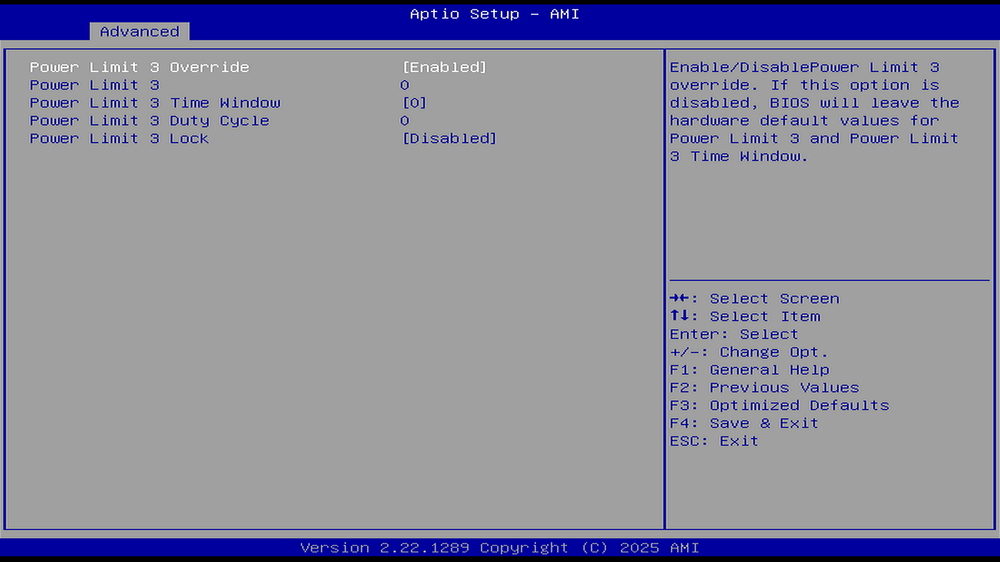

### Power Limit 3 Override

覆盖功耗限制 3，PL 3

选项参数均同 PL1。一旦超过该阈值，PL3 快速功耗限制算法将尝试通过动态限制频率来限制超过 PL3 的功耗峰值的占空比。PL3 默认是禁用的。这是一个可选设置。

### CPU Lock Configuration（CPU 锁定设置）

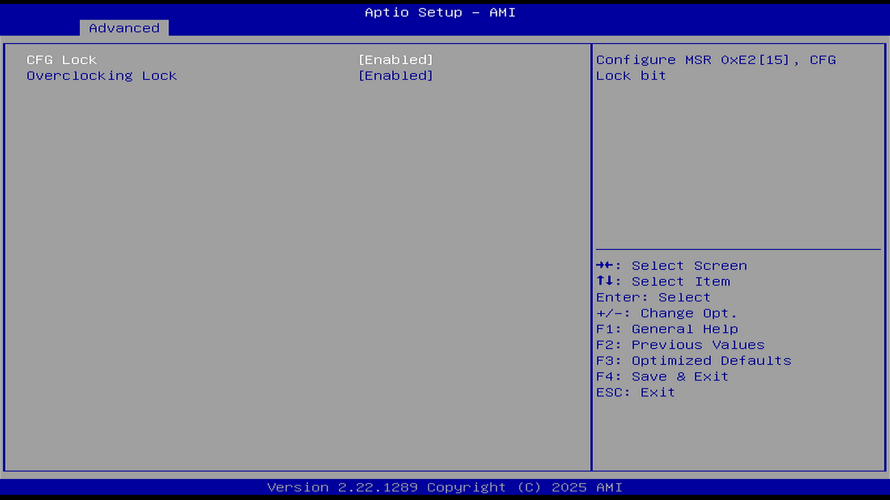

#### CFG Lock（CFG 锁）

选项：

Disable（禁用）

Enable（启用）

说明：

关闭或者开启 MSR 0xe2 寄存器，电源管理相关。控制 MSR 0xE2 的低 16 位（bits [15:0]）开关。

MSR 0xE2 是 Model Specific Register 的一个寄存器位数锁定，属于非标准寄存器，是用来控制 CPU 的工作环境和读取工作状态，例如电压、温度、功耗等非程序性指标。如果 CFG Lock 是开启状态（即 MSR 0xE2 是被锁定的），那么 MSR 0xE2 就是只读的。

如果使用黑苹果（Hackintosh），则需要关闭此选项，允许系统写入此寄存器。

Hyper-V 可能某些功能需要关闭此选项。

#### Overclocking Lock（超频锁定）

超频锁定（位于 FLEX_RATIO MSR 寄存器的第 20 位，地址为 194）

Intel 处理器带 K 才能超频。

## GT - Power Management Control（核显电源管理控制）

Intel Graphics Technology 即 GT，图形技术。

### Maximum GTT frequency（图形地址转换表最大频率）

GTT：Graphics Translation Table，图形地址转换表。

用户限制的最大 GT 频率。可选择 200 MHz（RPN）或 400 MHz（RP0）。超出范围的数值将被限制到该 SKU 支持的最小值或最大值。

### Disable Turbo GT frequency（禁用显卡睿频）

选项：

Disable（禁用）

Enable（启用）

说明：

启用：禁用显卡睿频。禁用：显卡频率不受限制。
