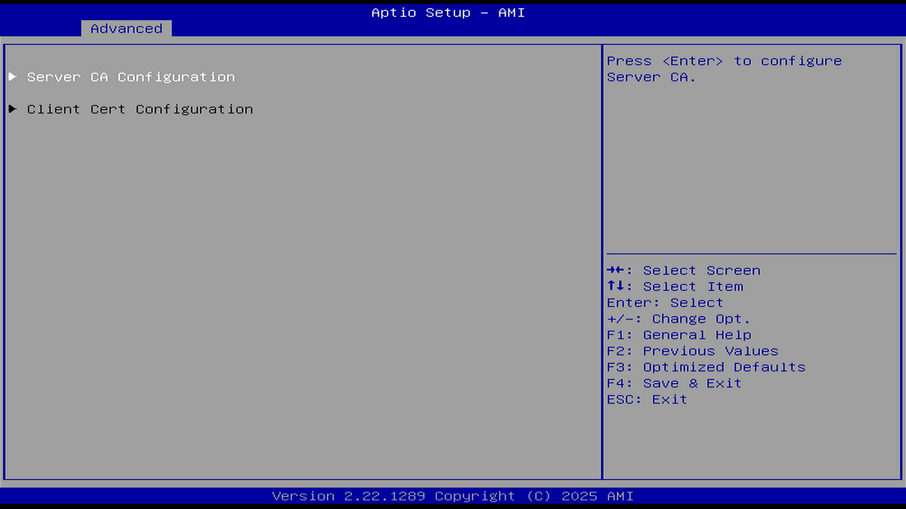
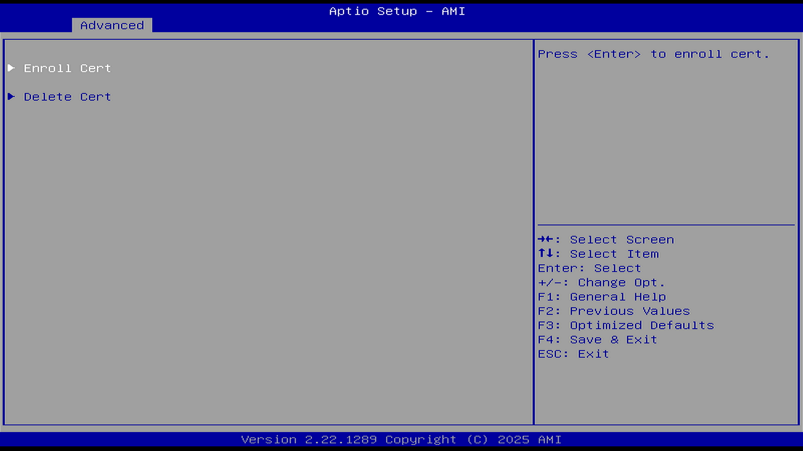
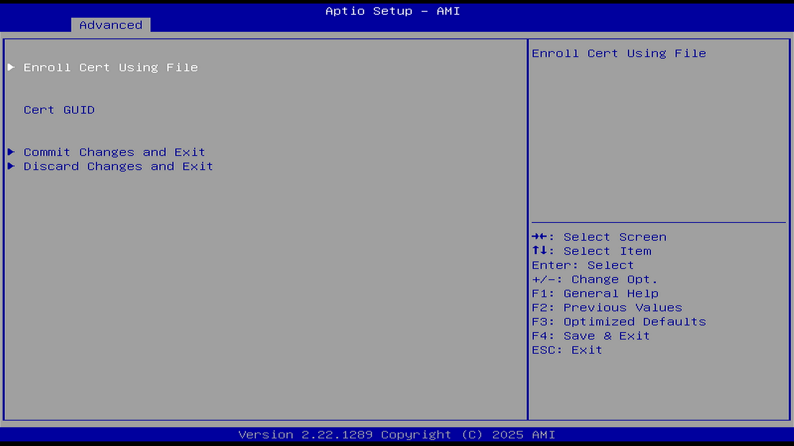
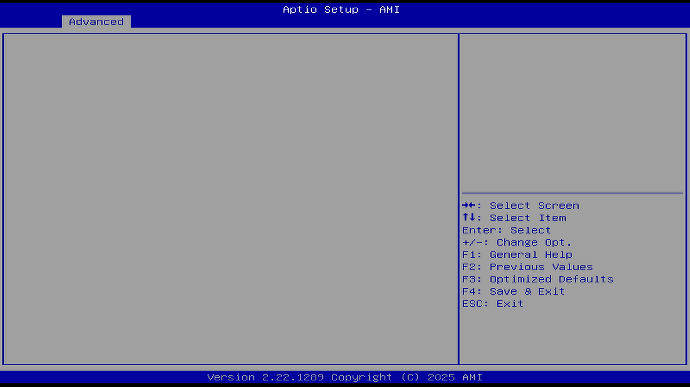

# Tls Auth Configuration（Tls 认证配置）

用以支持 IPv4 或 IPv6 HTTP 启动。

通过“Tls 认证配置”界面，可以进行 TLS 认证的相关配置。

TLS，Transport Layer Security，传输层安全性协议是一种广泛采用的安全性协议，旨在促进互联网通信的私密性和数据安全性。

## Server CA Configuration（服务器端 CA 设置）

服务器端 CA 证书配置菜单。

CA(Certification Authority) 认证机构：CA 是可信任的第三方机构，它负责颁发数字证书并验证证书申请者的身份。CA 是数字证书体系中的最高权威，其颁发的数字证书被广泛接受和信任。数字证书中包含了 CA 的公钥和数字签名，用于验证证书的真实性和完整性。

CA 证书是网络环境中具体身份的合法性证明。

### Enroll Cert（导入证书）

#### Enroll Cert Using File（通过文件系统导入证书）

#### Cert GUID（证书 GUID）

设置证书的 GUID（Globally Unique Identifier，全局唯一标识符）

GUID 是一种由算法生成的唯一标识。

#### Commit Changes and Exit（保存并退出）

#### Discard Changes and Exit（放弃保存并退出）

### Delete Cert（删除证书）

当存在证书时，“删除证书”界面中会显示证书列表；不存在证书时，界面则不显示内容。通过该界面，可删除已加载的证书。

## Client CA Configuration（客户端 CA 设置）

当前无可配置项。
