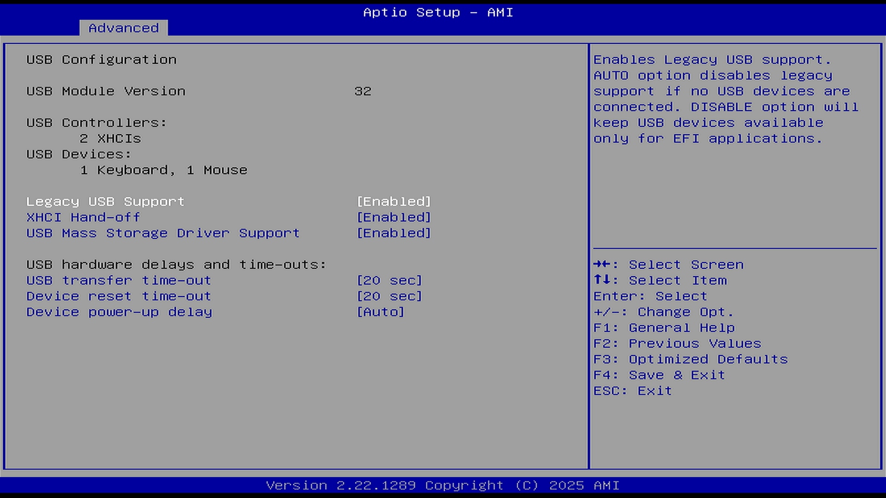

# USB Configuration（USB 配置）

## Legacy USB Support（传统引导下的 USB 支持）

选项：

Disable（禁用）

Enable（启用）

Auto（自动）

说明：

用于控制非 UEFI 环境下对 USB 设备（如鼠标和键盘）的支持行为。

AUTO 选项：如果没有连接 USB 设备，将禁用传统（Legacy）支持。

禁用选项：USB 设备仅在 EFI 应用中可用，BIOS 阶段不可使用。

## XHCI hand-off（xHCI 控制权切换）

选项：

Disable（禁用）

Enable（启用）

说明：

EHCI 用于支持 USB 2.0，xHCI 用于支持 USB 3.0。

xHCI Hand-off：USB 控制器接口控制权交接。

此选项为那些针对不支持 xHCI Hand-off 功能的操作系统提供了控制，强制开启此功能。这是针对不支持 xHCI 接管（xHCI hand-off）的操作系统的一种变通方案。XHCI 的所有权应由 XHCI 驱动程序接管。

XHCI Hand-off 选项的作用是在操作系统不支持 xHCI 的情况下，是否让 BIOS 控制 USB 3.0 控制器。

禁用 XHCI Hand-off：启动时由 BIOS 接管 USB 控制器，可能会将 USB 3.0 降为 USB 2.0，适用于原生不支持 USB 3.0 的旧系统（如 XP）。因此当系统不支持 xHCI 时，USB 3.0 设备在启动阶段或进入系统前可能无法正常使用。

启用 XHCI Hand-off：启动后由操作系统接管 USB 3.0 控制器，适用于原生支持 xHCI 的系统；如果系统对 xHCI 的支持损坏，可能导致 USB 设备无法使用。

## USB Mass Storage Driver Support（USB 大容量存储驱动支持）

选项：

Disable（禁用）

Enable（启用）

说明：

用于控制 BIOS/UEFI 对 USB 大容量存储设备（如 U 盘、移动硬盘）的支持。

关闭后无法从 USB 启动系统，即无法使用 USB 设备安装系统。

## USB hardware delays and time-outs:（USB 硬件延迟和超时）

设置 USB 传输控制信息、中断信息的超时时间。

### USB Transfer time-out（USB 传输超时）

选项（单位 sec 是秒）：

1 sec

5 sec

10 sec

20 sec

说明：

设置控制传输、批量传输和中断传输的超时时间。

### Device reset time-out（设备恢复超时）

选项（单位 sec 是秒）：

10 sec

20 sec

30 sec

40 sec

说明：

USB 大容量存储设备启动命令超时时间。遇到老旧或启动较慢的 USB 存储设备时，可适当增加超时时间。

如果设备在该时间内未响应启动命令，系统会判定设备启动失败，可能导致设备无法正常识别或使用。

### Device power-up delay（设备上电延迟）

选项：

Auto（自动）

Manual（手动）

说明：

设置设备在正确向主机控制器报告自身之前所允许的最长时间。

“Auto”模式使用默认值（对于根端口为 100 毫秒，对于集线器端口则采用集线器描述符中的延迟值）。

即：

- 在系统启动或设备初始化时，设置等待设备完成上电准备的时间。

- 确保设备有足够时间完成内部启动过程，避免因为过早访问导致识别失败或异常。

### Device power-up delay in seconds（设备上电延迟的秒数）

选项：

1-40（单位秒）

说明：

此选项依赖 Device power-up delay（设备上电延迟）。

## Port 60/64 Emulation（端口 60/64 仿真）

选项：

Disable（禁用）

Enable（启用）

说明：

启用或禁用端口 60/64 仿真支持。端口 60/64 是传统键盘控制器的 I/O 端口，某些旧操作系统依赖该端口进行键盘输入处理。

## Mass Storage Devices（大容量存储设备）

显示已连接的 USB 大容量存储设备列表。仅当安装了 USB 存储设备时此项才会出现。

## PCIE Tunneling over USB4（USB4 上的 PCIe 隧道）

选项：

Disable（禁用）

Enable（启用）

说明：

启用或禁用 USB4 上的 PCIe 隧道功能。USB4 支持 PCIe 协议隧道，允许通过 USB4/Thunderbolt™ 接口连接外部 PCIe 设备（如外置显卡、外置 NVMe 存储等）。该选项为 USB4 规范引入的新功能。

## USB4 CM Mode（USB4 连接管理器模式）

选项：

Disable（禁用）

Enable（启用）

说明：

启用或禁用 USB4 CM（Connection Manager，连接管理器）模式。USB4 连接管理器负责建立和维护 USB4 域内的隧道连接。

## Integrated Thunderbolt™ Enable（集成 Thunderbolt™ 控制器启用）

选项：

Disable（禁用）

Enable（启用）

说明：

启用或禁用集成的 Thunderbolt™ 控制器。仅当主板集成 Intel® Thunderbolt™ 控制器或安装了 GIGABYTE Thunderbolt™ 扩展卡时该子菜单才会出现。

## Discrete Thunderbolt™ Enable（独立 Thunderbolt™ 控制器启用）

选项：

Disable（禁用）

Enable（启用）

说明：

控制主板上搭载的独立 Thunderbolt™ 控制器芯片的开关。与上述 Integrated Thunderbolt™ Enable（集成 Thunderbolt™ 控制器启用）不同，此处指主板厂商额外部署的独立 Thunderbolt™ 控制器，如 Maple Ridge（JHL8540，Thunderbolt 4）或 Barlow Ridge（JHL9480，Thunderbolt 5）。启用后独立控制器对操作系统可见，可提供额外的 Thunderbolt™ 端口或更高带宽；禁用后独立控制器不工作。该选项仅在主板实际搭载独立 Thunderbolt™ 控制器时有效。

参见：英特尔公司. Intel® 8000 Series Thunderbolt™ 4 Controllers[EB/OL]. [2026-07-22]. <https://www.intel.com/content/www/us/en/products/details/io/thunderbolt/thunderbolt-4-controllers.html>.

## USB4 Host Router Class Code（USB4 主机路由器类代码）

选项：

Auto（自动）

Intel USB4 Ver2

PCIe 3 Slot

说明：

提供应用于主机路由器的类代码选项，用于加载不同的驱动程序。

Auto：由 OSPM（操作系统电源管理）USB 支持决定加载的驱动。

Intel USB4 Ver2：加载 Intel® USB4 Ver2 驱动。

PCIe 3 Slot：加载操作系统内置驱动。

## Barlow Ridge to MFDP on Win10 support（Win10 下 Barlow Ridge 以 MFDP 模式运行支持）

选项：

Enabled + RTD3（启用 + 运行时 D3）

Disabled（禁用）

说明：

该选项专用于搭载 Barlow Ridge（JHL9480，Thunderbolt 5 独立控制器）的主板，控制在 Windows 10 环境下 Barlow Ridge 独立控制器是否以 MFDP（Multi-Function Device Policy，多功能设备策略）模式运行。

Windows 10 对 Thunderbolt 5 / USB4 的原生支持有限，Barlow Ridge 控制器在标准模式下可能无法在 Windows 10 下正常枚举或工作。MFDP 模式将控制器以多功能设备方式呈现，以兼容 Windows 10 的驱动栈。

Enabled + RTD3：启用 MFDP 模式，并同时启用 RTD3（Runtime D3，运行时设备电源状态 D3hot），使控制器在空闲时进入低功耗状态。

Disabled：不启用 MFDP 模式，控制器以标准方式呈现。在 Windows 11 下通常无需启用此选项。

该选项仅在 Discrete Thunderbolt™ Enable（独立 Thunderbolt™ 控制器启用）设置为 Enabled 且主板搭载 Barlow Ridge 控制器时有意义。RTD3（Runtime D3）是 PCIe 设备电源管理的一种运行时低功耗状态，允许设备在系统不进入睡眠状态时自行进入 D3hot 子状态以降低功耗。
