# PCH-IO Configuration（平台控制总线配置）

以下是 PCH-IO 配置的相关内容。

PCH，Platform Controller Hub（平台控制器中枢），即南桥。作为平台控制器中枢，PCH 负责管理各类低速和中速外设的互连，这个设置即主板 I/O 设置。

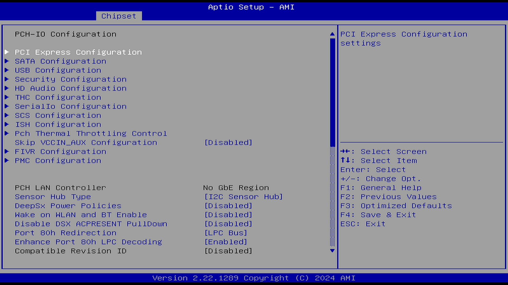

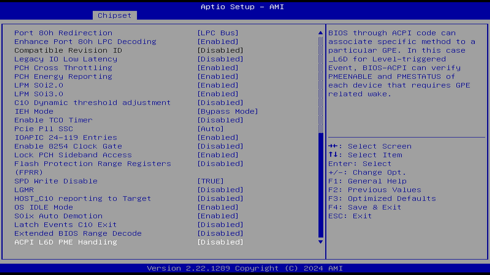

## PCI Express Configuration（PCIe 配置）

以下是 PCIe 配置的相关内容。

PCIe（Peripheral Component Interconnect Express，外围组件快速互连）是一种高带宽扩展总线，通常用于连接显卡、固态硬盘以及采集卡和无线网卡等外设。作为现代计算机系统的核心高速互连标准，PCIe 采用串行点对点拓扑结构，提供高吞吐量和低延迟的数据传输能力。

参见：Intel. 什么是 PCIe 4.0 和 5.0？[EB/OL]. [2026-03-26]. <https://www.intel.cn/content/www/cn/zh/gaming/resources/what-is-pcie-4-and-why-does-it-matter.html>.

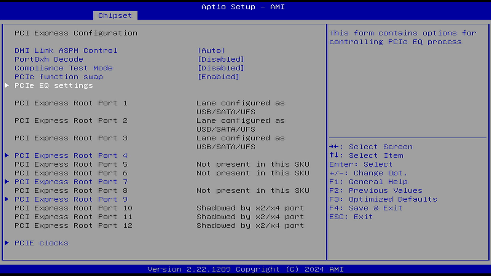

### Fia Programming（FIA 编程）

选项：

Enabled（启用）

Disabled（禁用）

说明：

对于每个 PCIe 根端口，如果该项启用，BIOS 会加载对应的 FIA（Flexible I/O Adapter）配置。平台在初始化时通过 FIA 设置决定 Root Port 的 Lane 分配、启用状态、速率协商等。

### DMI Link ASPM Control（DMI 链路 ASPM 控制）

选项：

Disabled（禁用）

L0s

L1

L0sL1

Auto（自动）

说明：

主动状态电源管理（ASPM）是一种针对 PCIe 设备的电源管理机制，旨在设备处于完全活动状态时实现节能。

此选项同时控制了 CPU 和芯片组 DMI 链路的 ASPM。

并非所有 PCIe 通道都以相同的方式工作：CPU PCIe 通道直接与 CPU 相连，而芯片组通道（即“PCH 通道”或南桥通道）通过芯片组并经由 DMI（Direct Media Interface，直接媒体接口）链路连接到 CPU。DMI 事实上就是一种 PCIe 通道。

对 DMI 链路主动状态电源管理（Active-state power management，ASPM）的控制。

PCI Express 2.0 规范规定了两种低功耗模式：L0s 和 L1 模式。

对于英特尔® Arc™ 显卡，所有高于 G2 的电源状态都需要启用 ASPM L1。这意味着必须启用 ASPM L1 和全局操作系统设置才能支持英特尔 Arc 显卡低功耗模式。

Intel 800 系列芯片组 PCH-S PCIe 控制器不支持 L0s 链路状态，仅支持 L1 子状态（L1.0/L1.1/L1.2）。

参考文献：英特尔公司. 英特尔® 处理器的直接媒体接口（DMI）是什么？[EB/OL]. (2023-05-31)[2024-01-15]. <https://www.intel.cn/content/www/cn/zh/support/articles/000094185/processors.html>.

### Port8xh Decode（PCIE 8xh 端口解码）

选项：

Enabled（启用）

Disabled（禁用）

说明：

打开或关闭 PCIe 8xh 端口解码。

PCIe`*` 根端口在设置了 MPC.P8XDE 后，会专门解码并响应地址范围为 80h 到 8Fh 的 I/O 周期。这些 I/O 周期的响应不受标准 PCI 的 I/O 基址/限制寄存器以及 I/O 空间使能字段的限制。这使得 POST 卡可以直接作为 PCI Express 设备连接到根端口，或者通过 PCI Express`*` 到 PCI 桥接器以 PCI 卡的形式连接。

所有对该地址范围的 I/O 读写操作都会被原封不动地转发到链路上。连接的设备必须能在 I/O 读操作时返回之前写入的值。BIOS 需要确保同一时刻最多只有一个根端口被启用以响应端口 8xh 范围内的 I/O 周期。

主要用于系统启动和诊断。

参见：Port 8xh Decode[EB/OL]. [2026-03-26]. <https://edc.intel.com/content/www/us/en/design/ipla/software-development-platforms/client/platforms/tiger-lake-mobile-y/intel-500-series-chipset-family-on-package-platform-controller-hub-datasheet-v/006/port-8xh-decode/>.

### Compliance Test Mode（合规测试模式）

选项：

Enabled（启用）

Disabled（禁用）

说明：

使用合规负载板时启用。

用于 PCIe 电气一致性测试的功能。

### PCIe function swap（PCIe 功能交换）

选项：

Enabled（启用）

Disabled（禁用）

说明：

当禁用时，防止 PCIe 根端口功能切换。如果启用了除第 0 功能之外的任何功能，第 0 功能仍将保持可见。

### PCIe EQ settings（PCIe 均衡设置）

#### PCIe EQ override（覆盖 PCIe 均衡配置）

选项：

Enabled（启用）

Disabled（禁用）

说明：

决定了以下选项：

#### PCIe EQ method（PCIe 均衡方式）

参见 DMI Gen4 EQ Mode（DMI Gen4 动态均衡模式）。

#### PCIe EQ mode（PCIe 均衡模式）

选项：

Use presets during EQ

Use coefficients during EQ

说明：

选择 EQ 模式。预设模式 —— 根端口将在均衡（EQ）过程中使用预设值；系数模式 —— 根端口将在均衡过程中使用系数。

#### EQ PH1 downstream port transmitter preset（在均衡第 1 阶段中下游端口发射器预设值）

选择在均衡第 1 阶段中将使用的预设值。

#### EQ PH1 upstream port transmitter present（在均衡第 1 阶段中上游端口发射器预设。）

选择在均衡第 1 阶段中将使用的预设值。

### CDR Relock（时钟数据恢复重新锁定）

参见 CDR Relock for CPU DMI（CPU DMI 的时钟数据恢复重新锁定）。

#### Enable EQ phase 2 local transmitter override（启用均衡第二阶段本地发射器覆盖）

选项：

Enabled（启用）

Disabled（禁用）

说明：

均衡第二阶段本地发射器覆盖可用于调试 PCI 设备均衡过程中的问题。

#### Number of presents or coefficients used during phase 3（在第三阶段使用的预设值或系数的数量）

选择在均衡的第三阶段将使用多少个预设值或系数。请注意，必须将列表中的所有条目设置为有效值。此字段的解释取决于 PCIe 均衡模式。

#### Preset 0

第 0 阶段是链路均衡的第一个阶段。

#### Preset 2

同上。

#### Preset 3

同上。

#### Preset 4

同上。

#### Preset 5

同上。

#### Preset 6

同上。

#### Preset 7

同上。

#### Preset 8

同上。

#### Preset 9

同上。

#### Preset 10

同上。

### Assertion on Link Down GPIOs（当 GPIO 链路下拉时发生中断）

选项：

Enabled（启用）

Disabled（禁用）

说明：

通过触发一个或多个 GPIO 引脚来发出信号通知或中断

### PCI Express Slot Selection（PCIe 插槽选择）

选项：

M2（M.2 连接器）

CEMX4 slot（4 通道 PCI Express 插槽，用于连接标准尺寸的 PCIe 扩展卡）

说明：

选择 PCIe 插槽的物理接口。

### PCI Express Root Port x（PCIe 根端口 x）

为每条单独的 PCIe 根端口设置的参数。

#### PCI Express Root Port x（PCIe 根端口 x）

选项：

Enabled（启用）

Disabled（禁用）

说明：

控制这条 PCI Express 根端口的开关。

#### Connection Type（连接类型）

选项：

Built-in（内置）

Slot（插槽）

说明：

内置设备（Built-In）：该根端口连接了一个内置设备，Slot Implemented 位（表示和当前端口相连的是一个 PCIe 插槽，而不是 PCIe 设备）将被清除。

插槽（Slot）：该根端口连接了一个用户可访问的插槽，Slot Implemented 位将被设置。

#### ASPM（主动状态电源管理）

参见 DMI Link ASPM Control（DMI 链路 ASPM 控制）。

#### L1 Substates（L1 子状态）

选项：

Disabled

L1.1

L1.1 & L1.2

说明：

PCIe L1 子状态选择。

L1 子状态是在标准 L1 低功耗状态的基础上进一步细分的多个更深层次的节能状态。启用此功能可以使 PCIe 链路进入更深层次的低功耗状态，如 L1.1 和 L1.2，从而实现更高效的电源管理。

#### L1 Low（L1 低功耗子状态）

选项：

Enabled（启用）

Disabled（禁用）

说明：

L1 低功耗子状态开关。

#### ACS（访问控制服务）

选项：

Enabled（启用）

Disabled（禁用）

说明：

ACS，Access Control Services Extended Capability，访问控制服务扩展能力

PCIe 和服务器规范中定义的访问控制服务（ACS）功能，是用于维护 IOMMU 组内隔离的硬件标准。

如果没有原生的 ACS，或者硬件供应商没有提供相反的确认，IOMMU 组内的任何多功能设备都存在暴露函数间点对点 DMA 的风险，这些 DMA 操作发生在 IOMMU 保护之外，从而使 IOMMU 组扩展到包括缺乏适当隔离的函数。

用于增强 I/O 虚拟化能力。

参见：

- Intel. A.2.2.4. Access Control Services (ACS) Capability Structure[EB/OL]. [2026-03-26]. <https://www.intel.com/content/www/us/en/docs/programmable/683059/24-3/access-control-services-acs-capability.html>. 定义 PCIe 访问控制服务的能力结构，用于隔离设备间的 DMA 访问。
- RedHat. Hardware Considerations for Implementing SR-IOV[EB/OL]. [2026-03-26]. <https://docs.redhat.com/zh-cn/documentation/red_hat_virtualization/4.2/html/hardware_considerations_for_implementing_sr-iov/index>. 讨论部署 SR-IOV 时需关注的硬件兼容性与配置要求。

#### PTM（精确时间测量）

选项：

Enabled（启用）

Disabled（禁用）

说明：

PTM，Precision Time Measurement，精确时间测量

参见：F-Tile Avalon® Streaming Intel® FPGA IP for PCI Express`*` User Guide[EB/OL]. [2026-03-26]. <https://www.intel.com/content/www/us/en/docs/programmable/683140/25-1/precision-time-measurement-ptm-58323.html>.

精确时间测量（PTM）使得多个具有独立本地时钟的组件之间能够实现精确的事件协调。通常，由于各自时钟对时间的值和变化速率的认知不同，实现这种精确协调是非常困难的。为了解决这一限制，PTM 允许组件计算其本地时间与共享的 PTM 主时间之间的关系：PTM 主时间是与 PTM 根节点相关联的独立时间域。每个 PTM 根节点为一个 PTM 层级提供 PTM 主时间。

PTM 请求者指能够作为终端点或上游端口关联的消费者使用 PTM 的功能。PTM 响应者指能够为根端口或根复合体提供 PTM 主时间的功能。PTM 根节点是 PTM 层级的 PTM 主时间来源，同时也是 PTM 响应者。F-Tile PCIe 硬件 IP 支持作为终端点模式或 PTM 请求者使用 PTM。

一种用于在 IP 和 FPGA 核架构之间进行精确时间测量的功能。

#### DPC（下行端口控制）

选项：

Enabled（启用）

Disabled（禁用）

说明：

DPC，Downstream Port Containment，下行端口控制

DPC 是 PCIe 标准的建议扩展，设计用于自动禁止发生非致命 (或致命) 错误后的链路以便防止可能扩散的数据损坏以及在软件支持时启动错误恢复。

Intel 800 系列芯片组 PCH-S 控制器不支持 DPC。

#### EDPC（增强型下行端口控制）

EDPC，Enhanced Downstream Port Containment（增强型下行端口控制）。

Intel 800 系列芯片组 PCH-S 控制器不支持 eDPC。

- Hot Plug（热插拔）

热插拔又称为带电插拔或热替换，是指在不切断设备电源的情况下，将主控板、接口板、光模块等部件插入或拔出设备。

选项：

Enabled（启用）

Disabled（禁用）

说明：

控制 PCIe 热插拔。

- URR（PCIe 不支持的请求报告）

URR，Unsupported Request Reporting，PCI Express 不支持的请求报告。用于报告不可纠正的错误状态寄存器，非致命 PCIe 错误

Enabled（启用）

Disabled（禁用）

参见：为什么使用适用于 PCI Express *的英特尔® FPGA P-Tile/H-Tile、Avalon® 流传输和 Avalon® 内存映射 IP 时，在高级错误报告（AER）中记录非严重 PCIe* 错误？[EB/OL]. [2026-03-26]. <https://www.intel.cn/content/www/cn/zh/support/programmable/articles/000080831.html>.

- FER（PCIe 设备致命错误报告）

FER，Device Fatal Error Reporting，设备致命错误报告

选项：

Enabled（启用）

Disabled（禁用）

说明：

PCI Express 设备致命错误报告。

- NFER（PCIe 设备非致命错误报告）

选项：

Enabled（启用）

Disabled（禁用）

说明：

NFER，PCI Express Device Non-Fatal Error Reporting，设备非致命错误报告

- CER（PCIe 设备可纠正错误报告）

PCIe 的错误可以分为两种类型：可纠正错误（Correctable Errors）和不可纠正错误（Uncorrectable Errors）。

参见：PowerEdge：管理可纠正错误阈值事件的第 14 代英特尔和第 15 代服务器[EB/OL]. [2026-03-26]. <https://www.dell.com/support/kbdoc/zh-cn/000194574/poweredge-%E7%AE%A1%E7%90%86%E5%8F%AF%E7%BA%A0%E6%AD%A3%E9%94%99%E8%AF%AF%E9%98%88%E5%80%BC%E4%BA%8B%E4%BB%B6%E7%9A%84%E7%AC%AC-14-%E4%BB%A3%E8%8B%B1%E7%89%B9%E5%B0%94%E5%92%8C%E7%AC%AC-15-%E4%BB%A3%E6%9C%8D%E5%8A%A1%E5%99%A8>.

选项：

Enabled（启用）

Disabled（禁用）

说明：

CER，Correctable Error Reporting（可纠正错误报告）。

- CTO（PCIe 完成超时）

TO，timeout

CT，Completion Timer，完成计时

选项：

Enabled（启用）

Disabled（禁用）

说明：

PCIe 设备发出的请求中有些请求需要 Completer 反馈 Completion，此时 Requester 会等待 Completion 再进行下一步操作。在某些异常情况下，比如配置不当、系统故障等，Requester 将无法收到或收齐 Completion。

为了不影响进一步使用，需要一种超时退出机制让 Requester 从这种等待状态恢复过来，这就是 Completion Timeout 机制（完成超时退出机制）。

参见：【PCIe】PCIe 完成超时机制[EB/OL]. [2026-03-26]. <https://www.cnblogs.com/linhaostudy/p/18958287>.

- SEFE（在发生致命错误时触发根 PCIe 系统错误）

选项：

Enabled（启用）

Disabled（禁用）

说明：

SEFE，System Error on Fatal Error，致命错误时触发系统错误。

在发生致命错误时触发根 PCIe 系统错误，通知系统发生了严重的硬件或链路故障。

- SENFE（在发生非致命错误时触发根 PCIe 系统错误）

选项：

Enabled（启用）

Disabled（禁用）

说明：

SENFE，System Error on Non-Fatal Error，非致命错误时触发系统错误。

在发生非致命错误时触发根 PCIe 系统错误

- SECE（在发生可纠正错误时触发根 PCIe 系统错误）

选项：

Enabled（启用）

Disabled（禁用）

说明：SECE，System Error on Correctable Error，发生可纠正错误时触发系统错误

在发生可纠正错误时触发根 PCIe 系统错误

- PME SCI（PCIe 的电源管理中断和系统控制中断）

参见 [维修资料] 关于电路图中的 SMI、SCI、PME#三个信号的功能解释[EB/OL]. [2026-03-26]. <https://www.chinafix.com/thread-1205171-1-1.html>.

选项：

Enabled（启用）

Disabled（禁用）

PME，Power Management Events，电源管理事件。电源管理中断。

SCI，System Control Interrupt，系统控制中断。SCI# 主要是在进入 ACPI 后，ACPI 用的中断信号。

用于控制 PCIe 的 PME 和 SCI。

- Advanced Error Reporting（高级错误报告）

选项：

Enabled（启用）

Disabled（禁用）

Advanced Error Reporting 即 AER，

每个符合 PCI Express 标准的设备都必须实现基本级别的错误管理，并且可以选择性地实现高级错误管理。PCI Express 高级错误报告功能（Advanced Error Reporting Capability，AER）是一种可选的扩展能力，可由支持高级错误控制与报告的 PCI Express 设备功能实现。

参见：P-Tile Avalon® Memory-mapped Intel® FPGA IP for PCI Express`*` User Guide[EB/OL]. [2026-03-26]. <https://www.intel.com/content/www/us/en/docs/programmable/683268/21-1-4-0-0/advanced-error-reporting-aer.html>.

#### PCIe Speed（PCIe 速率）

选项：

Auto（自动）

Gen1: PCIe 1.0 (2.5 GT/s)

Gen2: PCIe 2.0 (5.0 GT/s)

Gen3: PCIe 3.0 (8.0 GT/s)

Gen4: PCIe 4.0 (16.0 GT/s)

说明：

控制 PCIe 速率。

Intel 800 系列芯片组 PCH-S 控制器最大传输速率为 16 GT/s（Gen4），支持 14 个根端口、24 条通道。

#### Transmitter Half Swing（发送器半摆幅模式）

选项：

Enabled（启用）

Disabled（禁用）

说明：

PCIe 物理层的发送器。如何选取输出摆幅模式的方法是特定于具体实现的。

Intel 800 系列芯片组 PCH-S 控制器不支持半摆幅模式。

#### Detect Timeout（检测超时）

值：

0000-FFFF

`步长 = 0001`

单位为毫秒

说明：

参考代码等待链路退出检测状态的时间。

在假设端口无设备并可能禁用端口之前，会先检测已启用端口的状态。

#### Extra Bus Reserved（保留额外总线）

值：

0-7，步长 1

说明：

此根桥后方桥接器保留的额外总线（范围 0 到 7）。此选项提供选择保留给其他接口的总线数量

#### Reserved Memory（保留内存）

值：

1-14，步长 1

说明：

此根桥保留的内存范围（1 到 14 MB）。

#### Reserved I/O（保留 I/O）

值：

04-14，步长 4

说明：

此根桥保留的 I/O 范围（4 K、8 K、12 K、16 K 或 20 K）。

#### PCIEx CLKREQ Mapping Override（PCIe CLKREQ# 映射覆盖）

No CLKREQ

自定义数值

PCIE CLKREQ 覆盖，用于默认平台映射。设备通过 CLKREQ#管脚通知主机其需要使用时钟信号，以便退出低功耗状态或保持链路活跃。

#### PCH PCIe LTR Configuration（PCH PCIe 延迟容忍报告配置）

LTR，Latency Tolerance Reporting，延迟容忍报告

LTR 是一种新机制，使 Endpoint 能够传递其对内存读写和中断的延迟需求信息，可用于提高系统的电源管理效率。

#### LTR（延迟容忍报告）

选项：

Enabled（启用）

Disabled（禁用）

说明：

控制 LTR 开关。

- Snoop Latency Override（覆盖侦听延迟）

Disabled（禁用）

Manual（手动）

Auto（自动）

在多核 CPU 和缓存一致性系统中，“Snoop”指的是一个核心的缓存监视其他核心或外部代理（如 PCIe 设备通过 DMA）对共享内存的访问，以维护所有缓存数据的一致性。Snoop 操作需要时间，会引入延迟。这个延迟就是 Snoop Latency。

这个 BIOS 设置项不是 PCIe 设备报告的 LTR 值本身。它是系统 (具体是 SA 内的 PCIe 控制器/电源管理逻辑) 在评估 PCIe 设备 LTR 要求时，需要额外考虑的一个内部延迟补偿值。

参见：博客园. BIOS PCIe 配置里的 LTR Snoop Latency value of SA PCIE[EB/OL]. [2026-03-26]. <https://www.cnblogs.com/wanglouxiaozi/p/18946234>.

- Non Snoop Latency Override（覆盖非侦听延迟）

Disabled（禁用）

Manual（手动）

Auto（自动）

当北桥芯片接收到非侦听读取请求时，它不会侦听处理器的缓存，而是直接从直接内存访问（DMA）缓冲区中读取数据。

#### LTR Lock（锁定 LTR）

选项：

Enabled（启用）

Disabled（禁用）

说明：

锁定 PCIe LTR 的配置。

#### Peer Memory Write（PCIe P2P DMA 点对点内存写入）

选项：

Enabled（启用）

Disabled（禁用）

说明：

Peer Memory Write，PCIe Peer-to-Peer (PCIe P2P) DMA，PCIe 点对点 DMA。

参见：Peer Memory Write Enable[EB/OL]. [2026-03-26]. <https://jasonyychiu.blogspot.com/2021/03/peer-memory-write-enable.html>.

P2P（点对点）通信可使 PCIe 设备之间无需经过内存，直接将数据传输给对方（例如 NVMe SSD ↔️ PCIe GPU），从而实现 PCIe 总线上不同设备之间的数据共享。

### PCIE clocks（PCIe 时钟）

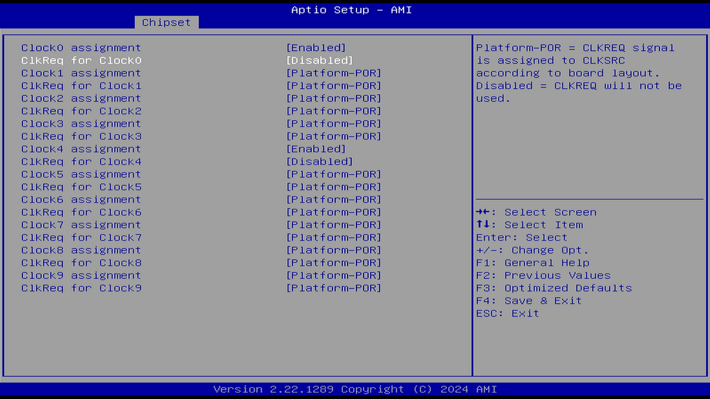

#### Clock0 Assignment（时钟 0 分配）

选项：

Platform-POR（平台上电复位）

Enabled（启用）

Disabled（禁用）

说明：

Platform-POR：时钟根据主板布局分配给 PCIe 接口或 LAN。

启用（Enabled）：即使未使用，也保持时钟启用状态。

禁用（Disabled）：关闭时钟。

禁用 clock1 会禁用 LAN 控制器，但不会禁用其根端口。

参见：What is "clock0 assignment" and "ClkReq for clock0" BIOS options?[EB/OL]. [2026-03-26]. <https://winraid.level1techs.com/t/what-is-clock0-assignment-and-clkreq-for-clock0-bios-options/104666>.

#### ClkReq for Clock0（时钟 0 的时钟请求引脚）

选项：

Platform-POR（平台上电复位）

Disabled（禁用）

说明：

Platform-POR `=` 会根据主板布局，将 CLKREQ 信号分配给 CLKSRC。

Disabled `=` 不使用 CLKREQ 信号。

PCIe 中的 CLKREQ# 管脚（Clock Request Pin，时钟请求引脚）用于管理 PCIe 链路中的时钟信号，以实现电源管理。

## SATA Configuration（SATA 配置）

以下是 SATA 配置的相关内容。

SATA，Serial Advanced Technology Attachment，串行 ATA，串行高级技术附件。SATA 是一种基于行业标准的串行硬件驱动器接口。

### SATA Controller(s)（SATA 控制器）

选项：

Enabled（启用）

Disabled（禁用）

说明：

控制 SATA 控制器的启用或禁用。

### SATA Mode Selection（SATA 模式选择）

选项：

AHCI（Advanced Host Controller Interface，高级主机控制接口）

RAID（Redundant Array of Independent Disks，独立磁盘冗余阵列）

IDE（Integrated Drive Electronics，集成驱动电子接口）

说明：

需要操作系统支持，否则可能无法启动。选择存储设备与计算机连接的标准方式。

一般只有非常老旧的计算机才会使用 IDE 接口。

现代计算机通常使用 AHCI 模式。大部分非 Windows 操作系统（本身也需要驱动才能支持）都与 RAID 模式不兼容（但是英特尔快速存储技术需要 RAID 模式）。

并且该 RAID，一般称作 Fake-RAID/hardware-assisted software RAID，伪 RAID，不是真正的硬 RAID。这种情况下可能需要英特尔快速存储技术（RST）驱动才能正常使用。

Intel 800 系列芯片组 SATA 控制器不支持 IDE 传统模式，仅支持 AHCI 与 RAID 模式。

参见：Install Arch Linux with Fake RAID[EB/OL]. [2026-03-26]. <https://wiki.archlinuxcn.org/wiki/Install_Arch_Linux_with_Fake_RAID>.

### SATA Test Mode（SATA 测试模式）

选项：

Enabled（启用）

Disabled（禁用）

说明：

BIOS 的 SATA 测试模式（回环）

启用或禁用 SATA 接口的回环测试模式的选项。该模式主要用于硬件验证和调试，帮助开发人员检查 SATA 接口的功能和性能。

### Aggressive LPM Support（主动进入链路低功耗状态 ALPM 支持）

选项：

Enabled（启用）

Disabled（禁用）

说明：

Aggressive LPM Support (ALPM)。

使 PCH 主动让 SATA 总线进入链路低功耗状态。此功能仅在 AHCI 模式下受支持。

当该功能设置为 Enabled（启用）时，SATA AHCI 控制器将管理 SATA 链路的电源使用。在 I/O 长时间无活动的情况下，控制器会将链路置于低功耗模式；而当 I/O 活动恢复时，控制器会将链路恢复为活动状态。该选项可设为 Disabled（禁用）或 Enabled（启用）。

### Software Preserve（软件保留）

Unknown（未知）

此项不可设置。

其具体作用尚不明确。

### Port x（端口 x）

选项：

Enabled（启用）

Disabled（禁用）

说明：

控制特定的 SATA 端口开关。

### Hot Plug（热插拔）

参见 PCIe 下面的 Hot Plug（热插拔）。

### Configured as eSATA（配置为 eSATA）

选项：

此项不可设置。

说明：

Hot Plug support。支持热插拔

eSATA 的全称是 External Serial ATA（外部串行 ATA），它是 SATA 接口的外部扩展规范。换言之，eSATA 就是“外置”版的 SATA，它是用来连接外部而非内部 SATA 设备。

参见：eSATA 接口的介绍和使用[EB/OL]. [2026-03-26]. <https://www.dell.com/support/kbdoc/zh-cn/000127522/esata-%E6%8E%A5%E5%8F%A3%E7%9A%84%E4%BB%8B%E7%BB%8D%E5%92%8C%E4%BD%BF%E7%94%A8>.

### External（外置）

选项：

Enabled（启用）

Disabled（禁用）

将此端口标记为外置端口。启用或禁用对外部 SATA 设备的支持。

### Spin Up Device（启动设备转动）

选项：

Enabled（启用）

Disabled（禁用）

说明：控制 PCH 是否初始化该设备。选择 [Enabled] 将在边沿检测从 0 变为 1 时，开始为设备执行 COMRESET 初始化顺序。

### SATA Device Type（SATA 设备类型）

选项：

Hard Disk Drive，HDD，机械硬盘

Solid State Drive，SSD，固态硬盘

说明：

使用此功能可指定 SATA 接口连接的硬盘类型。

### Topology（拓扑结构）

选项：

Unknown（未知）

ISATA

Flex-灵活模式

Direct connect：直连

M2: M.2

说明：

物理硬件接口。识别 SATA 拓扑结构类型。

### SATA Port 0 DevSlp（SATA 端口 0 的设备休眠）

选项：

Enabled（启用）

Disabled（禁用）

说明：

启用/禁用 SATA 端口 0 的 DevSlp（设备休眠）功能。要使 DevSlp 正常工作，硬盘和 SATA 端口都必须支持 DevSlp 功能，否则可能会出现意外行为。启用前请确认主板设计是否支持此功能。

设备睡眠（或 DevSleep / DevSlp）是某些 SATA 设备中的一种新功能，它允许设备进入低功耗的“设备睡眠”状态。例如，在 DevSleep 模式下，Intel® 固态硬盘 Pro 2500 系列（2.5 英寸）的功耗仅为 5 毫瓦，而处于空闲状态时的功耗为 55 毫瓦。

设备睡眠是 SATA 标准的一部分，理论上所有 SATA 设备（无论固态硬盘还是机械硬盘）均应支持该功能。

参见：什麼是 dev 睡眠功能以及如何禁用 dev 睡眠功能[EB/OL]. [2026-03-26]. <https://www.intel.com.tw/content/www/tw/zh/support/articles/000024170/memory-and-storage.html>.

### DITO Configuration（设备睡眠空闲超时配置）

选项：

Enabled（启用）

Disabled（禁用）

说明：

DITO，Device Sleep Idle Timeout（设备睡眠空闲超时）。

DITO 是指某个端口在硬件可以自动进入 DevSleep 状态之前必须保持空闲的时间。

参见：AHCI 1.3.1 Device Sleep Technical Proposal[EB/OL]. [2026-03-26]. <https://www.intel.com/content/dam/www/public/us/en/documents/technical-specifications/serial-ata-ahci-tech-proposal-rev1_3_1.pdf>.

### DITO Value（设备睡眠空闲超时值）

设置 DITO 值。这是一个最低的时间要求，但不意味着达到此时间就睡眠。

### DM Value（设备睡眠最小检测时间）

DM，Device Sleep Minimum Detection Time（DMDT），设备睡眠最小检测时间

在判定链路进入 DevSleep 前需要维持 DEVSLP 信号的最小检测时间。空闲的时间达到此值就会进入睡眠状态。

## USB Configuration（USB 配置）

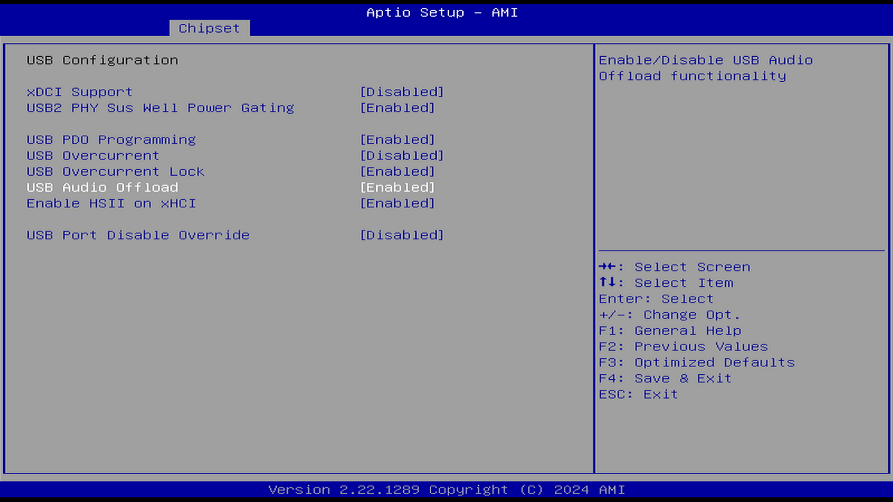

### XDCI Support（XDCI 支持）

选项：

Enabled（启用）

Disabled（禁用）

说明：

xDCI，Extensible Device Controller Interface，可扩展设备控制器接口。

用于支持 USB OTG 设备。

可扩展设备控制器接口（Extensible Device Controller Interface，简称 xDCI）是一种接口规范，定义了用于通用串行总线（USB 3）的设备控制器，该控制器能够与兼容 USB 1.x、2.0 和 3.x 的设备进行通信。

当计算机作为设备连接到另一台计算机时（例如，平板电脑连接到台式机），xDCI 控制器将在设备端被激活，并与另一台计算机的主机进行通信。

xDCI 控制器支持的最大链路速率为 USB 3.2 Gen 1x1（5 Gbps）。

注意：这些控制器作为独立的 PCI 功能集成在处理器芯片内部，用于支持具备 USB-C`*` 功能的端口。

参见：12th Generation Intel® Core™ Processors[EB/OL]. [2026-03-26]. <https://edc.intel.com/content/www/tw/zh/design/ipla/software-development-platforms/client/platforms/alder-lake-desktop/12th-generation-intel-core-processors-datasheet-volume-1-of-2/011/extensible-device-controller-interface-xdci/>.

### USB2 PHY Sus Well Power Gating（USB 2.0 物理层的 Sus Well 电源门控）

选项：

Enabled（启用）

Disabled（禁用）

说明：

此项对 PCH-H 无影响，用于控制 USB 2.0 物理层的 Sus Well 电源门控。

节能选项。

### USB PDO Programming（USB PDO 编程）

选项：

Enabled（启用）

Disabled（禁用）

说明：

PDO，Port Disable Override，端口禁用覆盖

此策略选项设置后，BIOS 会在 PEI 阶段配置端口禁用覆盖（Port Disable Override，PDO）寄存器。

如果禁用此选项，BIOS 将不会在 PEI 阶段配置 PDO，并保持 PDO 寄存器未锁定，以便后续进行配置。

若禁用此选项，则平台代码必须在启动操作系统之前自行设置该寄存器。

### USB Overcurrent（USB 过流）

选项：

Enabled（启用）

Disabled（禁用）

说明：

选择“Disabled”（禁用）将进行基于引脚的调试。如果启用了基于引脚的调试但未禁用 USB 过流功能，USB DbC（USB Debug Class）将无法正常工作。英特尔 DCI DbC 可通过 USB 端口调试英特尔 x86 平台。

### USB Overcurrent Lock（USB 过流锁定）

选项：

Enabled（启用）

Disabled（禁用）

说明：

可防止电流超过预设的最大限流值。

选择“Enabled”（启用）表示使用过流功能。启用此项后，XHCI 控制器将读取并使用过流引脚映射数据。

此选项用于控制 USB 是否应将过流引脚映射编程到 xHCI 控制器中。

禁用此功能将关闭过流检测功能。

过流引脚映射数据包含在各端口结构中（例如 USB30_PORT_CONFIG 的 OverCurrentPin 字段）。

在默认情况下，过流功能应保持启用，仅在 OBS 调试使用时禁用。

启用：将在相应的 xHCI 控制器寄存器中编程 USB 过流引脚映射

禁用：清除过流引脚映射，允许 OBS 使用过流引脚

### USB Audio Offload（USB 音频卸载）

选项：

Enabled（启用）

Disabled（禁用）

说明：

硬件卸载的音频处理允许在计算机的主 CPU 之外执行主要音频处理任务。简而言之，这是一项使用声卡进行的音频硬件加速功能。音频处理的大部分工作不再交由 CPU 来完成，而是由音频硬件进行处理。

参见：Hardware-Offloaded 音频处理[EB/OL]. [2026-03-26]. <https://learn.microsoft.com/zh-cn/windows-hardware/drivers/audio/hardware-offloaded-audio-processing>.

### Enable HSII on xHCI（对 xHCI 启用 HSII）

选项：

Enabled（启用）

Disabled（禁用）

说明：

HSII, HS Interrupt IN Alarm

启用/禁用 HSII 功能。启用该功能可能会导致功耗增加。

其具体作用尚不明确。参见：TigerLake Intel® Firmware Support Package (FSP) Integration Guide[EB/OL]. [2026-03-26]. <https://raw.githubusercontent.com/intel/FSP/master/TigerLakeFspBinPkg/Docs/TigerLake_FSP_Integration_Guide.pdf>.

### xHCI Compliance Mode（xHCI 合规模式）

选项：

Enabled（启用）

Disabled（禁用）

说明：

xHCI（eXtensible Host Controller Interface）是 USB 3.0 及更高版本的主机控制器接口规范。

合规模式用于测试 USB 控制器和设备是否符合 USB 标准规范，通常用于硬件开发和调试阶段。

### USB3 Link Speed Selection（USB3 链路速率选择）

GEN1: 5 Gbps

GEN2: 10 Gbps

说明：

设置 USB3 链路速率

### USB Port Disabled Override（USB 端口禁用覆盖）

选项：

Disabled（禁用）

Select Per-Pin（逐引脚选择）

说明：

有选择地启用或禁用相应的 USB 接口，使其是否向控制器报告设备连接状态。

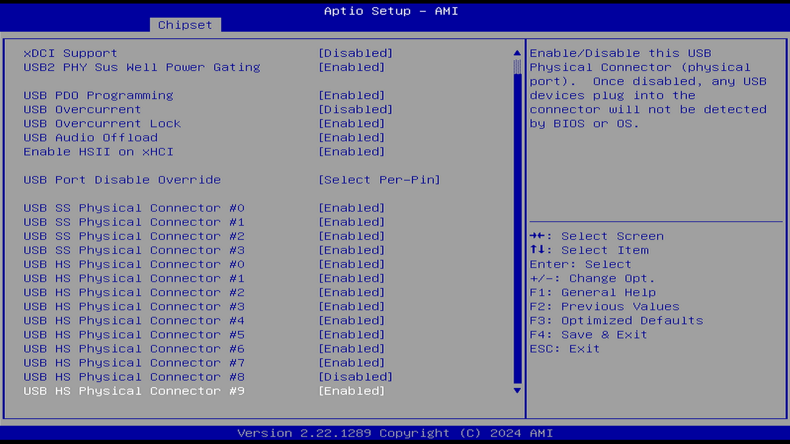

以上重复选项不再赘述。

#### USB SS Physical Connector #0（USB 3.0 物理连接 0 号）

选项：

Enabled（启用）

Disabled（禁用）

说明：

SS，SuperSpeed，超速，代表 USB 3.0 规范

启用或禁用此 USB 物理连接器（物理端口）。一旦禁用，插入该连接器的任何 USB 设备都不会被 BIOS 或操作系统检测到。

#### USB HS Physical Connector #0（USB 2.0 物理连接 0 号）

选项：

Enabled（启用）

Disabled（禁用）

说明：

HS，High Speed，高速，代表 USB 2.0 规范

启用或禁用此 USB 物理连接器（物理端口）。一旦禁用，插入该连接器的任何 USB 设备都不会被 BIOS 或操作系统检测到。

## Security Configuration（安全配置）

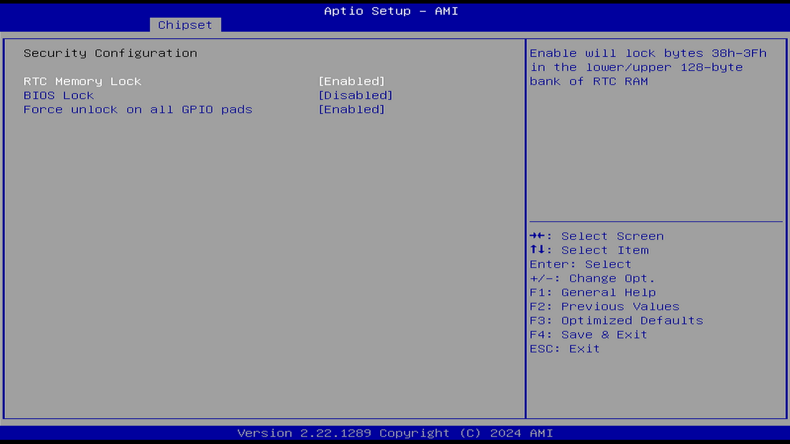

### RTC Memory Lock（RTC 内存锁定）

选项：

Enabled（启用）

Disabled（禁用）

说明：

实时时钟内存锁定

用于保护存储在 RTC RAM 中的特定内存区域。启用后将锁定 RTC RAM 的低/高 128 字节区块中的 38h 到 3Fh 字节。防止未经授权的访问和修改。

启用后可能无法修改主机或 RTC 中的时间。

### BIOS Lock（BIOS 锁定）

选项：

Enabled（启用）

Disabled（禁用）

说明：

启用此功能是确保闪存的 SMM（系统管理模式）保护所必需的。启用此功能后，只有在 SMM 中运行的代码才能修改 BIOS 区域。

启用后无法使用工具刷写/更新 BIOS。

### Force unlock on all GPIO pads（强制解锁所有 GPIO 引脚）

选项：

Enabled（启用）

Disabled（禁用）

说明：

启用后，BIOS 将强制所有 GPIO 引脚处于解锁状态。

黑苹果可能会用到此选项，否则触控板可能无法使用。

## HD Audio Configuration（HDA 高清音频配置）

选项：

Enabled（启用）

Disabled（禁用）

说明：

HD Audio，HDA，高清音频，是平台上的音频子系统，并不等同于核显自带声卡。

控制 HD-Audio 设备的检测。启用后，以下相关的菜单项将会出现。

以下重复选项不列出。

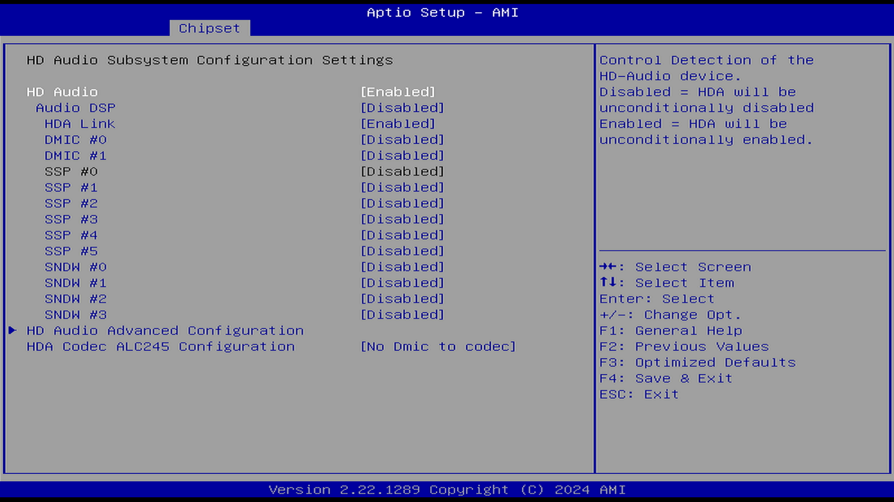

### Audio DSP（音频数字信号处理器）

选项：

Enabled（启用）

Disabled（禁用）

说明：

DSP，Digital Signal Processors，数字信号处理器。

控制音频数字信号处理器开关。其主要作用是对音频信号进行数字处理和优化，以提升音频效果并保持输出一致性。

#### HDA Link（HDA 链路）/ Audio Link Mode（音频链路模式）

选项：

HD Audio Link：HDA 链路

SSP (I2S)：I²S，串行音频接口

SoundWire：MIPI 协会推出的关于音频的规范

Advanced Link Config：高级链路配置

说明：

选择链接模式：

1）HDA-Link（SDIO-1），DMIC[0-1]

2）SSP[0-5]，DMIC[0-1]

3）SNDW [1-4]

4）“Advanced”模式可分别启用每个接口。

DMIC，Digital Microphone，数字麦克风。

SNDW，SoundWire。

#### DMIC #0（数字麦克风 0 号）

同上。

SSP #0 (串行音频接口 0 号)

同上。

SNDW #0（SoundWire 0 号）

同上。

### HDA-Link Codec Select（HDA 链路编解码器选择）

选项：

Platform Onboard：平台板载，主板自带的音频芯片

External Kit：外置套件

说明：

选择使用平台板载编解码器（仅安装一个 Verb 表）还是外部编解码器套件（安装多个 Verb 表）。

### HD Audio Advanced Configuration（HDA 高级配置）

HD Audio 子系统高级配置设置

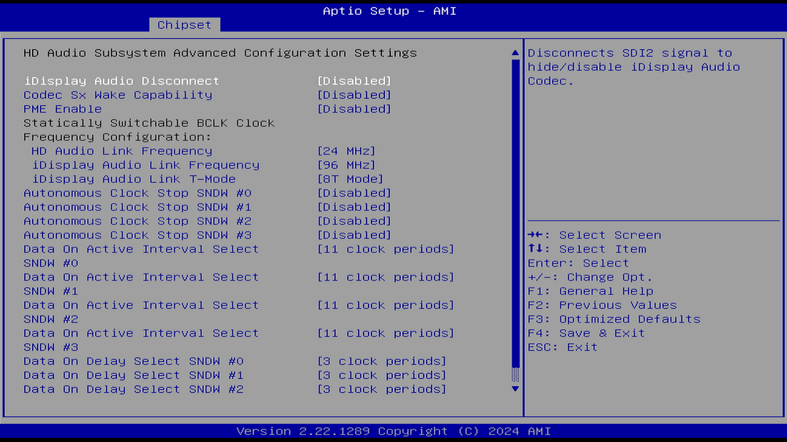

#### iDisplay Audio Disconnect（断开 iDisplay 音频）

选项：

Enabled（启用）

Disabled（禁用）

说明：

iDisplay：Integrated Display Audio，iGPU（核显）的音频。

断开 SDI2 信号以隐藏（禁用）iDisplay 音频编解码器。

控制核显接入显示器后是否启用音频。当启用此选项时，系统会断开显示器的音频连接，可能导致通过 HDMI 和 DisplayPort 输出的音频信号无法传输到显示器（即核显声卡没声音）。

#### Codec Sx Wake Capability（编解码器 Sx 唤醒能力）

选项：

Enabled（启用）

Disabled（禁用）

说明：

在 Sx（即 S1、S2、S3 等）状态下检测由编解码器发起的唤醒的能力（例如通过调制解调器编解码器）。

此设置控制音频编解码器在系统处于低功耗睡眠状态时是否能够触发系统唤醒。

#### PME Enable（启用电源管理事件）

选项：

Enabled（启用）

Disabled（禁用）

说明：

PME，Power Management Event，电源管理事件

启用在 POST 期间通过 PME 唤醒 HD Audio 控制器。

控制系统是否允许在 POST（Power-On Self-Test）期间通过 PME 事件唤醒 HD Audio 控制器。

启用此选项后，系统可以在启动过程中接收来自音频控制器的电源管理事件，从而触发唤醒操作。

#### HD Link Frequency（HD 链路频率）

选项：

6 MHz

12 MHz

24 MHz

说明：

选择 HD Audio Link 频率。仅在 HDA 编解码器支持所选频率时适用。必须选择正确的选项，否则可能无法输出音频。

#### iDisplay Audio Link Frequency（iDisplay 音频链路频率）

选项：

48 MHz

96 MHz

说明：

核显音频链路频率。

必须选择正确的选项，否则会没声音。

#### iDisplay Audio Link T-Mode（iDisplay 音频链路 T-模式）

选项：

2T：每个时钟周期传输 2 个数据位。

4T：每个时钟周期传输 4 个数据位。

8T：每个时钟周期传输 8 个数据位。

16T：每个时钟周期传输 16 个数据位。

说明：

指示 SDI 是以 1 T、2 T（CNL）模式，还是以 2 T、4 T、8 T（ICL）模式运行。

CNL：Cannon Lake 架构，部分第八代 Intel 酷睿处理器代号。

ICL：Ice Lake 架构，第十代 Intel 酷睿处理器代号

必须选择正确的选项，否则会没声音。

#### Autonomous Clock Stop SNDW #x（SoundWire 链路编号 x 的自主时钟停止）

选项：

Enabled（启用）

Disabled（禁用）

说明：

SoundWire 链路编号 x 的自主时钟停止。“x”表示链路编号。

控制是否启用 SoundWire 链路的自主时钟停止功能。当启用此功能时，特定的 SoundWire 链路（如 LINK4）在不活动时会自动停止时钟，以降低功耗。此功能适用于支持自主时钟停止的 SoundWire 编解码器。

#### Data on Active Interval Select SNDW #x（SoundWire 链路编号 x 活跃间隔期间选择时钟周期的数据）

选项：

3：在活动间隔期间使用 3 个时钟周期进行数据传输。

4：在活动间隔期间使用 4 个时钟周期进行数据传输。

5：在活动间隔期间使用 5 个时钟周期进行数据传输。

6：在活动间隔期间使用 6 个时钟周期进行数据传输。

说明：

选择在 SoundWire 链路的活动间隔期间传输数据的时钟周期数。配置取决于具体设备。

#### Data on Delay Select SNDW #x（SoundWire 链路编号 x 的延迟选择时钟周期数据）

选项：

2：在活动间隔期间使用 2 个时钟周期进行数据传输。

3：在活动间隔期间使用 3 个时钟周期进行数据传输。

说明：

该设置允许用户为指定的 SoundWire 链路（例如 SNDW #1、SNDW #2 等）配置数据传输的延迟周期数。配置取决于具体设备。

### HDA Codec ALC245 Configuration（HDA 编解码器 ALC245 配置）

选项：

No Dmic to codec（不配置数字麦克风）

4 Dmic to codec（4 个数字麦克风通道）

2 Dmic to codec（2 个数字麦克风通道）

说明：

配置数字麦克风接入 ALC245

## THC Configuration（触控主机控制器配置）

THC，Touch Host Controller，触控主机控制器

触控主机控制器（Touch Host Controller）是芯片组（PCH）中的一个 IP 模块，用于与触控设备（例如：触控屏、触控板等）进行通信。

THC-SPI 不适用于 Intel Core Ultra 200S 系列桌面处理器平台。

参见：Intel Touch Host Controller (THC)[EB/OL]. [2026-03-26]. <https://docs.kernel.org/hid/intel-thc-hid.html>.

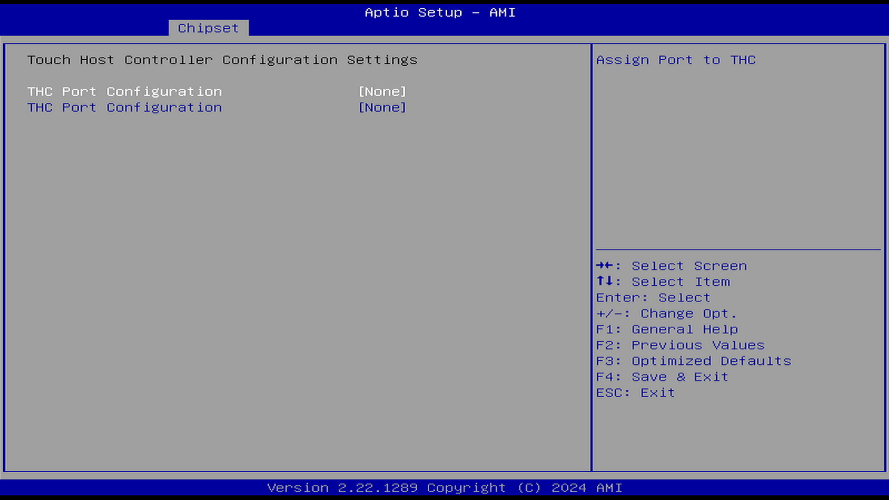

### THC Port Configuration（触控主机控制器端口配置）

选项：

None（无）

THC0（触控主机控制器端口 0）

说明：

为触控主机控制器分配端口。

## SerialIo Configuration（串行 IO 配置）

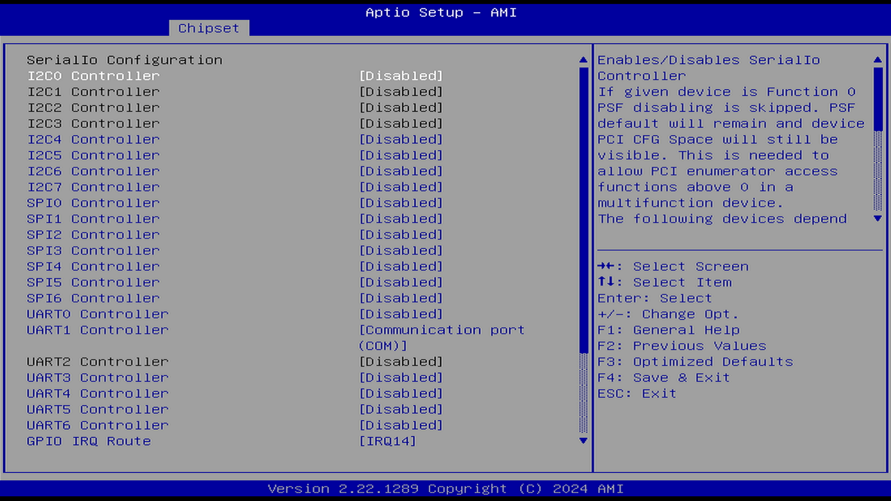

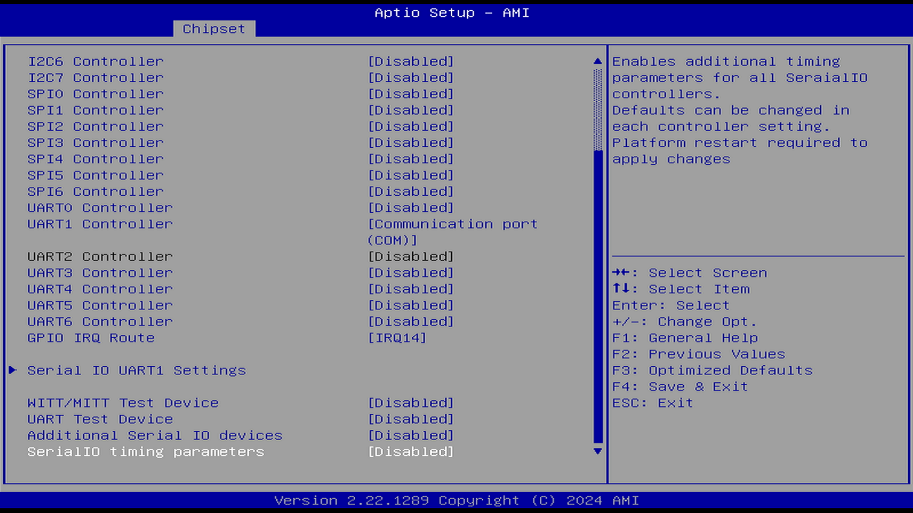

Intel 800 系列芯片组在 Serial I/O 子系统中新增 I3C 控制器（符合 MIPI I3C HCI 规范），支持 2 条 I3C 总线，向后兼容 I²C，支持动态地址分配、带内中断和热插拔。ISH（Integrated Sensor Hub）亦升级至 5.6 版本，ISH 接口新增 I3C 支持。

### I2C3 Controller（I²C3 控制器）

选项：

Enabled（启用）

Disabled（禁用）

说明：

以下设备相互依赖：I2C0 和 I2C1-2-3。用于连接低速外围设备。

控制 I²C3 总线开关。触摸屏、触摸板、RTC 等可能会用到。

### SPI1 Controller（SPI1 控制器）

选项：

Enabled（启用）

Disabled（禁用）

说明：

以下设备相互依赖：UART0、UART1 和 SPI0-1

控制 SPI1 总线开关。用于连接高速外围设备。

### SPI2 Controller（SPI2 控制器）

选项：

Enabled（启用）

Disabled（禁用）

说明：

依赖于：PCI 模式下的热管理子系统。如果启用了 PSE SPI0、PWM 或 TGPIO，则 SPI2 将被禁用。

控制 SPI2 总线开关。

用于连接高速外围设备。

### UART0 Controller（串口 0 控制器）

选项：

Enabled（启用）

Disabled（禁用）

说明：

控制串口 0 开关。

以下设备相互依赖：UART0、UART1 和 SPI0-1

当以下情况出现时，UART0（00:30:00）无法被禁用：子设备被启用，例如 CNVi 蓝牙（`_SB.PC00.UA00.BTH0`）

当以下情况出现时，UART0（00:30:00）无法被启用：启用了 I²S 音频编解码器（`_SB.PC00.I2C0.HDAC`）

### UART1 Controller（串口 1 控制器）

选项：

Enabled（启用）

Disabled（禁用）

Comm. Port (COM)

说明：

用于与外部设备进行串行通信。

以下设备相互依赖：UART0、UART1 和 SPI0-1

### GPIO IRQ Route（GPIO 中断路由）

选项：

IRQ14

IRQ15

说明：

将所有 GPIO 路由到一个中断。

### Serial IO I2Cx Settings（串行 IO I²Cx 设置）

查看 I²Cx 设置。

### Serial IO SPIx Settings（串行 IO SPIx 设置）

查看 SPIx 设置。

### Serial IO UARTx Settings（串行 IO 串口 x 设置）

查看串口 x 设置。

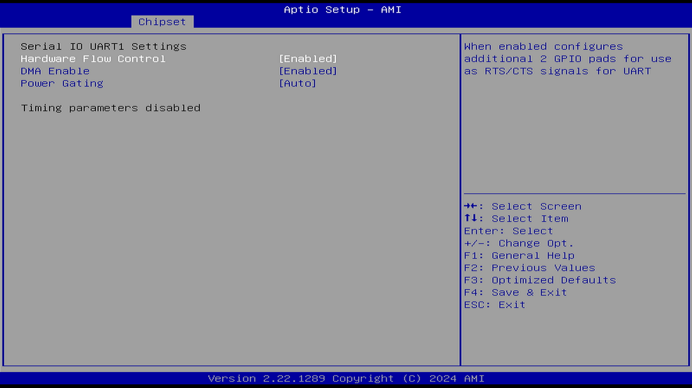

#### Hardware Flow Control（硬件流控）

选项：

Enabled（启用）

Disabled（禁用）

说明：

启用后，将额外配置两个 GPIO 引脚，用作 UART 的 RTS/CTS 信号支持 UART 硬件流控。流控本身可以控制数据传输的进度，进而防止数据丢失。

参见：什么是硬件流控制[EB/OL]. [2026-03-26]. <https://www.cnblogs.com/liyu925/p/4671911.html>.

#### DMA Enable（启用 DMA）

选项：

Enabled（启用）

Disabled（禁用）

说明：

启用：操作系统的 UART 驱动将在可能的情况下使用 DMA。

禁用：操作系统的 UART 驱动将强制使用 PIO 模式。

PIO，The Programmed Input/Output，编程输入输出。关闭后由 PIO 设计实例执行从主机处理器到目标器件的内存传输。

#### Power Gating（电源门控）

选项：

Enabled（启用）支持休眠/唤醒

Disabled（禁用）不节能，设备始终工作

Auto（自动）

说明：

禁用（Disabled）：不支持 `_PS0` / `_PS3`，设备在初始化后会停留在 D0 状态。

启用（Enabled）：启用 `_PS0` 和 `_PS3`，用于支持将设备从复位状态中恢复。

自动（Auto）：如果设备在第一次电源门控（PG）之前就已初始化，通过 ACPI 自动检测 `_PS0` 和 `_PS3`。

如果设备已经被使用（通过 DBG2），则禁用电源门控（PG）。

### WITT/MITT I2C Test Device（WITT/MITT I²C 测试设备）

选项：

Enabled（启用）

Disabled（禁用）

说明：

启用 SIO（Super I/O，超级 I/O）I²C WITT 设备，并选择使用的控制器。

Windows I²C 测试工具（Windows I²C Test Tool，WITT）和多接口测试工具（Multi-Interface Test Tool，MITT）是一种测试工具，用于验证简单外围总线的硬件和软件。

### WITT/MITT SPI Test Device（WITT/MITT SPI 测试设备）

选项：

Enabled（启用）

Disabled（禁用）

说明：

启用 SIO SPI WITT 设备，并选择使用哪个控制器。

### UART Test Device（串口测试设备）

选项：

Enabled（启用）

Disabled（禁用）

说明：

启用 SIO UART 测试设备，并选择使用哪个控制器。

### LPSS Device D3 State（LPSS 设备 D3 状态）

选项：

Enabled（启用）

Disabled（禁用）

说明：

操作系统启动前的 LPSS D3 状态（D3 是低功率设备的最低功率状态）。就是让该设备在 OS 启动前处于哪种子状态，影响其初始化与唤醒行为。

LPSS，Low Power Subsystem，低功率子系统。

参考文献：Microsoft. 设备低功率状态[EB/OL]. (2024-01-15)[2024-01-15]. <https://learn.microsoft.com/zh-cn/windows-hardware/drivers/kernel/device-sleeping-states>.

### Additional Serial IO devices（附加串行 IO 设备）

选项：

Enabled（启用）

Disabled（禁用）

说明：

启用后，ACPI 将报告连接到串行 IO 的附加设备。

启用该设置后，BIOS 会在操作系统启动之前将 LPSS（Serial IO）总线上的控制器（如 I²C、SPI、UART、GPIO 等）通过 ACPI 表（如 DSDT、SSDT）枚举并报告。这样操作系统在启动时能识别并管理这些设备。参见：ACPI Specification 概述 (基于 ACPI_Spec_6_4_Jan22)[EB/OL]. [2026-03-26]. <https://blog.csdn.net/anqi8955/article/details/120162679>.

### SerialIO timing parameters（串行 IO 时序参数）

选项：

Enabled（启用）

Disabled（禁用）

说明：

启用所有串行 IO 控制器的附加时序参数。每个控制器的默认值可在各自的设置中更改。更改此设置后需要重启才能生效。

## SCS Configuration（存储与通信子系统配置）

SCS：Storage and Communication Subsystem，存储与通信子系统。

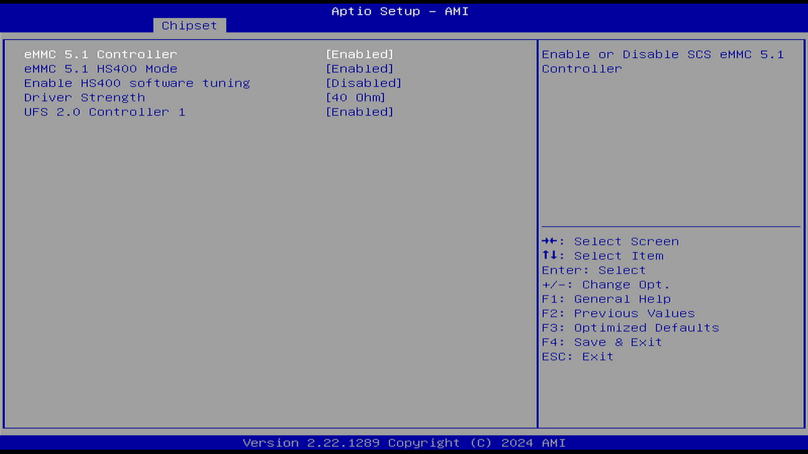

### eMMC 5.1 Controller（eMMC 5.1 控制器）

选项：

Enabled（启用）

Disabled（禁用）

说明：

控制 eMMC 5.1 控制器开关。

### eMMC 5.1 HS400 Mode（eMMC 5.1 HS400 模式）

选项：

Enabled（启用）

Disabled（禁用）

说明：

控制 eMMC 5.1 HS400 模式（总线速度）开关。

HS400，是一种 eMMC 的 HS400 数据传输模式，为 eMMC 数据总线工作于双边采样 (DDR) 模式下的数据传输模式，带宽可达 400 MB/s。

### Enable HS400 software tuning（启用 HS400 软件调优）

选项：

Enabled（启用）

Disabled（禁用）

说明：

软件调优应提高 eMMC HS400 的稳定性，但会以增加启动时间为代价。

### Driver Strength（驱动强度）

选项：

33

40

50

单位：欧姆 Ω

说明：

### UFS 2.0 Controller 1（UFS 2.0 控制器 1）

选项：

Enabled（启用）

Disabled（禁用）

说明：

UFS，Universal Flash Storage，通用闪存存储。UFS 是一种存储标准。一般应用于嵌入式。

控制 UFS 2.0 控制器 1 开关。

### SDCard 3.0 Controller（SD 卡 3.0 控制器）

选项：

Enabled（启用）

Disabled（禁用）

说明：

控制 SCS SDHC 3.0（UHS-I）控制器开关。传输速率最高可达 104 MB/s。

## ISH Configuration（整合传感器中枢配置）

ISH，Integrated Sensor Hub，整合传感器中枢。ISH 内置于 PCH 中，且依赖 PCI 总线。

Intel 800 系列芯片组搭载 ISH 5.6 版本，ISH 接口新增 I3C 支持（ISH IO：1 SPI、3 I2C、1 I3C、2 UART、12 GPIO）。

参见：Intel Integrated Sensor Hub[EB/OL]. [2026-03-26]. <https://edc.intel.com/content/www/us/en/design/products/platforms/processor-and-core-i3-n-series-datasheet-volume-1-of-2/002/ish-micro-controller/>.

ISH（集成传感器 Hub）由一个微控制器驱动运行。

- 这个微控制器核心可以在本地完成对传感器数据的聚合与处理，从而减轻主处理器负担，降低整个平台的平均功耗。
- 核心内部集成了一个本地 APIC（高级可编程中断控制器），它可以从系统的 IOAPIC 接收消息（例如中断事件）。
- 此微控制器还包含一个本地启动 ROM（Boot ROM），其中集成了用于初始化的固件（FW）。

传感器集线器（Sensor Hub）能将传感器轮询和算法处理的任务卸载给一个专用的低功耗协处理器。这能让核心处理器可以更频繁地进入低功耗模式，从而延长电池续航时间。

目前有许多厂商提供符合 HID Sensor 使用规范的外部传感器集线器。这些设备常见于平板电脑、二合一可转换笔记本电脑以及嵌入式产品中。

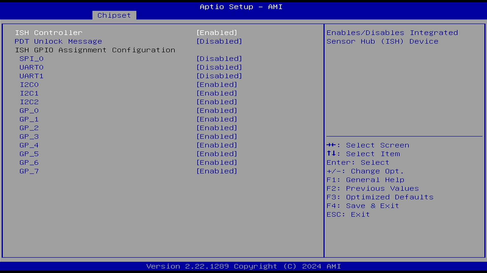

### ISH Controller（整合传感器中枢控制器）

选项：

Enabled（启用）

Disabled（禁用）

说明：

控制整合传感器中枢控制器（ISH）设备开关。

### PDT Unlock Message（解锁 PDT 消息）

选项：

Enabled（启用）

Disabled（禁用）

说明：

启用 `=` 向 ISH 发送 PDT 解锁消息。

消息发送后，该字段会自动恢复为禁用状态。

其具体作用尚不明确。

### SPI_0

选项：

Enabled（启用）

Disabled（禁用）

说明：

引脚配置说明

Enabled（启用）：表示该引脚被配置为 ISH 的原生功能。

Enabled（启用）呈灰色：表示存在冲突，例如另一个 Serial IO 控制器占用了该引脚。必须禁用该控制器才能配置此引脚为 ISH 功能。

| ISH 功能 | 与其共享的设备接口 | 适用芯片组 |
| -------- | ------------------ | ---------- |
| ISH UART0 | LPSS I2C2 | PCH-H |
| ISH UART1 | LPSS UART1 | 不区分 |
| ISH I2C2 | LPSS I2C5 或 I2C3 | PCH-LP / PCH-H |

为了防止引脚冲突让用户手动决定引脚由 ISH 使用还是由其他低功耗控制器（如 I2C、UART）使用。

### UART0

同上

### UART1

同上

### I2C0

同上

### I2C1

同上

### I2C2

同上

### GP_0

GP，GPIO

同上

### GP_1

同上

### GP_2

同上

### GP_3

同上

### GP_4

同上

### GP_5

同上

### GP_6

同上

### GP_7

同上

## Pch Thermal Throttling（PCH 热容忍）

PCH 热容忍控制。

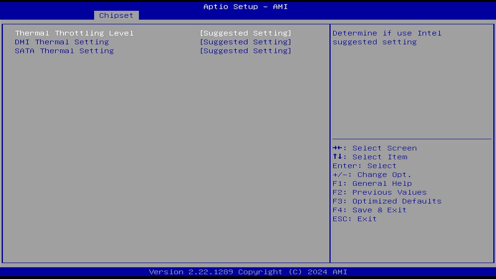

### Thermal Throttling Level（热容忍级别）

选项：

Suggested Setting（推荐设置）

Manual（手动）

说明：

以下选项仅当本项选择 Manual（手动）才会出现。

#### Thermal Throttling（热节流）

选项：

Enabled（启用）

Disabled（禁用）

说明：

控制热节流开关。

#### TT Status 13（同步电源管理状态 13）

选项：

Enabled（启用）

Disabled（禁用）

说明：

PM Sync 状态 13 将强制系统至少进入 T2 状态。

PM Sync，Power Management Synchronization，同步电源管理。

#### Thermal Throttling Lock（热节流锁定）

选项：

Enabled（启用）

Disabled（禁用）

说明：

锁定整个热节流寄存器。

#### T0 Level（T0 级别）

如果温度触发点（Trip Point Temperature）小于等于 T0 级别，系统处于 T0 状态。

#### T1 Level（T1 级别）

如果温度触发点（Trip Point Temperature）大于 T0 级别且小于等于 T1 级别，系统处于 T1 状态。

#### T2 Level（T2 级别）

如果温度触发点（Trip Point Temperature）大于 T1 级别且小于等于 T2 级别，系统处于 T2 状态。

### DMI Thermal Settings（DMI 热管理设置）

选项：

Suggested Setting（推荐设置）

Manual（手动）

说明：

以下选项仅当本项选择 Manual（手动）才会出现。

#### DMI Thermal Sensor Autonomous Width（DMI 热传感器自动数据链路宽度协商）

选项：

Enabled（启用）

Disabled（禁用）

说明：

启用/禁用由热传感器发起的自动数据链路宽度协商，即 DMI 热传感器自动数据链路宽度调整功能。

#### Thermal Sensor 0 Width（热传感器 0 数据链路宽度）

选项：

x1

x2

x4

x8

x16

说明：

当热传感器的输出为 T0 时，确定 DMI 链路宽度。

#### Thermal Sensor 1 Width（热传感器 1 数据链路宽度）

同上。

#### Thermal Sensor 2 Width（热传感器 2 数据链路宽度）

同上。

#### Thermal Sensor 3 Width（热传感器 3 数据链路宽度）

同上。

### SATA Thermal Setting（SATA 热管理设置）

选项：

Suggested Setting（推荐设置）

Manual（手动）

说明：

SATA 控制器的热节流配置，包括控制器 1-3。

以下选项仅当本项选择 Manual（手动）才会出现。

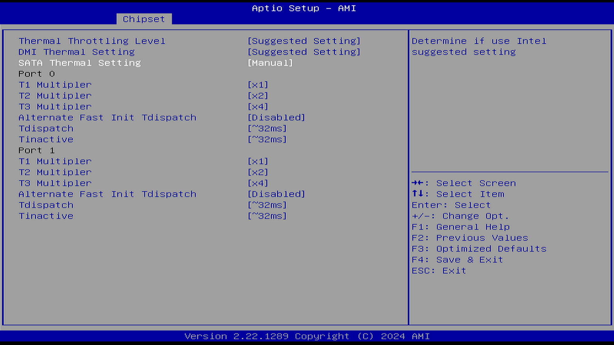

#### T1 Multiplier（T1 端口复用器）

选项：

x1

x2

x4

Disabled（禁用）

说明：

配置 SATA 端口 T1 Multiplier 值。Multiplier，SATA 端口复用器，使多路 SATA 设备能够连接到一个 SATA 主端口上。

#### T2 Multiplier（T2 端口复用器）

同上。

#### T3 Multiplier（T3 端口复用器）

同上。

#### Alternate Fast Init Tdispatch（SATA 端口备用快速初始化）

选项：

Enabled（启用）

Disabled（禁用）

说明：

打开或关闭 SATA 端口备用快速初始化。

其具体作用尚不明确。

#### Tdispatch（SATA 端口备用快速初始化值）

选项：

~32 ms

~128 ms

~8 ms

说明：

设置 SATA 端口备用快速初始化值。

其具体作用尚不明确。

#### Tinactive（SATA 端口 Tinactive 的值）

选项：

- ~32 ms
- ~128 ms
- ~8 ms

说明：

设置 SATA 端口 Tinactive 的值。

其具体作用尚不明确。

## Skip VCC_AUX Configuration（跳过 VCC_AUX 辅助电源轨配置）

选项：

Enabled（启用）

Disabled（禁用）

说明：

VCC_AUX 为辅助电源轨，用于为 FPGA 内部的各种逻辑资源模块提供电源。

参见：Cyclone® V SoC 设备中使用的 VCC_AUX 和 VCC_AUX_SHARED 电源轨是什么？[EB/OL]. [2026-03-26]. <https://www.intel.cn/content/www/cn/zh/support/programmable/articles/000086743.html>.

其具体作用尚不明确。

## FIVR Configuration（全集成电压调节模块配置）

FIVR，Fully Integrated Voltage Regulator，全集成电压调节模块。

处理器集成了多个电压轨，以降低平台的物料清单（BOM）成本，让主板设计变简单，减少了主板上的元器件。并支持处理器可以利用的额外电压级功能。

PCH 上集成了 FIVR，包括 VNN、V1P05 等电压轨，这些电压由 VCCIN_Aux 提供电源。VCCIN_Aux 还为 CPU 内的 VCCSA 电压轨供电。除了 VCCSA 的 FIVR 外，计算芯片（compute die）还集成了另外 4 个 FIVR，分别为 VCCCORE、VCCSA、VCCL2、VCCGT 和 VCCRING 供电，这些电压均从平台上的 VCCIN VR 衍生而来。每个 FIVR 都能控制特定的电压轨。

参见：Fully Integrated Voltage Regulator (FIVR)[EB/OL]. [2026-03-26]. <https://edc.intel.com/content/www/us/en/design/ipla/software-development-platforms/servers/platforms/intel-pentium-silver-and-intel-celeron-processors-datasheet-volume-1-of-2/fully-integrated-voltage-regulator-fivr/>.

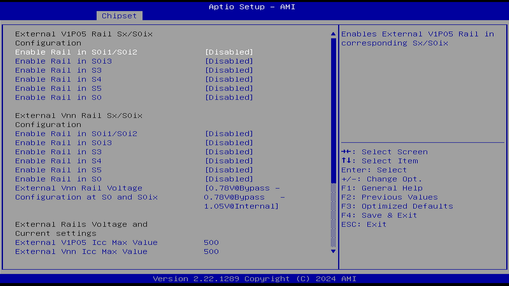

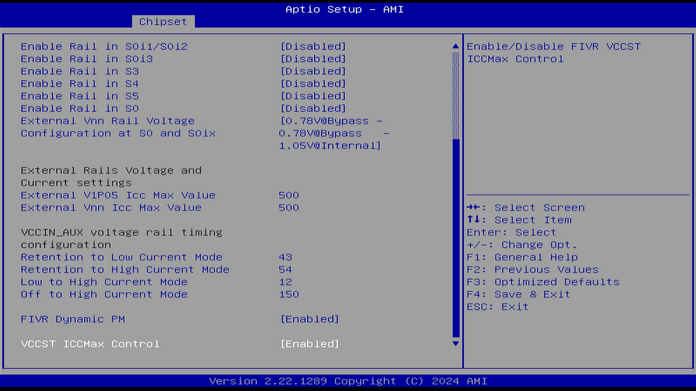

### External V1P05 Rail S×/S0ix Configuration（外部 V1P05 电压轨 S×/S0ix 配置）

V1P05，VCCRAM，属于外部旁路电压轨。

#### Enable Rail in S0i1/S0i2（启用 S0i1/S0i2 状态下的外部电压轨）

选项：

Enabled（启用）

Disabled（禁用）

说明：

启用与对应的 S×/S0ix 状态相关的外部 V1P05 电压轨。S0ix 即现代待机。

#### Enable Rail in S0i3（启用 S0i3 状态下的电压轨）

同上。

#### Enable Rail in S3（启用 S3 状态下的电压轨）

同上。

#### Enable Rail in S4（启用 S4 状态下的电压轨）

同上。

#### Enable Rail in S5（启用 S5 状态下的电压轨）

同上。

#### Enable Rail in S0（启用 S0 状态下的电压轨）

同上。

### External Vnn Rail S×/S0ix Configuration（外部 Vnn 电压轨 S×/S0ix 配置）

重复选项忽略。

#### External Vnn Rail Voltage Configuration at S0 and S0ix（外部 Vnn 电压轨在 S0 和 S0ix 状态下的电压配置）

选项：

- 0.78V@Bypass - 0.78V@Bypass - 1.05V@Internal

- 1.05V@Bypass - 1.05V@Bypass - 1.05V@Internal

说明：

为外部电压轨配置 TARGET_VOLT_LEVEL。

其具体作用尚不明确。

### External Rails Voltage and Current Settings（外部电压轨的电压与电流设置）

#### External V1P05 Icc Max Value（外部 V1P05 ICC 最大值）

外部 V1P05 电压轨的 ICC（静态供电电流）最大值，单位为毫安（mA）。接受的取值范围为 0 到 500 mA。

#### External Vnn Icc Max Value（外部 Vnn ICC 最大值）

外部 Vnn 电压轨的 ICC（静态供电电流）最大值，单位为毫安（mA）。接受的取值范围为 0 到 500 mA。

### VCC_AUX Voltage rail timing configuration（VCC_AUX 电压轨的时序配置）

指定 VCCAUX 电源轨的电压。有关当前器件系列的详细信息，请参阅该器件的数据手册。

参见：Altera® Quartus® Prime Standard Edition Settings File Reference Manual[EB/OL]. [2026-03-26]. <https://www.intel.com/content/www/us/en/docs/programmable/683084/current/vccaux-user-voltage.html>.

#### Retention to Low Current Mode（Retention 从关闭状态到低功耗模式的时间）

Retention（保留）寄存器是一种低功耗设计技术。

Retention 至低功耗模式的过渡说明如下。

从关闭状态（0 V）过渡到高电流模式电压的时间，单位为微秒（μs）。该字段的步进为 1 微秒。

#### Retention to High Current Mode（Retention 到高功耗模式的时间）

从保持模式电压（Retention Mode Voltage）过渡到高电流模式电压（High Current Mode Voltage）的时间，单位为微秒（μs）。

该字段的步进为 1 微秒。

#### Low to High Current Mode（从低功耗到高功耗模式的时间）

从低电流模式电压（Low Current Mode Voltage）过渡到高电流模式电压（High Current Mode Voltage）的时间，单位为微秒（μs）。

该字段的步进为 1 微秒。

#### Off to High Current Mode（从关闭状态到高电流模式电压的时间）

从关闭状态（0V）过渡到高电流模式电压的时间，单位为微秒（μs）。

该字段的步进为 1 微秒。

值为 0 表示禁止过渡到 0 V。该数值必须大于或等于 VccST 板上 FET 的上升时间（FET ramp time）。

### FIVR Dynamic PM（FIVR 动态功率管理器）

选项：

Enabled（启用）

Disabled（禁用）

说明：

FIVR Dynamic PM，Fully Integrated Voltage Regulators Dynamic Power Management，FIVR 动态功率管理器

利用 FIVR 内部机制（AVS、DVFS、各轨电流监控等）对系统各个电压轨进行精细控制和快速切换。

### VCCST ICCMax Control（FIVR VCCST 最大 ICC 控制）

选项：

Enabled（启用）

Disabled（禁用）

说明：

VCCST Voltage：信号维持电压。

控制 CPU 待机电压轨的最大电流上限设置。

## PMC Configuration（电源管理控制器配置）

PMC，Power Management Controller，电源管理控制器。

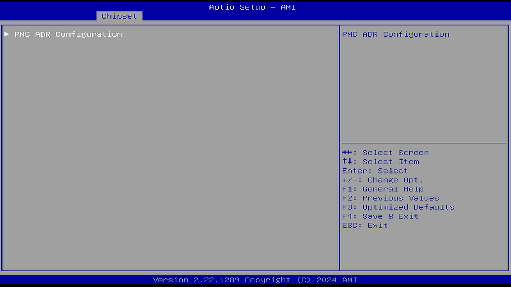

### PMC ADR Configuration（电源管理控制器 ADR 控制）

异步内存刷新（ADR）功能提供了一种机制，在即将发生全局重置或交流电源故障的情况下，能够在非易失性内存配置中，保护易失性内存子系统中的关键数据。

进入 ADR 状态会强制将特定 ADR 保护的 CPU 内部“写缓冲区”中的数据刷新出去。任何不在这些被 ADR 保护的缓冲区中的写入数据（概念上称为“ADR 保护缓冲区”）在重置或断电时都会丢失。

CPLD（复杂可编程逻辑器件）必须能够检测交流电源故障或即将发生的全局重置，并向 PCH 断言 ADR_TRIGGER 信号。

当 PCH 检测到 ADR_TRIGGER 被断言时，会通过 PM_SYNC 链路通知 CPU，并启动 ADR 计时器。

一旦 CPU 收到通知，就会将 ADR 保护写缓冲区中的数据刷新出去。

当 ADR 计时器超时后，PCH 会断言 ADR_COMPLETE 信号，从而触发 NVDIMM 上的 SAVE 引脚。

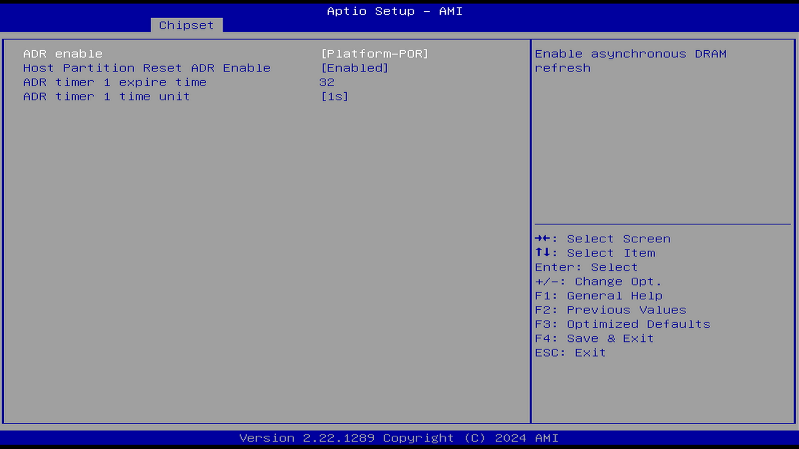

#### ADR enable（启用 ADR）

选项：

Platform-PDR（平台预设）

Enabled（启用）

Disabled（禁用）

说明：

控制异步内存刷新开关。ADR，Asynchronous DRAM Refresh，异步内存刷新。参见“计算机组成原理”相关书籍。

#### Host Partition Reset ADR Enable（发生 Host 分区复位时触发 ADR）

选项：

Platform-PDR（平台预设）

Enabled（启用）

Disabled（禁用）

说明：

该功能的具体作用尚不明确。

#### ADR timer 1 expire time（ADR 定时器 1 到期时间）

输入期望的 ADR 定时器到期时间，有效取值范围为 1 到 256。输入的时间将根据 ADR 定时器的时间单位进行缩放。

#### ADR timer 2 time unit（ADR 定时器 2 时间单元）

选项：

- [1us]
- [10us]
- [100us]
- [1ms]
- [10ms]
- [100ms]
- [1s]
- [10s]

说明：

其具体作用尚不明确。

## PCH Lan controller（PCH 局域网控制器）

选项：

Enabled（启用）

Disabled（禁用）

说明：

控制内置网卡开关。

以下项目仅在将 PCH LAN 控制器设置为 [启用] 时才会显示。

### LAN Wake From DeepSx（通过网络从 DeepSx 唤醒）

选项：

Enabled（启用）

Disabled（禁用）

说明：

DeepSx 表示深度睡眠模式。

通过网络从 DeepSx 唤醒功能。

### Wake on LAN Enable（启用 WoL）

参见 WoL（网络唤醒）。

### SLP_LAN# Low on DC Power（在低直流电力状态下的 SLP_LAN# 功能）

选项：

Enabled（启用）

Disabled（禁用）

说明：

此项目可以控制低直流电力状态下的 SLP_LAN# 功能。SLP_LAN# 信号为低（低电平拉低）时，将关闭网卡的物理电源轨，减少功耗。

## Sensor Hub Type（传感器中枢类型）

选项：

None（无）

I2C

USB

说明：

选择“None”将隐藏“I2C Sensor Hub”设置选项；

选择“I2C”将隐藏“ALS”设置选项；

选择“USB”将同时隐藏“I2C”和“ALS”两个设置选项。

## DeepSx Power Policies（深度睡眠电源策略）

选项：

Disabled（禁用）

Enable in S4-S5-Battery（在 S4–S5 电池模式下启用）

Enable in S5-Battery（在 S5 电池模式下启用）

Enable in S4-S5（在 S4–S5 状态下启用）

Enable in S5（在 S5 状态下启用）

说明：

配置深度睡眠模式，若启用设备会自动切换到空闲状态，这是一种功耗最低的模式。

某些功能（例如 Wake on LAN）由于需要设备某些部分保持活动，因此在此状态下将不再可用。

## Wake on WLAN and BT Enable（启用无线局域网和蓝牙唤醒）

参见 WoL（网络唤醒）。

## Disable DSX ACPRESENT PullDown（在退出 DeepSx 或 G3 状态时，禁用 PCH 内部的 ACPRESENT 下拉电阻）

选项：

Enabled（启用）

Disabled（禁用）

说明：

在退出 DeepSx 或 G3 状态时，禁用 PCH 内部的 ACPRESENT 下拉电阻。这意味着在系统从深度睡眠（DeepSx）或完全关机（G3）状态恢复时，PCH 不会主动拉低 ACPRESENT 信号线（交流适配器检测信号）。

启用此选项可能会导致某些功能（例如 Wake on LAN）在系统处于低功耗状态时无法正常工作。

## Port 80h Redirection（端口 80h 重定向）

选项：

LPC Bus

PCIE Bus

说明：

LPC，Low Pin Count，英特尔低引脚数总线。

控制 Port 80h 的周期发送位置。用于调试。

## Enhance Port 80h LPC Decoding（增强端口 80h LPC 解码）

选项：

Enabled（启用）

Disabled（禁用）

说明：

增强 Port 80h 的 LPC 解码功能：支持 LPC 总线后端对 Port 80h 的字（word）/双字（dword）解码。调试用，可支持更多调试硬件。

## Compatible Revision ID（CRID 兼容版本 ID）

选项：

Enabled（启用）

Disabled（禁用）

说明：

Compatible Revision ID，CRID：兼容版本 ID。RID 寄存器的默认上电值为 SRID。该值根据产品的版本（stepping）进行分配。

## Legacy IO Low Latency（传统 IO 低延迟）

选项：

Enabled（启用）

Disabled（禁用）

说明：

设置以启用传统 IO 的低延迟。某些系统无论功耗如何都需要更低的 IO 延迟。这是在功耗与 IO 延迟之间的权衡。

有资料表明，启用该选项在部分场景下可能改善游戏体验。

## PCH Cross Throttling（PCH 交叉节流）

选项：

Enabled（启用）

Disabled（禁用）

说明：

只有 UTL 支持此功能。UTL 的含义尚不明确。

为了防止过热，对 PCH 功率进行节流管理。

PCH 交叉节流可能导致总线和外设性能受限，影响实时任务的执行。禁用后避免总线带宽受限，确保实时任务对总线和外设的访问效率。

用于控制系统中多个设备共享 PCIe 根节点时的带宽分配。当多个设备同时向根节点发送数据时，PCH Cross Throttling 可通过降低单个设备的带宽，保证整体带宽的均衡分配，避免某一设备过度占用带宽。

参见：

- 从善若水.【实时性】实时性优化的一些参数设置和心得[EB/OL]. [2026-03-26]. <https://blog.csdn.net/qq_31985307/article/details/130791459>. 总结 Linux 实时性调优的内核参数与实践经验。

- 沐多.【原创】有利于提高 xenomai /PREEMPT-RT 实时性的一些配置建议[EB/OL]. [2026-03-26]. <https://www.cnblogs.com/wsg1100/p/12730720.html>. 针对 xenomai 和 PREEMPT-RT 给出降低延迟的 BIOS 与内核配置建议。

## PCH Energy Reporting（PCH 能耗报告）

选项：

Enabled（启用）

Disabled（禁用）

说明：

用于监测能耗的 PCH 能耗报告功能。

启用能耗报告。BIOS 提示必须设置为启用。此选项仅供测试用途。

## LPM S0i2.0（链路低功耗状态 S0i2.0）

选项：

Enabled（启用）

Disabled（禁用）

启用/禁用 S0ix 子状态。

此设置仅用于测试目的。

在量产环境中应启用 S0ix 子状态。

## LPM S0i3.0（链路低功耗状态 S0i3.0）

同上。

## C10 Dynamic threshold adjustment（C10 动态阈值调整）

选项：

Enabled（启用）

Disabled（禁用）

说明：

与 C10 低功耗状态相关。

## IEH Mode（隔离执行加固模式）

选项：

Bypass Mode（旁路模式）

Disabled（禁用）

说明：

IEH，Isolated Execution Hardening，隔离执行加固。

IEH 模式，可提升系统安全性。

## Enable TCO Timer（启用 TCO 计时器）

选项：

Enabled（启用）

Disabled（禁用）

说明：

启用或禁用 TCO 计时器。禁用时，将关闭 PCH ACPI 计时器，停止 TCO 计时器，并且不会发布 ACPI MADT 表。

## Pcie PLL SSC（PCIe PLL 扩频时钟）

选项：

Auto（自动）

Disabled（禁用）

0.0%–2.0%，步进为 0.1%。

说明：

PCIe PLL 扩频百分比。AUTO —— 保持硬件默认值，不由 BIOS 覆盖。

该功能的具体作用尚不明确。

## IOAPIC 24-119 Entries（IOAPIC 24-119 条目）

选项：

Enabled（启用）

Disabled（禁用）

说明：

IRQ24–119 可能会被 PCH 设备使用。禁用这些中断可能会导致某些设备无法正常工作。

用于设置是否使用超过 24 个 IOAPIC 条目以确保兼容性。I/O APIC 包含一个重定向表，用于将来自外部总线的中断路由到一个或多个本地 APIC。控制 IOAPIC 24–119 项可扩展至 PIROI–PIROX 与否。

## Enable 8254 Clock Gate（启用 8254 时钟门控）

选项：

Enabled（启用）

Disabled（禁用）

说明：

在早期阶段启用/禁用 8254 时钟门控。启用 8254CGE（CGE，Clock Gating Enable，启用时钟门控）是支持 SLP_SO 所必需的。平台也可以在后期阶段禁用该策略并设置 8254CGE。

8254 是一种 PIT（Programmable Interval Timer，可编程定时器），它利用若干个寄存器来进行定时和计时的操作。GATE 门控信号实现定时控制与事件计数功能。

## Lock PCH Sideband Access（锁定 PCH 侧带访问）

选项：

Enabled（启用）

Disabled（禁用）

说明：

侧带信号用于处理器与 PCH 之间的通信。

锁定 PCH 侧带访问，包括特定端点（例如 PSFx）的侧带接口锁定和侧带 PortID 掩码。如果已设置 POSTBOOT SAI，则该选项无效。

## Flash Protection Range Registers (FPRR)（Flash 保护范围寄存器）

选项：

Enabled（启用）

Disabled（禁用）

说明：

BIOS 写保护机制，可防止恶意软件对 BIOS 进行直接篡改。通过 Flash 保护范围寄存器实现。

## SPD Write Disable（SPD 写保护）

选项：

True（启用）

False（禁用）

说明：

参见：What is SPD?[EB/OL]. [2026-03-26]. <https://www.lenovo.com/us/en/glossary/spd/>.

BIOS 提示：出于安全考虑，必须设置 SPD 写保护位。

SPD 代表串行存在检测（Serial Presence Detect），是一种标准化的方法，用于访问计算机内存模块的信息。SPD 数据存储在内存上的 EEPROM 芯片中，允许系统 BIOS 读取内存的详细信息，如速度、容量和时序，从而确保内存的最佳性能和兼容性。

禁用该选项可能会影响 XMP（英特尔®至尊内存配置文件）设置，即内存超频功能。

## LGMR（LPC 内存范围解码）

选项：

Enabled（启用）

Disabled（禁用）

说明：

LGMR，LPC Memory Range Decode，LPC 内存范围解码

用于 LPC 内存范围解码的 64 KB 内存块。允许系统将 64 KB 的内存块映射到 LPC 接口。用于调试。低针数总线（LPC）是一种传统总线，是为取代工业标准架构（ISA）总线而开发的。嵌入式控制器（EC）、基板管理控制器（BMC）和超级 I/O（SIO）是通过低针数总线（LPC）连接到芯片组的。

## HOST_C10 reporting to Target（向目标设备报告 HOST_C10）

选项：

Enabled（启用）

Disabled（禁用）

说明：

此选项用于启用通过 eSPI 虚拟线向目标设备报告 HOST_C10 状态。eSPI 是 Intel 推出的新一代总线接口，用于替代 LPC。

eSPI，Enhanced Serial Peripheral Interface，增强型串行外设接口

参见：增强型串行外设接口（eSPI）接口基本规格（适用于客户端和服务器平台）[EB/OL]. [2026-03-26]. <https://www.intel.cn/content/www/cn/zh/content-details/841685/enhanced-serial-peripheral-interface-espi-interface-base-specification-for-client-and-server-platforms.html>.

## OS IDLE Mode（系统待机状态）

选项：

Enabled（启用）

Disabled（禁用）

说明：

## S0ix Auto Demotion（S0ix 自动降级）

选项：

Enabled（启用）

Disabled（禁用）

说明：

主机在进入 S0ix 低功耗状态失败时，自动降级（Auto-Demotion）到较浅层低功耗状态（如 S0 Idle / S0i1 / S0i0 等）。

## Latch Events C10 Exit（退出 C10 状态时锁存事件）

选项：

Enabled（启用）

Disabled（禁用）

说明：

在退出 C10 状态时锁存事件。

该功能的具体作用尚不明确。

## Extend BIOS Range Decode（扩展 BIOS 解码范围）

选项：

Enabled（启用）

Disabled（禁用）

说明：

启用此项后，落入特定内存区域的内存周期（memory cycles）将被重定向到 SPI 闪存控制器。

其具体作用尚不明确。

## ACPI L6D PME Handling（ACPI 中 L6D（_L6D）PME 事件处理）

选项：

Enabled（启用）

Disabled（禁用）

说明：

BIOS 可以通过 ACPI 代码将特定方法关联到某个特定的 GPE。在本例中，`_L6D` 是一个电平触发事件的方法。BIOS-ACPI 可以检查每个需要通过 GPE 唤醒的设备的 PMEENABLE 和 PMESTATUS。

其具体作用尚不明确。

## Beep On（蜂鸣器）

选项：

Enabled（启用）

Disabled（禁用）

说明：

用于启用或禁用蜂鸣器。

## PSE Configuration（可编程服务引擎配置）

PSE，Programmable Service Engine，可编程服务引擎。

参见：借助英特尔的首个物联网增强型平台，推动性能、集成和多功能性[EB/OL]. [2026-03-26]. <https://www.intel.cn/content/www/cn/zh/products/docs/processors/embedded/enhanced-for-iot-platform-brief.html>.

英特尔® 可编程服务引擎是专为物联网功能打造的卸载引擎，采用了 ARM Cortex-M7 微控制器。该引擎可为物联网应用程序提供独立的低 DMIPS 计算和低速输入输出，还能为实时计算和时间敏感型同步提供专门服务。

英特尔® 可编程服务引擎配备了新的功能，如远程带外设备管理、网络代理、嵌入式控制器精简版和传感器控制中心。通过开源代码或预置固件二进制，可以使用灵活的编程方式对其进行配置，从而满足应用需求，并运行基于 ARM 的实时应用程序。

### PSE Controller（可编程服务引擎控制器）

选项：

Enabled（启用）

Disabled（禁用）

说明：

启用或禁用英特尔® 可编程服务引擎（PSE）。启用后，将显示以下菜单项。

#### LOG OUTPUT OFFSET（日志输出偏移）

确定内存中 PSE 日志输出区域的偏移量。

#### LOG OUTPUT SIZE（日志输出大小）

确定内存中 PSE 日志输出区域的大小限制。

#### Shell (PSE Shell)

选项：

Enabled（启用）

Disabled（禁用）

说明：

PSE Shell

#### Eclite

选项：

Enabled（启用）

Disabled（禁用）

说明：

PSE Eclite 服务。嵌入式控制器替代方案。参见：Intel ISHTP eclite controller Driver[EB/OL]. [2026-03-26]. <https://www.kernelconfig.io/config_intel_ishtp_eclite>.

用于访问 PSE（可编程服务引擎）——一种类似嵌入式控制器的 IP，通过 ISHTP（集成传感器集线器传输协议）从平台获取电池、温度和 UCSI（USB Type-C 连接器系统软件接口）相关数据。

对于不想在英特尔 Elkhart Lake 平台（J/N 系列 ATOM E 系列）上使用独立嵌入式控制器的用户，可以利用作为 PSE 子系统一部分的集成解决方案 ECLite。

#### CPU Temp Read（CPU 温度读取）

选项：

Enabled（启用）

Disabled（禁用）

说明：

PSE Eclite CPU 温度读取。

#### OOB（远程带外管理）

PSE OOB 服务。专为物联网（IoT）和嵌入式应用设计。

选项：

Enabled（启用）

Disabled（禁用）

说明：

OOB，Remote Out-of-Band，远程带外管理。

#### WoL（网络唤醒）

选项：

Enabled（启用）

Disabled（禁用）

说明：

PSE GBE Wake On Lan（WoL），PSE 千兆网网络唤醒。

#### PSE Debug (JTAG/SWD) Enable（启用 PSE JTAG/SWD 调试）

SWD（Serial Wire Debug，串行线调试）和 JTAG（Joint Test Action Group，联合测试工作组）是两种常用的调试接口协议。

选项：

Enabled（启用）

Disabled（禁用）

说明：

控制 PSE JTAG/SWD 调试开关。

#### PSE JTAG/SWD PIN MUX（PSE JTAG 引脚多路复用）

选项：

Enabled（启用）

Disabled（禁用）

说明：

控制 PSE JTAG 引脚多路复用（Pin Mux）。如果 Sci 引脚多路复用已启用，则不允许启用此项。

#### CAN0（CAN0 总线）

选项：

None（无）

PSE owned（PSE 所有权）

Host owned（主机所有权）

说明：

CAN0 与 I²S0 及 TGPIO 16-17 存在引脚冲突。控制 CAN0 总线的所有权。

#### CAN1（CAN1 总线）

选项：

None（无）

PSE owned（PSE 所有权）

Host owned（主机所有权）

说明：

CAN1 与 I²S0 以及 TGPIO 14–15 存在引脚冲突，用于控制 CAN1 总线的所有权。

#### DMA0（DMA0 通道）

选项：

None（无）

PSE owned（PSE 所有权）

Host owned（主机所有权）

说明：

选择 DMA0 的所有权。

#### DMA1（DMA1 通道）

选项：

None（无）

PSE owned（PSE 所有权）

Host owned（主机所有权）

说明：

选择 DMA1 的所有权。

#### DMA2（DMA2 通道）

选项：

None（无）

PSE owned（PSE 所有权）

Host owned（主机所有权）

说明：

选择 DMA2 的所有权。

#### GBE0（GBE 0 千兆网）

选项：

None（无）

PSE owned（PSE 所有权）

Host owned（主机所有权）

说明：

选择 GBE0 的所有权。

#### PSE GBE0 DLL Override（PSE GBE0 DLL 覆盖）

选项：

Enabled（启用）

Disabled（禁用）

说明：

启用或禁用 PSE GBE0 的 DLL（Delay-Locked Loop，延迟锁相环）。启用此功能前，必须先启用 GBE0。

#### PSE GBE0 Tx_Delay（PSE GBE0 Tx 延迟）

配置 DLL 从属模块中延迟元件的总数量。默认值为 16，最小值为 1，最大值为 63。

#### GBE2（GBE 2 千兆网）

选项：

None（无）

PSE owned（PSE 所有权）

Host owned（主机所有权）

说明：

选择 GBE2 的所有权。

#### PSE GBE1 DLL Override（PSE GBE1 DLL 覆盖）

选项：

Enabled（启用）

Disabled（禁用）

说明：

启用或禁用 PSE GBE1 的 DLL（延迟锁相环）。要启用此功能，必须先启用 GBE1 控制器。

#### PSE GBE1 Tx_Delay（PSE GBE1 Tx 延迟）

配置 DLL 从属模块中延迟元件的总数量。默认值为 16，最小值为 1，最大值为 63。

#### GPIO/TGPIO 0 MUX SELECTION（GPIO/TGPIO 0 多路复用选择）

选项：

LOWER（低区段）

MID（中区段）

TOP（顶区段）

All GPIO（所有 GPIO）

说明：

TGPIO：Time-Aware GPIO，时间感知 GPIO。

Lower: TGPIO(0-19),GPIO(20-29)

Mid: TGPIO(0-9,20-29),GPIO(10-19)

Top: TGPIO(10-29) GPIO(0-9)

All: GPIO(0-29)

#### GPIO/TGPIO 0 Pin Selection（GPIO/TGPIO 0 引脚选择）

启用或禁用单个 GPIO/TGPIO 0 引脚。

#### GPIO/TGPIO 1 MUX SELECTION（GPIO/TGPIO 1 多路复用选择）

选项：

LOWER（低区段）

MID（中区段）

TOP（顶区段）

All GPIO（所有 GPIO）

说明：

Lower: TGPIO(30-49) GPIO(50-59)

Mid: TGPIO(30-39, 50-59) GPIO(40-49)

Top: TGPIO(40-59) GPIO(30-39)

All: GPIO(30-59)

#### GPIO/TGPIO 1 Pin Selection（GPIO/TGPIO 1 引脚选择）

启用或禁用单个 GPIO/TGPIO 1 引脚。

#### List of PSE peripherals that can generate interrupts（可以产生中断的 PSE 外设列表）

选项：

Enabled（启用）

Disabled（禁用）

说明：

为可以产生中断的 PSE 外设设置中断模式。

启用＝中断设置为 SB 模式；SB 模式（Sideband Mode）也称为传统的 INTx 中断，该方式存在中断线数量有限、共享资源等限制。

禁用＝使用 MSI 模式；MSI 模式（Message Signaled Interrupts，消息信号中断）引入于 PCI 2.2 规范，支持更高效的中断处理。

#### DMA Test（DMA 测试）

选项：

Enabled（启用）

Disabled（禁用）

说明：

DMA 测试设备。

## TSN GBE Configuration（时间敏感网络千兆以太网配置）

TSN：Time Sensitive Network，时间敏感网络

GBE：Gigabit Ethernet，千兆以太网

### PCH TSN LAN Controller（平台控制器中枢的时间敏感网络局域网控制器）

选项：

Enabled（启用）

Disabled（禁用）

说明：

启用/禁用时间敏感局域网控制器。

### PCH TSN GBE Multi-Vc（平台控制器中枢的时间敏感网络千兆以太网多虚拟通道）

选项：

Enabled（启用）

Disabled（禁用）

说明：

用于控制时间敏感网络的多虚拟通道功能。

### PCH TSN GBE SGMII Support（平台控制器中枢的时间敏感网络千兆以太网 SGMII 模式支持）

选项：

Enabled（启用）

Disabled（禁用）

说明：

SGMII：Serial Gigabit Media Independent Interface，串行千兆媒体独立接口，可促进网络设备之间的高速通信。

为 PCH TSN GBE 启用/禁用 SGMII 模式。处于同一 PLL 公共通道上的 SGMII 模式端口必须使用相同的链路速度。如果 TSN 端口使用了相同的 PLL 公共通道，可能需要禁用 SATA 或 UFS。请确保 IFWI 为 SGMII 设置了正确的引导配置。确保 Flex IO 通道分配不为 NONE。

### PCH TSN Link Speed（平台控制器中枢的时间敏感网络链接速率）

选项：

24 MHz 2.5 Gbps

24 MHz 1 Gbps

38.4 MHz 2.5 Gbps

38.4 MHz 1 Gbps

说明：

PCH TSN 链路速度配置

### PCH TSN GBE x Multi-Vc（平台控制器中枢的时间敏感网络千兆以太网 x 的多虚拟通道）

选项：

Enabled（启用）

Disabled（禁用）

说明：

启用/禁用 TSN 多虚拟通道。TSN GBE x 必须归主机所有。

### PCH TSN GBE x SGMII Support（平台控制器中枢的时间敏感网络千兆以太网 x 的 SGMII 模式支持）

选项：

Enabled（启用）

Disabled（禁用）

说明：

启用/禁用 PCH TSN GBE x 的 SGMII 模式。处于 SGMII 模式且使用同一 PLL 公共通道的端口必须使用相同的链路速率。由于该 TSN 端口使用相同的 PLL 公共通道，必须禁用 UFS。请确保 IFWI 已为 SGMII 正确设置了跳线。请确保 Flex IO 通道分配不为 NONE。

### PCH TSN GBE x Link Speed（平台控制器中枢的时间敏感网络千兆以太网 x 的链路速率）

选项：

24 MHz 2.5 Gbps

24 MHz 1 Gbps

38.4 MHz 2.5 Gbps

38.4 MHz 1 Gbps

说明：

PCH TSN GBE x 链路速率配置

## PCIe Ref PLL SSC（PCIe 参考锁相环扩频百分比）

SSC：Spread Spectrum Clocking，扩频时钟

PLL：Phase Locked Loop，锁相环

## Flash Protection Range Registers（FPRR，闪存保护范围寄存器）

关闭后，可使用 FPT 工具直接修改 BIOS，无需使用编程器。

## PinCntrl Driver GPIO Scheme（引脚控制驱动 GPIO 方案）

其具体作用尚不明确。
