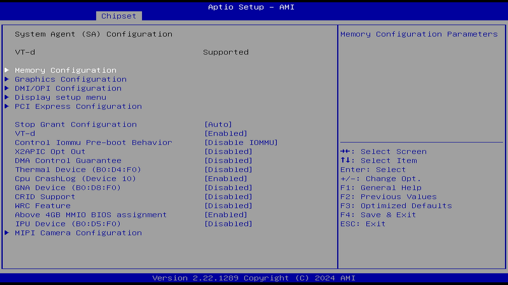
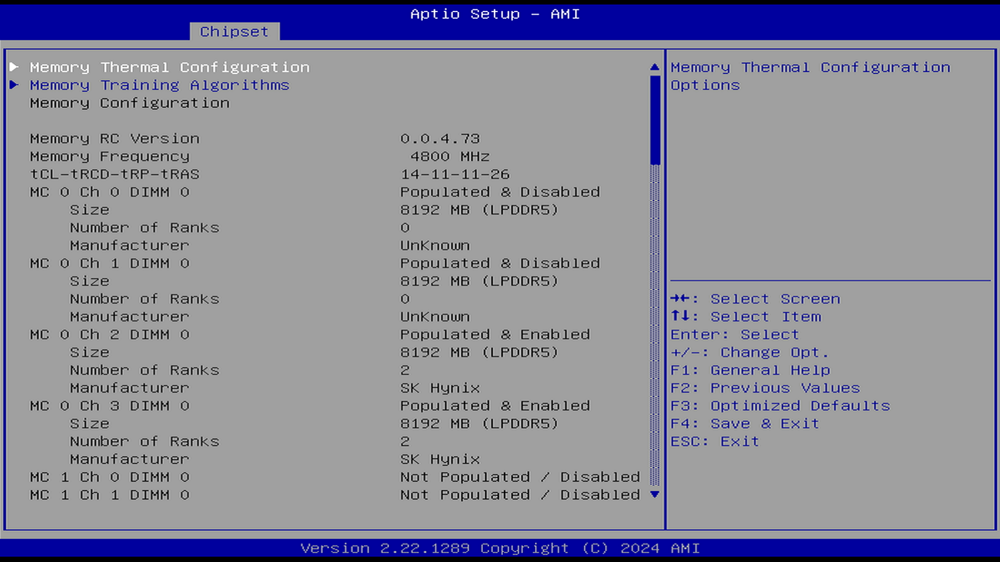
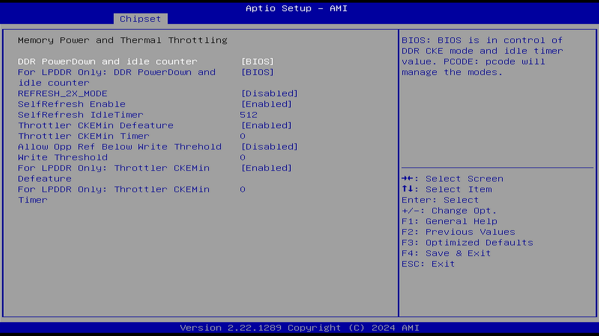
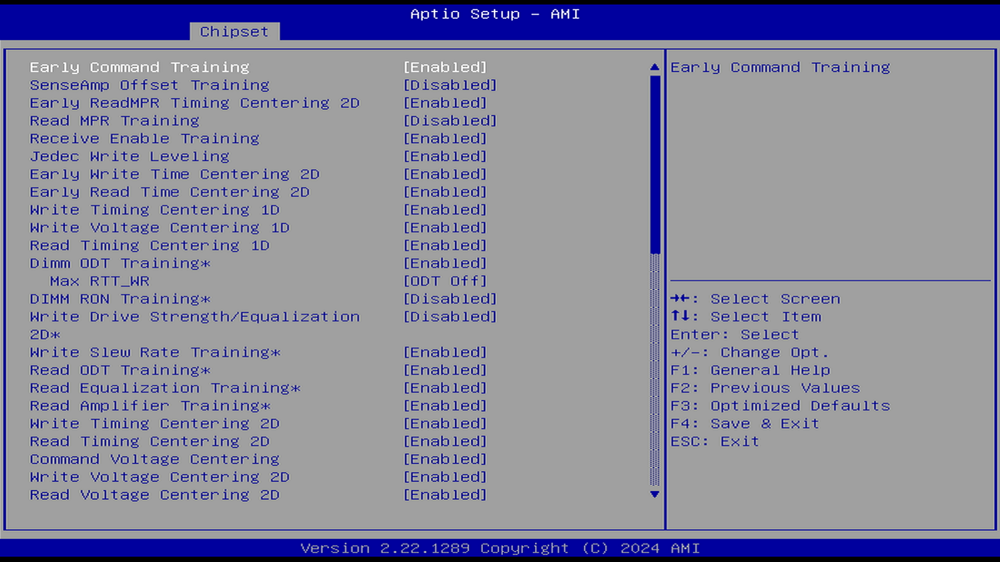
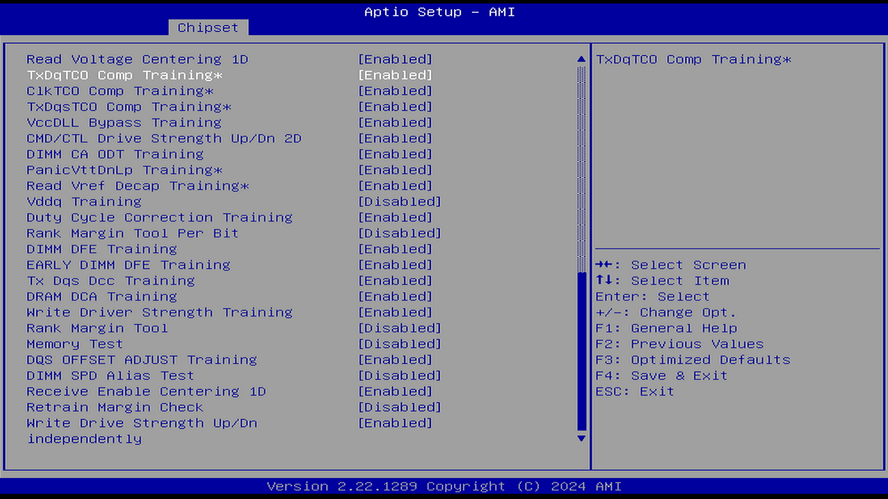
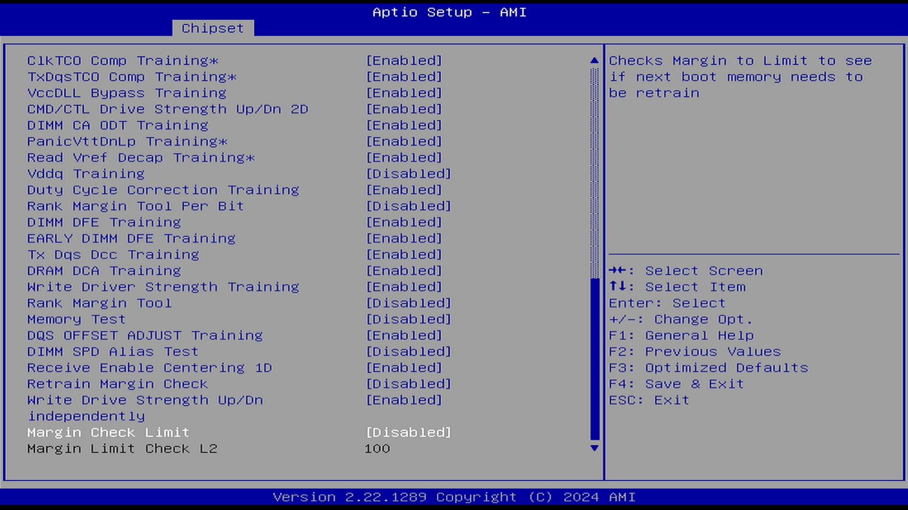
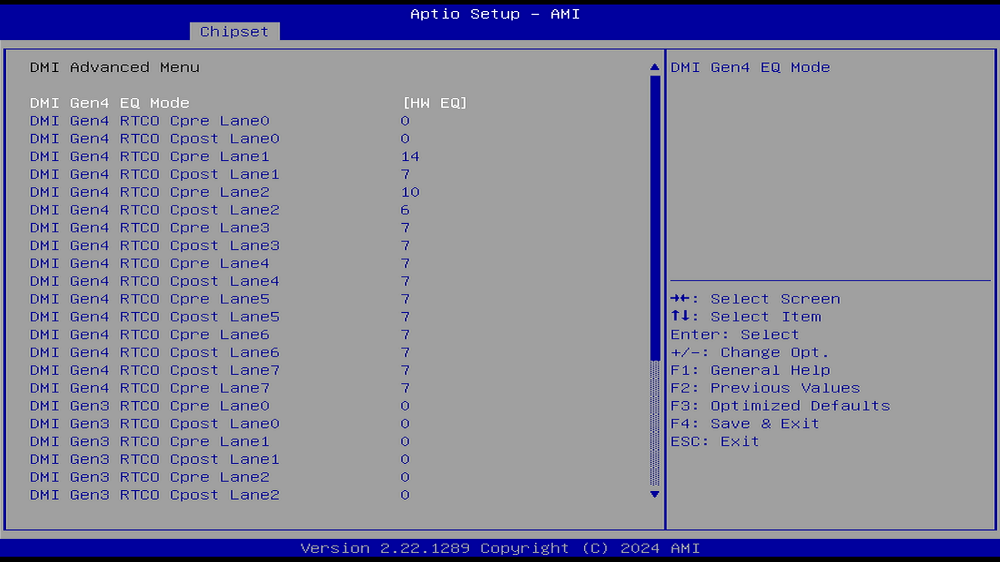
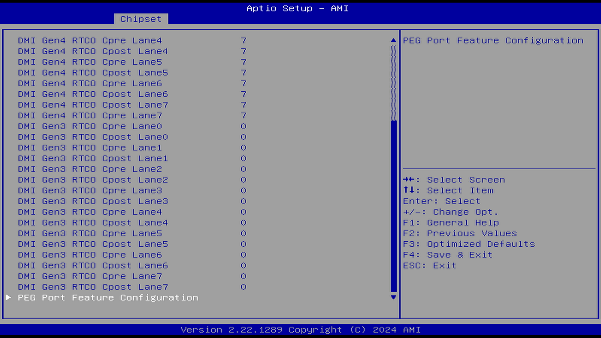
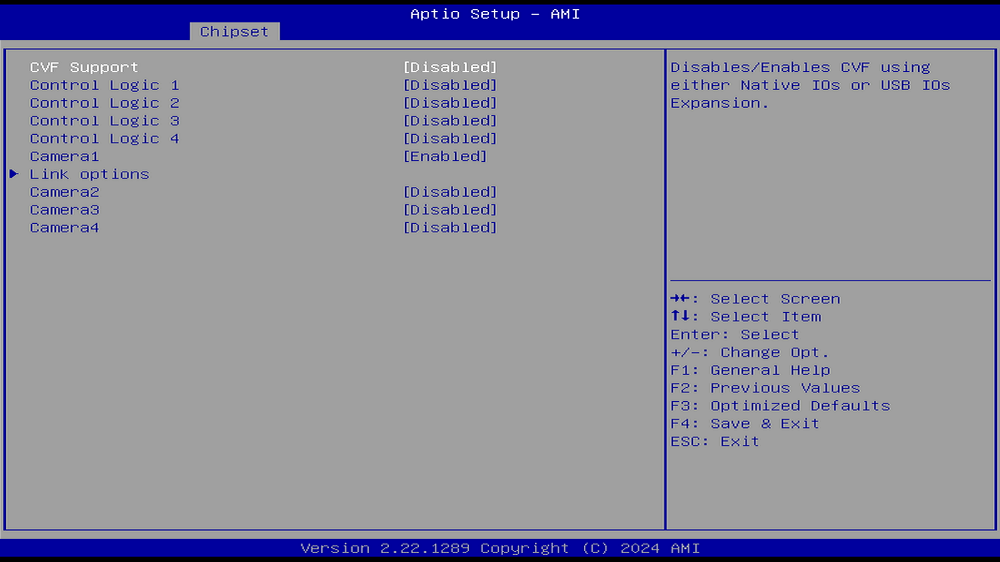
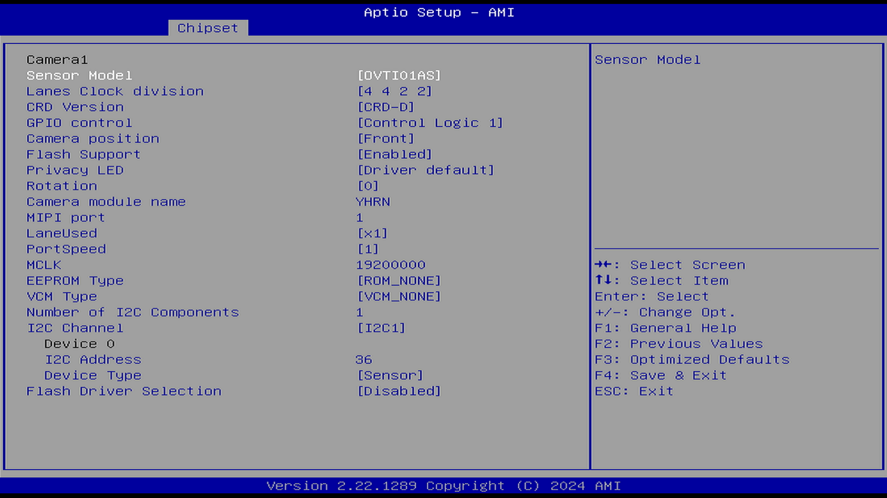

# System Agent (SA) Configuration（系统代理配置）

本小节用于配置系统代理相关参数，包括内存控制器、PCIe 接口等设置。

以下选项可能与 PCH-IO Configuration（平台控制器中枢 I/O 配置）中的部分南桥相关选项存在重叠。这是因为 System Agent（SA）Configuration（系统代理配置）用于控制由 CPU 直接引出的 PCIe 接口。

在 Intel CPU 架构中（第二代 Sandy Bridge 及以后），System Agent 是一个集成在 CPU 芯片内部的模块，它作为处理器与系统组件之间的核心互连单元，包含了：

- 内存控制器（IMC - Integrated Memory Controller），负责管理与主存储系统的通信
- PCIe Root Complex（用于 CPU 直连的 PCIe 通道，例如 PEG（PCI Express Graphics）），提供高速外设互连
- 显示引擎（如果 CPU 有核显），处理图形输出
- 与 Ring Bus 或 Mesh 的接口，实现处理器核心间通信
- 电源管理逻辑等，优化系统能效

参见：博客园. BIOS PCIe 配置里的 LTR Snoop Latency value of SA PCIE[EB/OL]. [2026-03-26]. <https://www.cnblogs.com/wanglouxiaozi/p/18946234>.

## Memory Configuration（内存配置）

内存配置作为系统代理配置的核心组成部分，直接影响内存系统的性能、稳定性和功耗表现。以下是内存配置的相关参数。

### Memory Thermal Configuration（内存热效应配置）

#### Memory Power and Thermal Throttling（内存功耗与热容忍）

#### DDR PowerDown and idle counter（DDR 省电模式与空闲计数器）

选项：

BIOS

PCODE

说明：

DDR（Double Data Rate SDRAM，双倍数据速率同步动态随机存取存储器），即 DDR 内存。

此功能用于决定由 BIOS 还是硬件控制 DDR 的省电模式与空闲计数器。当选择“PCODE”时，由硬件算法控制这些模式；当选择“BIOS”时，则由 BIOS 控制这些模式。默认设置为“BIOS”。

#### For LPDDR Only: DDR PowerDown and idle（仅适用于 LPDDR：DDR 省电与空闲控制）

选项：

BIOS

PCODE

说明：

LPDDR（Low Power Double Data Rate SDRAM，低功耗内存），适用于笔记本、平板等移动平台。

仅适用于 LPDDR：

BIOS：由 BIOS 控制 DDR 的 CKE 模式和空闲计时器值。

PCODE：由硬件算法管理这些模式。

#### REFRESH_2X_MODE（REFRESH 2X 模式）

选项：

Disabled（禁用）

Enabled for WARM or HOT（仅当温或热时开启）

Enabled HOT only（仅当热时开启）

说明：

此功能用于启用 REFRESH 2X 模式，当温度处于“温”或“热”的状态时，通过提高 DRAM 的刷新率来维持可接受的整体错误率。

禁用

当热状态为“温”或“热”时，iMC 启用 2 倍刷新率模式

仅当热状态为“热”时，iMC 启用 2 倍刷新率模式

默认设置为“Disabled”（禁用）。

#### SelfRefresh Enable（启用自刷新）

选项：

Enabled（启用）

Disabled（禁用）

说明：

DDR 自刷新。

根据 DDR 的存储单元结构，电容会缓慢地泄露电荷，此时存储的数据就会丢失，因此就需要自刷新，即充电，通过充电保持数据信号。

#### SelfRefresh IdleTimer（自刷新定时器）

范围：

[64K-1, 512]，单位为 DCLK800s（默认值为 512）

DCLK800s：表示以 DRAM 时钟 800 MHz（对应 DDR3-1600）的时钟周期（即 1 DCLK800 ≈ 1.25 ns）为单位的时间间隔。

说明：

DDR 定时自刷新。

#### Throttler CKEMin Defeature（禁用节流器 CKEMin 功能）

选项：

Enabled（启用）

Disabled（禁用）

说明：

用于控制内存低功耗设置。CKE 模式。

CKEMin：Clock Enable Minimum，时钟使能最小值

在进入低功耗状态之前，时钟信号保持开启（使能）的最短时间或最低限度，确保数据传输或内存操作的完整性和稳定性。

#### Throttler CKEMin Timer（节流器 CKEMin 计时器）

CKEMin 的计时器数值，范围 0-255。要求最小值为 SC_ROUND_T（系统时钟周期的数量）+ BYTE_LENGTH（4）（字节长度，一般是 4）。

#### Allow Opp Ref Below Write Threshold（允许在写入阈值以下的机会刷新）

选项：

Enabled（启用）

Disabled（禁用）

说明：

禁用设置时，集成内存控制器在空闲时不会完成自刷新。

当设置为 Enabled 时，集成内存控制器在空闲一段时间后可能进入自刷新模式。

参见：戴尔科技. PowerEdge:DRAM Refresh and Opportunistic Self-Refresh[EB/OL]. [2026-03-26]. <https://infohub.delltechnologies.com/zh-cn/l/cpu-best-practices-3/poweredge-dram-refresh-and-opportunistic-self-refresh/>。DRAM 刷新与机会性自刷新的最佳实践。

允许在不退出低功耗状态（power down）的情况下进行机会性刷新（opportunistic refreshes）

#### Write Threshold（写入阈值）

配合 Allow Opp Ref Below Write Threshold（允许在写入阈值以下的机会刷新）使用。

在 CKE（时钟使能）为低电平期间，允许累积的写入次数（内存控制器允许积累的最大写入操作次数。一旦达到此阈值，内存控制器可能会强制退出低功耗模式，处理积累的写入操作），直到重新使能 CKE（CKE 被置为高电平）。

#### For LPDDR Only: Throttler CKEMin Defeature（仅 LPDDR：禁用节流器 CKEMin）

同 Throttler CKEMin Defeature（禁用节流器 CKEMin 功能）。

#### For LPDDR Only: Throttler CKEMin Timer（仅 LPDDR：节流器 CKEMin 计时器）

同 Throttler CKEMin Timer（节流器 CKEMin 计时器）。

#### Memory Thermal Management（内存热效应管理）

选项：

Enabled（启用）

Disabled（禁用）

说明：

Intel® Memory Thermal Management，Intel 内存热效应管理。参见：英特尔公司. 12th Generation Intel® Core™ Processors[EB/OL]. [2026-03-26]. <https://edc.intel.com/content/www/tw/zh/design/ipla/software-development-platforms/client/platforms/alder-lake-desktop/12th-generation-intel-core-processors-datasheet-volume-1-of-2/011/intel-memory-thermal-management/>。Intel 第 12 代处理器内存热管理的技术规范。一系列控制温度的措施。

#### PECI Injected Temperature（通过 PECI 传入温度）

选项：

Enabled（启用）

Disabled（禁用）

说明：

通过 PECI 向处理器传入的内存温度。在典型服务器或嵌入式系统平台中，BMC（或 EC）或管理引擎可以通过 PECI 将 CPU 和内存的温度数据汇总，并提供给风扇控制或功耗管理模块。

#### EXTT# via TS-on-Board（通过板载温度传感器连接 EXTT#）

选项：

Enabled（启用）

Disabled（禁用）

说明：

启用或禁用将板载温度传感器（TS-on-Board）的 ALERT# 和 THERM# 信号路由到 PCH 上的 EXTTS# 引脚。

板载温度传感器（TS-on-Board）用于检测 PCB 或模块温度。若要让系统统一协调管理风扇或功耗策略，就需要将这些信号注入至 PCH。

#### EXTT# via TS-on-DIMM（通过内存上的温度传感器连接 EXTT#）

选项：

Enabled（启用）

Disabled（禁用）

说明：

将 DIMM（内存）上的温度传感器（TS-on-DIMM）的 ALERT# 信号路由到芯片组（PCH）的 EXTT# 引脚。

#### Virtual Thermal Sensor (VTS)（虚拟温度传感器）

选项：

Enabled（启用）

Disabled（禁用）

说明：

虚拟温度传感器（VTS）是一种软件机制，可实时、准确地监控零部件在运行条件下的细粒度热行为。用于调试。

### Memory Training Algorithm（内存训练算法）

以下是内存训练算法的相关配置。

选项：

Enabled（启用）

Disabled（禁用）

说明：

内存初始化和测试校准。内存训练是一种在保证内存稳定工作的前提下寻找最大化内存工作效率的方法。

每次的内存训练可能需要数分钟至数十分钟不等的时间才能完成。

内存训练是平台对用户或 XMP 配置文件设置的时序和速度进行测试的过程。

如果在 POST 期间检测到以下任何一种情况，则可能会进行内存重新训练：

- UEFI BIOS 中的总内存加密设置发生更改
- UEFI BIOS 更新时内存参考代码（MRC）发生更改

参见：联想公司. 检测内存重新训练[EB/OL]. [2026-03-26]. <https://download.lenovo.com/manual/thinkpad_x1_carbon_gen13/user_guide/zh-cn/Detect_memory_retraining.html>.

#### Early Command Training（早期命令训练）

选项：

Enabled（启用）

Disabled（禁用）

说明：

在系统启动时对 DRAM 命令时序进行优化

#### SenseAmp Offset Training（感应放大器偏移训练）

选项：

Enabled（启用）

Disabled（禁用）

说明：

训练 DRAM 接收端感应放大器（Sense Amplifier）的偏移电压，补偿电路本身的偏移量，确保读取数据时能准确采样。

#### Early ReadMPR Timing Centering 2D（内存初始化的早期阶段时序中心化 2D）

选项：

Enabled（启用）

Disabled（禁用）

说明：

2D（Two-Dimensional）：表示训练同时作用于两个维度，例如驱动强度和终端电阻。

在内存初始化早期阶段，利用多用途寄存器（MPR）进行二维时序中心化训练，将数据采样时序调整至眼图中心。

#### Read MPR Training（读多用途寄存器训练）

选项：

Enabled（启用）

Disabled（禁用）

说明：

Multi Purpose Register，多用途寄存器

利用多用途寄存器（MPR）中存储的已知数据模式进行读取训练，校准读取时序与电压，确保数据线能够正确采样。

#### Receive Enable Training（接收使能训练）

选项：

Enabled（启用）

Disabled（禁用）

说明：

训练接收使能信号的时序，确定读取数据选通信号（DQS）的正确使能窗口，使控制器能在有效数据区间内捕获读数据。

#### Jedec Write Levelling（JEDEC 写入校准）

选项：

Enabled（启用）

Disabled（禁用）

说明：

JEDEC，Joint Electron Device Engineering Council，联合电子设备工程委员会，发布了一系列 JEDEC 标准。

JEDEC 标准定义的写入均衡训练，通过调节写入数据选通信号（DQS）与 DRAM 时钟（CK）的相位关系，补偿 fly-by 拓扑结构下时钟到达各 DRAM 颗粒的时间偏差。

#### Early Write Time Centering 2D（早期写入时序中心化 2D）

选项：

Enabled（启用）

Disabled（禁用）

说明：

在内存初始化早期阶段进行二维写入时序中心化训练，将写入数据采样时序调整至数据眼图中心。

#### Early Read Time Centering 2D（早期读取时序中心化 2D）

选项：

Enabled（启用）

Disabled（禁用）

说明：

在内存初始化早期阶段进行二维读取时序中心化训练，将读取数据采样时序调整至数据眼图中心。

#### Write Timing Centering 1D（写入时序中心化 1D）

选项：

Enabled（启用）

Disabled（禁用）

说明：

一维写入时序中心化训练，沿时序单一维度调整写入数据采样点至数据眼图中心，提升写入可靠性。

#### Write Voltage Centering 1D（写入电压中心化 1D）

选项：

Enabled（启用）

Disabled（禁用）

说明：

一维写入电压中心化训练，沿电压单一维度调整写入参考电压至数据眼图中心，优化写入信号裕量。

#### Read Timing Centering 1D（读取时序中心化 1D）

选项：

Enabled（启用）

Disabled（禁用）

说明：

一维读取时序中心化训练，沿时序单一维度调整读取数据采样点至数据眼图中心，减少时序误差。

#### Dimm ODT Training*（内存模块终端电阻训练）

选项：

Enabled（启用）

Disabled（禁用）

说明：

ODT（On-Die Termination，片内端接技术）是在内存芯片内部集成的终端电阻，可改善信号完整性。

通过训练优化 ODT 数值。

#### Max RTT_WR（最大 RTT_WR）

此项依赖 Dimm ODT Training*（Dimm ODT 训练）。

选项：

ODT Off（禁用 ODT）

120 ohms (Ω)

说明：

设定内存芯片内部终端电阻的 WR（写入端接电阻）。

#### DIMM RON Training*（内存模块 RON 训练）

选项：

Enabled（启用）

Disabled（禁用）

说明：

控制内存模块（DIMM）上的 RON 终端电阻训练开关。

训练内存模块（DIMM）输出驱动器的导通电阻（RON），使输出阻抗与传输线匹配，减少信号反射，改善信号完整性。

#### Write Drive Strength/Equalization 2D *（写入驱动强度/均衡 2D*）

选项：

Enabled（启用）

Disabled（禁用）

说明：

二维训练写入驱动强度与均衡参数，同时优化输出驱动能力和信号均衡，改善写入信号质量。

#### Write Slew Rate Training *（写入上升/下降斜率训练*）

选项：

Enabled（启用）

Disabled（禁用）

说明：

优化写入信号的上沿与下沿。

#### Read ODT Training *（读取终端电阻训练*）

选项：

Enabled（启用）

Disabled（禁用）

说明：

训练读取侧的片内终端电阻（ODT）阻值，优化终端匹配以减少信号反射，改善读取信号完整性。

#### Read Equalization Training *（读取均衡训练*）

选项：

Enabled（启用）

Disabled（禁用）

说明：

训练读取路径的信号均衡器参数，补偿通道损耗引起的信号失真，提升高速读取时的信号质量。

#### Read Amplifier Training*（读取放大器训练）

选项：

Enabled（启用）

Disabled（禁用）

说明：

训练 DRAM 读取路径中的感应放大器电路。

#### Write Timing Centering 2D（写入时序中心化 2D）

选项：

Enabled（启用）

Disabled（禁用）

说明：

二维写入时序中心化训练，同时沿时序和电压两个维度调整写入采样点至数据眼图中心。

#### Read Timing Centering 2D（读取时序中心化 2D）

选项：

Enabled（启用）

Disabled（禁用）

说明：

二维读取时序中心化训练，同时沿时序和电压两个维度调整读取采样点至数据眼图中心。

#### Command Voltage Centering（命令信号电压中心化）

选项：

Enabled（启用）

Disabled（禁用）

说明：

优化命令信号参考电压的设置。

#### Write Voltage Centering 2D（写入电压中心化 2D）

选项：

Enabled（启用）

Disabled（禁用）

说明：

优化写入操作中数据线参考电压和驱动强度的设置

#### Read Voltage Centering 2D（读取电压中心化 2D）

选项：

Enabled（启用）

Disabled（禁用）

说明：

优化读取操作中数据线参考电压和驱动强度的设置

#### Late Command Training（后期命令训练）

选项：

Enabled（启用）

Disabled（禁用）

说明：

优化命令信号在写入操作中的时序和信号完整性。

#### Round Trip Latency（RTL 往返延迟）

选项：

Enabled（启用）

Disabled（禁用）

说明：

训练内存 RTL，优化信号往返延迟时间，从而降低内存延迟。

#### Turn Around Timing Training（切换延迟训练）

选项：

Enabled（启用）

Disabled（禁用）

说明：

训练读写操作切换之间的时序，优化读转写、写转读的间隔时间，在保证信号完整性的前提下降低切换延迟。

#### CMD CTL CLK Slew Rate Training（命令控制时钟上升/下降速率训练）

选项：

Enabled（启用）

Disabled（禁用）

说明：

训练命令、控制和时钟信号的压摆率（Slew Rate，即信号边沿变化速率），优化信号边沿以兼顾信号完整性与功耗。

#### CMD/CTL DS & E 2D（命令/控制信号驱动强度与均衡 2D）

选项：

Enabled（启用）

Disabled（禁用）

说明：

CMD/CTL：指内存控制器与内存模块之间传输命令和控制信号的线路。

#### Read Timing Centering 1D（读取时序中心化 1D）（第二组）

选项：

Enabled（启用）

Disabled（禁用）

说明：

减少时序误差并提升读取可靠性。

#### TxDqTCO Comp Training *（TxDqTCO Comp 训练*）

选项：

Enabled（启用）

Disabled（禁用）

说明：

优化命令信号到数据总线传播延迟。

#### ClkTCO Comp Training *（ClkTCO Comp 训练*）

选项：

Enabled（启用）

Disabled（禁用）

说明：

优化时钟到数据总线传播延迟。

#### TxDqsTCO Comp Training *（TxDqsTCO Comp 训练*）

选项：

Enabled（启用）

Disabled（禁用）

说明：

内存控制器到数据总线信号的传输延迟。

#### VccDLL Bypass Training *（VccDLL 旁路训练*）

选项：

Enabled（启用）

Disabled（禁用）

说明：

优化 DLL 电压控制的设置。

#### CMD/CTL Drive Strength Up/Dn 2D（CMD/CTL 驱动强度上升/下降 2D）

选项：

Enabled（启用）

Disabled（禁用）

说明：

对命令和控制信号的驱动强度进行训练。

#### DIMM CA ODT Training（DIMM CA ODT 训练）

选项：

Enabled（启用）

Disabled（禁用）

说明：

优化命令/地址总线的 ODT 特性。

#### PanicVttDnLp Training *（PanicVttDnLp 训练*）

选项：

Enabled（启用）

Disabled（禁用）

说明：

训练终端电压（VTT）下行调节的低功耗特性，优化 VTT 在低功耗模式下的电压调节表现。

#### Read Vref Decap Training（读取 Vref Decap 训练）

选项：

Enabled（启用）

Disabled（禁用）

说明：

优化解耦电容路径。

#### Vddq Training（Vddq 训练）

选项：

Enabled（启用）

Disabled（禁用）

说明：

针对 VDDQ 的调校。

#### Duty Cycle Correction Training（占空比校正训练）

选项：

Enabled（启用）

Disabled（禁用）

说明：

自动校正 DDR/LPDDR 系统中的时钟信号占空比。

#### Rank Margin Tool Per Bit（按位排名边际工具）

选项：

Enabled（启用）

Disabled（禁用）

说明：

Margin 测试是电子系统中用于评估设备在参数偏离标称值时工作能力的方法。

#### DIMM DFE Training（DIMM DFE 训练）

选项：

Enabled（启用）

Disabled（禁用）

说明：

用于 DDR 的 Decision Feedback Equalizer（决策反馈均衡器）训练，缓解信号衰减和码间干扰问题。

#### EARLY DIMM DFE Training（早期 DIMM DFE 训练）

选项：

Enabled（启用）

Disabled（禁用）

说明：

在内存系统启动时的早期进行的训练。

#### Tx Dqs Dcc Training（TxDQS DCC 校准训练）

选项：

Enabled（启用）

Disabled（禁用）

说明：

用于 Tx DQS 信号的占空比校正。

#### DRAM DCA Training（DRAM DCA 校准训练）

选项：

Enabled（启用）

Disabled（禁用）

说明：

优化占空比。

#### Write Driver Strength Training（写入驱动强度训练）

选项：

Enabled（启用）

Disabled（禁用）

说明：

调整写入信号强度。

#### Rank Margin Tool（排名边际工具）

同 Rank Margin Tool Per Bit（按位排名边际工具）。

#### Memory Test（内存测试）

选项：

Enabled（启用）

Disabled（禁用）

说明：

内存测试训练

#### DQS OFFSET ADJUST Training（DQS 偏移调整训练）

选项：

Enabled（启用）

Disabled（禁用）

说明：

在 DDR 中，DQS 信号的主要作用是用于在一个时钟周期内准确地区分每个数据传输周期，从而便于接收方准确接收数据。

高级内存信号时序调整

#### DIMM SPD Alias Test（DIMM SPD 别名测试）

选项：

Enabled（启用）

Disabled（禁用）

说明：

SPD，Serial Presence Detect，串行存在检测，包含了内存的品牌、容量、时序、电压等参数。

这项测试用于检测内存模块的 SPD 信息是否存在别名或冲突，即确保每个内存模块的 SPD 信息是唯一且正确的。

#### Receive Enable Centering 1D（接收使能中心化 1D）

选项：

Enabled（启用）

Disabled（禁用）

说明：

优化接收使能信号的时序对齐

#### Retrain Margin Check（重新训练边际检查）

选项：

Enabled（启用）

Disabled（禁用）

说明：

#### Write Drive Strength Up/Dn independently（独立设置上沿和下沿的写入驱动强度）

选项：

Enabled（启用）

Disabled（禁用）

说明：

分别设置上沿和下沿的写入驱动强度。

#### Margin Check Limit（边际检查限制）

选项：

Disabled（禁用）

L1

L2

Both

说明：

设定内存训练裕量检查的阈值等级。L1 与 L2 分别对应不同严格程度的裕量检查限值，用于在训练后验证内存时序与电压裕量是否满足稳定性要求。

#### Margin Check Limit L2（边际检查限制 L2）

此选项依赖于 Margin Check Limit 的选项 L2。

L2 检查阈值是 L1 检查阈值的倍数。例如，200 表示是 2 倍的 L1 检查阈值。

### Debug Value（调试值）

以下是调试和优化 DDR 内存性能的设置项。

### MRC ULT Safe Config（MRC ULT 安全配置）

选项：

Enabled（启用）

Disabled（禁用）

说明：

ULT：Ultra-Low TDP，低功耗移动平台

MRC：Memory Reference Code，BIOS 内存参考代码。用于初始化内存控制器并优化读/写时序和电压以获得最佳表现。

在功耗和热设计受限的条件下保障启动可靠性。安全配置即保守配置。

### LPDDR DqDqs Re-Training（LPDDR DQ-DQS 再训练）

选项：

Enabled（启用）

Disabled（禁用）

说明：

LPDDR4/4X 内部没有 DLL 来稳定 DQS 与 CK 之间的相位关系，因温度、电压和工艺变化，tDQS-CK（读路径）和 tDQS2DQ（写路径）会产生漂移，影响数据锁存位置，从而导致读写错误。因此需要动态重新训练，以保证稳定性和可靠性。

参见：LPDDR4---retraining[EB/OL]. [2026-03-26]. <https://blog.csdn.net/qq_33473931/article/details/138251131>.

### Safe Mode Support（安全模式支持）

选项：

Enabled（启用）

Disabled（禁用）

说明：

该选项将用于绕过那些可能影响内存参考代码 MRC 稳定性的问题

启用此选项可能有助于绕过某些已知问题。

### Memory Test on Warm Boot（在热启动时进行内存测试）

选项：

Enabled（启用）

Disabled（禁用）

说明：

重新断电后上电是冷启动，例如点击关机按钮关机后开机。

重启是热启动，其全程不断电，只清空内存。

控制热启动时是否进行内存训练

### Maximum Memory Frequency（最大内存频率）

选项：

Auto（自动）

1067, 1333, 1400, 1600, 1800, 1867, 2000, 2133, 2200, 2400, 2600, 2667, 2800, 2933, 3000, 3200, 3467, 3600, 3733, 4000, 4200, 4267, 4400, 4600, 4800, 5000, 5200, 5400, 5600, 5800, 6000, 6200, 6400, 10000, 12800

说明：

最大内存频率，单位 MHz。其中 10000、12800 属超频（XMP）或未来 MRDIMM 标准范畴，非 JEDEC 标准消费级速度。

### LP5 Bank Mode（LPDDR5 Bank 模式）

选项：

Auto（自动）

LP5 8 Bank Mode

LP5 16 Bank Mode

LP5 BG Mode

说明：

根据内存频率进行选择。

内存 Bank 是电脑系统与内存之间数据总线的基本工作单位。参见：什么是内存 BANK[EB/OL]. [2026-03-26]. <https://iknow.lenovo.com.cn/spider/detail/kd/030022>.

### Frequency Limit for Mixed 2DPC DDR4（混合 2DPC DDR4 内存条的频率限制）

值：

0-65535

`0 = Auto`（自动）

说明：

2DPC：每个通道插两根内存条

Mixed：插入两个不同品牌或频率/容量的内存条

覆盖混合 2DPC 配置或非 POR 2DPC 配置下的降频限制。0 表示自动决定，否则指定内存速度（单位：MT/s）。

### Frequency Limit for Mixed 2DPC DDR5 1 Rank 8 GB and 8 GB（混合 2DPC DDR5 单排 8 GB 与 8 GB 配置的频率限制）

值：

0-65535

`0 = Auto`（自动）

说明：

2DPC DDR5 1 Rank：在每个内存通道（DPC）中各插入一根 8 GB 容量、单排名（1R）的内存条，共两根，组成双通道配置。

### Frequency Limit for Mixed 2DPC DDR5 1 Rank 16 GB and 16 GB（混合 2DPC DDR5 单排 16 GB 与 16 GB 配置的频率限制）

值：

0-65535

`0 = Auto`（自动）

说明：

2DPC DDR5 1 Rank：在每个内存通道（DPC）中各插入一根 16 GB 容量、单排名（1R）的内存条，共两根，组成双通道配置。

### Frequency Limit for Mixed 2DPC DDR5 1 Rank 8 GB and 16 GB（混合 2DPC DDR5 单排 8 GB 与 16 GB 配置的频率限制）

值：

0-65535

`0 = Auto`（自动）

说明：

可覆盖混合模式下的 2DPC 配置或非 POR 情况下的 2DPC 配置所默认降低的内存速度。

### Frequency Limit for Mixed 2DPC DDR5 2 Rank（混合 2DPC DDR5 双面内存配置的频率限制）

值：

0-65535

`0 = Auto`（自动）

说明：

Mixed 2DPC：指每个内存通道插入两根不同规格（如品牌、容量、Rank）的 DDR5 模块，共四根内存条。

可覆盖混合模式下的 2DPC 配置或非 POR 情况下的 2DPC 配置所默认降低的内存速度。

### LCT Cmd Eye Width（LCT Cmd 眼宽）

值：

0-65535

`0 = Auto`（自动）

说明：

眼宽（Eye Width）：眼宽是指眼图中信号时钟周期的宽度，即从信号的一个边沿（上升沿或下降沿）到下一个相同边沿的水平距离。眼宽的大小反映了信号的时序稳定性，即信号边沿是否清晰且稳定。

参见：10 分钟教会你看眼图，太有用了！！[EB/OL]. [2026-03-26]. <https://www.eet-china.com/mp/a35960.html>；DisplayPort 测试中的眼高和眼宽分别是什么？- 高速信号测试[EB/OL]. [2026-03-26]. <https://www.claudelab.com/article-item-161.html>.

### HOB Buffer Size（HOB 缓冲区总大小）

选项：

Auto（自动）

1B

1 KB

最大值（假设 HOB 总大小为 63 KB）

说明：

HOB：Hand-Off Block，是 UEFI 启动流程中用于在 PEI 阶段向 DXE 阶段传递配置信息和系统资源数据的机制。

### Max TOLUD（最大 TOLUD）

选项：

Dynamic（动态），1 GB, 1.25 GB, 1.5 GB, 1.75 GB, 2 GB, 2.25 GB, 2.5 GB, 2.75 GB, 3 GB, 3.25 GB, 3.5 GB

说明：

设置 TOLUD 的最大值。动态分配会根据已安装图形控制器所需的最大 MMIO 长度，自动调整 TOLUD。

参见：为何系统识别不全？4 GB 内存终极解谜[EB/OL]. [2026-03-26]. <https://memory.zol.com.cn/130/1302306_all.html#p1302306>.

Top of Low Usable DRAM (TOLUD)，低地址段内存顶端，表示 4 GB 以下的可用 DRAM 最大地址边界。其描述的是可设定地址的物理内存总量。TOLUD 寄存器会始终在 4 GB 内存地址以下工作。

### SA GV (SAGV)

选项：

Disabled（禁用）

Enabled（启用）

Fixed to 1st Point（固定到第 1 点）

Fixed to 2nd Point（固定到第 2 点）

Fixed to 3rd Point（固定到第 3 点）

Fixed to 4th Point（固定到第 4 点）

说明：

是否启动 System Agent Geyserville（SAGV），系统会根据负载动态调整电压及频率，或固定在特定的控制点。

参见：英特尔公司. 12th Generation Intel® Core™ Processors[EB/OL]. [2026-03-26]. <https://edc.intel.com/content/www/us/en/design/ipla/software-development-platforms/client/platforms/alder-lake-desktop/12th-generation-intel-core-processors-datasheet-volume-1-of-2/011/011/sagv-points/>；SAGV 降低 System Agent 功耗的方式[EB/OL]. [2026-03-26]. <https://blog.xzr.moe/archives/348/>.

SAGV（System Agent Geyserville）是一种使 SoC 能根据内存带宽利用率和/或各类工作负载的延迟需求，动态调整系统代理（System Agent）工作点（电压/频率）的技术，采用动态电压频率调节（DVFS）来提高能效。Pcode 启发式算法通过周期性评估内存利用率和 IA 停顿情况，负责请求合适的 Qclock 工作点。

SAGV 功能可以为内存频率配置四个频点，分别称为低、中、高、最大频率点，系统会根据对内存带宽和延迟的需求，动态地在这四个频率点之间选择频率。对于每个频率点，还可以通过 Gear 模式来指定内存控制器和内存时钟速度之间的分频比。具体频率参见英特尔手册。

- LowBW — 低频点，最低功耗点。特点是低功耗、低带宽、高延迟。系统在低到中等带宽消耗时会保持在此点。
- MedBW — 在功耗与性能之间取得平衡的调优点。
- HighBW — 特点是高功耗、低延迟、中等带宽，同时也用作 RFI（射频干扰）缓解点。
- MaxBW / lowest latency —— 最低延迟点，带宽低但功耗最高。

动态 Gear 技术：内存控制器可以以 DRAM 速度的 1:1（Gear-1，传统模式，内存同频）、1:2（Gear-2 模式，内存分频）或 1:4（Gear-4 模式，内存分频）比例运行。Gear 指的是内存速度（内存频率）与内存控制器时钟（内存控制器频率）之间的比值。内存控制器通道宽度等于 DDR 通道宽度乘以 Gear 比例。注意，内存控制器位于 CPU 上。

Gear 1 模式下，内存控制器和内存同步工作；其他模式下，内存控制器和内存异步工作（更容易超频）。

Gear 1 的性能最佳（内存能效最高、内存延迟最低），Gear 4 的性能最差。但是基本上只有 DDR4 才能支持 Gear 1；DDR5 内存频率很高，内存控制器频率几乎不可能达到同等频率（Gear 1），一般最高只能采用 Gear 2（否则可能无法开机）。对于频率特别高的 DDR5 内存条，可能只能达到 Gear 4。如果在 CPU-Z 等软件中看到内存频率为 2400 MHz（需乘以 2 才是 MT/s，即内存的实际传输速率），而内存控制器频率为 1200 MHz，则说明当前内存工作在 Gear 2 模式。

### First Point Frequency（第 1 点频率）

值：

0-65535

为指定点设置频率。

0 表示由内存参考代码 MRC 自动选择。

须填写具体频率的整数值，例如：1333。

### First Point Gear（第 1 点 Gear）

选项：

0：Auto

1-G1

2-G2

3-G3

4-G4

说明：

SAGV 第 1 点的 Gear 速率。

### Second Point Frequency（第 2 点频率）

同 First Point Frequency（第 1 点频率）。

### Second Point Gear（第 2 点 Gear）

同 First Point Gear（第 1 点 Gear）。

### Third Point Frequency（第 3 点频率）

同 First Point Frequency（第 1 点频率）。

### Third Point Gear（第 3 点 Gear）

同 First Point Gear（第 1 点 Gear）。

### Fourth Point Frequency（第 4 点频率）

同 First Point Frequency（第 1 点频率）。

### Fourth Point Gear（第 4 点 Gear）

同 First Point Gear（第 1 点 Gear）。

### SAGV Switch Factor IA（SAGV 切换因子 IA）

值：

1-50

用于触发上下切换的 IA（Intel Architecture，即 CPU 核心）负载百分比的 SAGV 切换因子，根据系统负载（如内存带宽、延迟需求、IA Stall 等）动态调整 System Agent 电压与频率。

### SAGV Switch Factor GT（SAGV 切换因子 GT）

值：

1-50

用于触发上下切换的 GT（核显）负载百分比的 SAGV 切换因子。

### SAGV Switch Factor IO（SAGV 切换因子 IO）

值：

1-50

用于触发上下切换的 IO 负载百分比的 SAGV 切换因子。

### SAGV Switch Factor Stall（SAGV Stall 百分比阈值）

值：

1-50

触发升频和降频所需的 IA/GT 停滞百分比阈值（SAGV 切换因子）。

### Threshold For Switch Up（触发升频所需的持续时间阈值）

值：

1-50

在高负载持续达到多少毫秒后，SAGV 将触发升频。

### Threshold For Switch Down（触发降频所需的持续时间阈值）

值：

1-50

在低负载持续达到多少毫秒后，SAGV 将触发降频。

### Retrain on Fast Fail（快速失败时重新训练）

选项：

Enabled（启用）

Disabled（禁用）

说明：

如果软件内存测试（SW MemTest）在快速流程（Fast flow）期间失败，则以冷启动模式重新启动 MRC。

### DDR4_1DPC（DDR4 1DPC 性能特性）

选项：

Disabled（禁用）

Enabled on DIMM0 only（仅 DIMM0 启用）

Enabled on DIMM1 only（仅 DIMM1 启用）

Enabled（启用）

说明：

DDR4 1DPC 性能特性，针对双排（2R）内存条（DIMM）。该特性可以仅在 DIMM0 或 DIMM1 上启用，或者同时在两个插槽上启用。

### Row Hammer Mode（行敲击模式）

选项：

Disabled（禁用）

RFM（Refresh Management，刷新管理）

pTRR（pseudo Target Row Refresh，伪目标行刷新）

说明：

行敲击防护模式。RFM 是 DDR5 JEDEC 标准引入的行锤击缓解机制（通过刷新管理降低行锤击风险）；pTRR 是 DDR4 时代的伪目标行刷新机制。如果平台不支持 RFM，则回退到 pTRR。

行敲击：一种针对 DRAM 内存的攻击或故障现象，通过反复快速访问某一行内存，可能导致相邻内存行的数据发生位翻转（数据破坏）。

参见：RowHammer 攻击：内存的隐形威胁[EB/OL]. [2026-03-26]. <https://www.cnblogs.com/zhanggaoxing/p/18099550>.

### RH LFSR0 Mask（行敲击 pTRR 的 LFSR0 掩码）

`1/2^1`, `1/2^2`, `1/2^3`, `1/2^4`, `1/2^5`, `1/2^6`, `1/2^7`, `1/2^8`, `1/2^9`, `1/2^10`, `1/2^11`, `1/2^12`, `1/2^13`, `1/2^14`, `1/2^15`

控制行敲击防护机制中 pTRR 的触发频率。

### RH LFSR1 Mask（行敲击 pTRR 的 LFSR1 掩码）

同 RH LFSR0 Mask（行敲击 pTRR 的 LFSR0 掩码）。

### MC Refresh Rate（内存控制器刷新速率）

选项：

NORMAL Refresh（正常刷新）

2x Refresh（2 倍刷新）

4x Refresh（4 倍刷新）

说明：

MC（Memory Controller，内存控制器）。

为防止 DRAM 中的数据因为电容泄漏而丢失，必须定期刷新。

### Refresh Watermarks（刷新水位线）

选项：

Low（低）

High（高）

说明：

设置刷新恐慌水位线（Refresh Panic Watermark）和刷新高优先级水位线（Refresh High-Priority Watermark）为高或低值。控制 DRAM 刷新策略。

### LPDDR ODT RttWr（LPDDR 写入终端电阻）

值：

0-255

说明：

为 LPDDR4 / LPDDR5 设置初始 RttWr（写终端电阻）ODT（片上终端）覆盖值，单位为欧姆。取值范围 0x01 到 0xFF，默认值 0 表示自动。

用于调试。

### LPDDR ODT RttCa（LPDDR RttCa 片的 ODT）

值：

0-255

说明：

用于 LPDDR4/LPDDR5 的初始 RttCa 片上终端电阻（ODT）覆盖值，单位为欧姆。范围为 0x01 至 0xFF，默认值 0 表示自动（AUTO）。

用于调试。

### Exit On Failure (MRC)（内存训练失败后退出）

选项：

Enabled（启用）

Disabled（禁用）

说明：

当 MRC 训练失败时，系统将立刻退出训练流程并重启系统。

### New Features 1 - MRC（MRC 新功能 1）

选项：

Enabled（启用）

Disabled（禁用）

说明：

启用此选项可能会引入新的内存训练特性或优化。

### New Features 2 - MRC（MRC 新功能 2）

同 New Features 1 - MRC（MRC 新功能 1）。

### Ch Hash Override（覆盖通道哈希）

选项：

Enabled（启用）

Disabled（禁用）

说明：

在多通道内存系统中，内存控制器通过特定的映射策略（如哈希算法）将内存地址分配到不同的内存通道，以实现负载均衡和性能优化。该设置允许用户覆盖默认的通道映射策略。

### Ch Hash Support（通道哈希支持）

选项：

Enabled（启用）

Disabled（禁用）

说明：

这是只读设置，无法修改。

启用/禁用通道哈希支持。注意：仅在内存交织（Memory Interleaving，即通过在不同内存上的交错访问来提高内存访问性能的技术）模式下有效。

### Ch Hash Mask（通道哈希掩码）

值：

1-16383

这是个只读设置，无法修改。

设置要包含在 XOR 函数中的位。注意：位掩码对应的是位 [19:6]。

自定义用于通道地址哈希的地址位范围。

### Ch Hash Interleaved Bit（通道哈希交织的位）

选项：

BIT6, BIT7, BIT8, BIT9, BIT10, BIT11, BIT12, BIT13

说明：

这是个只读设置，无法修改。

选择用于通道交织模式的位。注意：BIT7 对应以 2 个缓存行粒度进行通道交错，BIT8 对应 4 个缓存行，BIT9 对应 8 个缓存行。

### Extended Bank Hashing（扩展存储单元哈希）

选项：

Enabled（启用）

Disabled（禁用）

说明：

通过选择更多地址位参与哈希运算，从而创建更复杂的 bank 映射模式。

### Per Bank Refresh（每存储单元刷新）

选项：

Enabled（启用）

Disabled（禁用）

说明：

启用或禁用每个 bank 的刷新（Per Bank Refresh）。此选项仅影响支持 PBR（Per Bank Refresh，每 bank 刷新）技术的内存类型，例如 LPDDR4、LPDDR5 和 DDR5。

当使用全 bank 刷新（All-bank refresh）时，所有的 bank 在发出刷新指令前必须先被预充电（precharge）。这意味着在刷新操作（如 16 Gb 的 DRAM 中为 tRFC ≈ 280 ns）期间，所有 bank 都无法使用。全 bank 刷新会使整个 DRAM 在约 7% 的时间内不可用。

而使用每 bank 刷新（Per-bank refresh）时，系统会对每个 bank 单独发出刷新命令。这样，在某个 bank 正在刷新时，其他 bank 仍然可以继续工作。每 bank 刷新的持续时间较短（如 16 Gb 的 DRAM 中为 tRFCpb ≈ 140 ns），因此每个 bank 的不可用时间约为 3.5%。

使用每 bank 刷新（Per Bank Refresh）可以减少，甚至消除刷新操作带来的性能损失。

参见：DDRMC5 Memory Controller[EB/OL]. [2026-03-26]. <https://docs.amd.com/r/en-US/pg456-integrated-mc/Transaction-Size>.

### VC1 Read Metering（VC1 读取计量功能）

选项：

Enabled（启用）

Disabled（禁用）

说明：

硬件行为调优项，RdMeter。

### Strong Weak Leaker（强/弱泄漏）

值：

1-7

说明：

用于设定内存泄漏检测机制的灵敏度。

### Power Down Mode（CKE 电源关闭模式控制）

选项：

Auto（自动）

No Power Down（禁用 CKE 电源关闭模式）

APD（Active Power-Down，活动电源关闭模式，开启 DLL）

PPD-DLLoff（Precharge Power-Down with DLL Off，预充电低功耗模式，关闭 DLL）

说明：

当启用该选项后，内存控制器会使用 CKE 上升沿信号（Clock Enable）来控制 DRAM 是否进入低功耗电源关闭模式。

该选项控制内存在处于活动待机状态时是否进入低功耗模式。

### Pwr Down Idle Timer（低功耗模式空闲计时器）

值：

0-255

说明：

该计时器决定了系统在空闲状态下等待多长时间后自动进入低功耗状态，以降低能耗。

最小值应等于最坏情况下的往返延迟（Roundtrip delay）加上突发长度（Burst Length）。

0 表示自动（AUTO）：对于 ULX/ULT 平台为 64，对于 DT/Halo 平台为 128。

ULT = Ultra Low TDP（超低 TDP）；ULX = Ultra Low eXtreme TDP（极限 TDP）。

### Page Close Idle Timeout（页面关闭空闲超时）

选项：

Enabled（启用）

Disabled（禁用）

说明：

当内存控制器检测到某个页面（Page）在一段时间内没有被访问时，会自动关闭该页面，以释放资源并降低功耗。

### Memory Scrambler（内存扰频）

选项：

Enabled（启用）

Disabled（禁用）

说明：

实际的物理内存单元排列通常不与外部看到的逻辑地址顺序一致（这意味着相邻的逻辑地址不一定对应物理上相邻的内存单元）。内存系统会将外部提供的逻辑地址映射（翻译）为内部实际访问的物理地址，这个过程称为地址扰乱。

内存扰频可提高内存测试的覆盖率和有效性。需要提供地址映射信息来确保测试的准确性和完整性。

参见：佚名. study and implementation of bist for 65nm high speed memory[EB/OL]. [2026-03-26]. <https://repository.nirmauni.ac.in/jspui/bitstream/123456789/150/1/04MEC005.pdf>.

### Force ColdReset（强制冷重置）

选项：

Enabled（启用）

Disabled（禁用）

说明：

对 DDR 内存执行完整的初始化过程，包括断电后重新上电或复位所有寄存器和状态。

强制冷重置（Force ColdReset）或选择 MrcColdBoot 模式，当在内存参考代码（MRC）执行期间需要进行冷启动（Coldboot）时使用。注意：如果系统中存在管理引擎（ME）5.0 MB 版本，则必须使用强制冷重置（ForceColdReset）！

### Controller 0, Channel 0 Control（控制器 0 通道 0 控制）

选项：

Enabled（启用）

Disabled（禁用）

说明：

控制控制器 0 通道 0 开关。

### Controller 0, Channel 1 Control（控制器 0 通道 1 控制）

可用选项及说明同 Controller 0, Channel 0 Control。

### Controller 0, Channel 2 Control（控制器 0 通道 2 控制）

可用选项及说明同 Controller 0, Channel 0 Control。

### Controller 0, Channel 3 Control（控制器 0 通道 3 控制）

可用选项及说明同 Controller 0, Channel 0 Control。

### Controller 1, Channel 0 Control（控制器 1 通道 0 控制）

可用选项及说明同 Controller 0, Channel 0 Control。

### Controller 1, Channel 1 Control（控制器 1 通道 1 控制）

可用选项及说明同 Controller 0, Channel 0 Control。

### Controller 1, Channel 2 Control（控制器 1 通道 2 控制）

可用选项及说明同 Controller 0, Channel 0 Control。

### Controller 1, Channel 3 Control（控制器 1 通道 3 控制）

可用选项及说明同 Controller 0, Channel 0 Control。

### Force Single Rank（强制单 Rank）

选项：

Enabled（启用）

Disabled（禁用）

说明：

启用后，每个 DIMM 中只会使用 Rank 0。

### In-Band ECC Support（IBECC 带内 ECC 支持）

选项：

Enabled（启用）

Disabled（禁用）

说明：

一般是 DDR5/LPDDR 用。In-Band ECC：IBECC，带内错误纠正代码。IBECC 是 Intel 内存控制器提供的带内 ECC 功能，通过在数据流中插入 ECC 位实现端到端纠错保护，可使用标准非-ECC 内存。IBECC 与 DDR5 内置的 On-Die ECC（片上 ECC，仅在 DRAM 芯片内部纠正单比特错误）是不同层级的纠错技术。如果内存配置为非对称（asymmetric，内存混用），则该功能将被启用。

使用此技术可在内存传输过程中实时检测和纠正数据错误，提高系统的稳定性和数据完整性。

但 IBECC 会明显降低内存效率，根据实际测试最高可降低五分之一的内存性能。

### Memory Remap（内存重映射）

选项：

Enabled（启用）

Disabled（禁用）

说明：

4 GB 以上内存重映射。该功能允许系统将物理内存地址空间中 4 GB 以上的内存重新映射，使操作系统能够识别和使用超过 4 GB 的内存容量。

### Time Measure（时间测量）

选项：

Enabled（启用）

Disabled（禁用）

说明：

启用或禁用打印执行 MRC 所花费的时间。

### Fast Boot（快速启动）

选项：

Enabled（启用）

Disabled（禁用）

说明：

启用/禁用 MRC 的快速通道。即关闭每次启动时的内存训练过程。

### Rank Margin Tool Per Task（每任务的边际排名）

选项：

Enabled（启用）

Disabled（禁用）

说明：

启用/禁用在每个主要训练步骤运行 Rank Margin Tool（RMT）边际排名工具。

### Training Tracing（训练跟踪）

选项：

Enabled（启用）

Disabled（禁用）

说明：

启用/禁用在每个主要训练步骤打印当前的训练状态。

### Lpddr Mem WL Set（设定内存写入延迟）

选项：

Set A

Set B

说明：

仅适用于 LPDDR，内存写入延迟设置选择（默认使用 A，如果内存设备支持，则使用 B）。

### BDAT Memory Test Type（BDAT 内存测试类型）

说明：

只读选项，无法设置。

Rank Margin Tool Rank（边际排名工具 Rank 级别）

Rank Margin Tool Bit（边际排名工具 Bit 级别）

Margin 2D（二维扫描）

说明：

BDAT：BIOS Data ACPI Table，BIOS 数据 ACPI 表

该设置决定了在 BDAT（BIOS 数据 ACPI 表）中填充何种类型的内存训练数据。

### Rank Margin Tool Loop Count（边际排名工具循环计数）

值：

0-32

说明：

指定在边际排名工具测试中使用的循环次数。0 表示自动（AUTO）。

### ECC DFT（ECC 可测试性设计）

选项：

Enabled（启用）

Disabled（禁用）

说明：

在使用 DFT（Design for Test，可测试性设计）进行检测时，可验证 ECC 电路本身的正确性。

### Write0（写零）

选项：

Enabled（启用）

Disabled（禁用）

说明：

LP5/DDR5 的 Write0，是一种 Write Pattern Command，即全零写入模式。当有效地使用时，该命令可以通过不在总线上传输数据来节省功耗。

### Periodic DCC（定期 DCC）

选项：

Enabled（启用）

Disabled（禁用）

说明：

定期运行占空比校正器（Duty-Cycle Corrector）。

Periodic DCC 能在运行一段时间后自动重新校准，确保输出时钟占空比保持正确，从而提升稳定性和信号完整性。

### LPMode（功能未知）

选项：

Auto（自动）

Enabled（启用）

Disabled（禁用）

说明：

控制 LPMode

该功能暂无公开说明。

### PPR Enable（启用 PPR）

选项：

Enabled（启用）

Hard PPR（hPPR，硬 PPR）

说明：

PPR，Post Package Repair，封装后修复。PPR 分为两种模式：hPPR（Hard PPR，硬修复，使用熔丝永久映射，永久性修复）和 sPPR（Soft PPR，软修复，使用 SRAM 缓存动态映射，临时性修复，断电失效）。本选项中 Enabled 对应 sPPR，Hard PPR 对应 hPPR。

参见：FQXSFMA0026I：DIMM [arg1] 自我修复，尝试进行封装后修复（PPR）成功。[arg2][EB/OL]. [2026-03-26]. <https://pubs.lenovo.com/sr635-v3/zh-CN/FQXSFMA0026I>.

PPR 会在可能的情况下修复出错的行。PPR 是一种内存自我修复过程，在该过程中，系统会将对故障存储单元或地址行的访问替换为对 DRAM 设备中备用行的访问。

### SAM Overloading（SAM 过载）

选项：

Enabled（启用）

Disabled（禁用）

说明：

启用：复制 SAGV 频率点；禁用：不复制。

该功能暂无公开说明。

## Graphics Configuration（显卡配置）

以下是核显配置的相关参数。

### Graphics Turbo IMON Current（显卡睿频电流检测电流值）

选项范围：

14-31

说明：

设置显卡在睿频模式下的电流限制。

### Skip Scanning of External Gfx Card（跳过扫描外部显卡）

选项：

Enabled（启用）

Disabled（禁用）

说明：

禁用独立显卡，仅使用集成显卡。

启用此选项后，系统将不会扫描 PEG（PCI Express Graphics）（PCIe x16，一般是显卡插槽）和 PCH PCIe 端口（如 PCIe x1、x4、x8）上的外部显卡。

### Primary Display（主显示）

选项：

Auto（自动）

IGFX（Integrated Graphics，核显）

PEG（x 16 插槽，直连 CPU）

PCI

说明：

设置哪个显卡设备作为主显示设备。

### External Gfx Card Primary Display Conf（外部显卡主显示配置）

选项：

Auto（自动）

PCIEx（选择 PCIE 通道）

说明：

外部显卡主显示配置

### Internal Graphics（核显）

选项：

Auto（自动）

Disabled（禁用）

Enabled（启用）

说明：

根据设置选项保持启用核显。

### GTT Size（图形转换表大小）

选项：

2 MB

4 MB

8 MB

说明：

整个 GTT 所能寻址的范围就代表了 GPU 逻辑寻址空间。

用于设置显存大小，将系统内存映射到 GPU 的虚拟地址空间。

参考文献：freelancer-leon. Linux-Graphic.md[EB/OL]. (2024-01-15)[2024-01-15]. <https://github.com/freelancer-leon/notes/blob/master/kernel/graphic/Linux-Graphic.md>.

动态显存技术（Dynamic Video Memory Technology）不再是在内存中为 GPU 开辟专用显存，而是显存和系统按需动态共享整个主存。

GTT：Graphics Translation Table，图形转换表，又称 GART（Graphics Address Remapping Table）是动态显存技术的核心。

### Aperture Size（显存孔径）

值：

256 MB

说明：

作用：应用程序（如虚拟机的显卡）可能需要直接访问集成显卡专用的系统内存，该项是设置其值的大小，Proxmox VE 或其他虚拟化平台可能会用到此选项。

选择显示内存占用大小。在系统内存中为 GPU 分配的地址空间。使用此选项设置必须留给图形引擎（GFX Engine）的内存总大小。主内存区域中为图形保留的最大大小，操作系统可将其用作显存。

参见：英特尔公司. What is IGD Aperture Size?[EB/OL]. [2026-03-26]. <https://www.intel.com/content/www/us/en/support/articles/000028294/graphics.html>.

用于指定分配给集成显卡的 PCIe 基址寄存器（BAR）或访问窗口的大小。

应用程序通过访问 BAR，与专用于集成显卡的系统内存或用于 de-swizzle 的常规系统内存交互。较大的 IGD Aperture Size 并不总是最佳选择，因为它会增加系统地址空间中 BAR 的占用。

核显显存孔径（默认）`= 256 MB`（适用于第 10 代及更早 Intel® 处理器）。

注意，核显的总显存大小取决于操作系统，而不等同于此项。

### PSMI SUPPORT（PSMI 支持）

选项：

Enabled（启用）

Disabled（禁用）

说明：

PSMI，Power Supply Management Interface，电源供应管理接口

控制 PSMI 开关。

PSMI 是一个用于管理和监控电源供应器状态的接口。它允许主机系统通过 SMBus（System Management Bus）或 I²C 与电源供应器进行通信，从而获取实时的电流、电压、功耗、风扇转速和温度等信息。需要操作系统支持。

### DVMT Pre-Allocated（DVMT 预分配）

选项：

64 M / 96 M / 128 M / 160 M / 192 M / 224 M / 256 M / 288 M / 320 M / 352 M / 384 M / 416 M / 448 M / 480 M / 512 M

说明：

若将此值设置为 512 MB，意味着系统内存将永久预留 512 MB，即使显卡并未实际占用如此多的显存。

选择核显使用的 DVMT 5.0 预分配（固定）显存大小。黑苹果可能需要调大此值。系统在启动时预先保留一部分固定大小的系统内存，专门用作显存。

DVMT，Dynamic Video Memory，动态视频内存技术。DVMT 动态分配系统内存以用作视频内存。

参考文献：英特尔公司. 关于旧型英特尔® 图形产品内存的常见问题解答[EB/OL]. (2024-01-15)[2024-01-15]. <https://www.intel.cn/content/www/cn/zh/support/articles/000006532/graphics/legacy-graphics.html>.

### DVMT Total Gfx Mem（DVMT 总计显存）

选项：

128 M

256 M

MAX（最大值）

说明：

选择核显设备使用的 DVMT 5.0 总显存大小。显卡在运行时最多可使用的动态显存总量。

可用于图形的动态内存区域的最大大小。当某个软件应用需要图形资源时，可以请求更多内存作为图形内存使用。当该应用关闭后，占用的图形内存将被释放，并重新供操作系统使用。

### DiSM Size (GB)（DiSM 大小）

值：

0-7（GB）

说明：

2LM 模式下的 DiSM 大小

Intel 傲腾持久内存在 2LM 模式（即傲腾作为系统内存使用）下，分配给图形用途的内存空间大小。

### Intel Graphics Pei Display Peim（Intel 显卡 PEI 显示 PEIM 模块）

选项：

Enabled（启用）

Disabled（禁用）

说明：

PEIM（Pre-EFI Initialization Module，预 EFI 初始化模块）是在 PEI（Pre-EFI Initialization）阶段运行的小型固件驱动模块，承担硬件早期初始化任务。

控制是否在 PEI 阶段使用核显显示输出。

### VDD Enable（启用 VDD）

选项：

Enabled（启用）

Disabled（禁用）

说明：

是否允许 BIOS 对 VDD（电压）参数的强制控制。

### Configure GT for use（配置核显以供使用）

选项：

Enabled（启用）

Disabled（禁用）

说明：

在 BIOS 中启用或禁用核显配置。

### RC1p Support（RC1p 支持）

选项：

Enabled（启用）

Disabled（禁用）

说明：

如果启用了 RC1p，并且满足其他条件，则向 PMA 发送 RC1p 频率请求。

PMA，Power Management Agent，电源管理代理。

### PAVP Enable（启用 PAVP）

选项：

Enabled（启用）

Disabled（禁用）

说明：

参见：使用英特尔® 显卡播放蓝光光盘常见问题解答[EB/OL]. [2026-03-26]. <https://www.intel.cn/content/www/cn/zh/support/articles/000006968/graphics.html>.

PAVP，Protected Audio Video Path，受保护的音频视频路径。

这是一种英特尔开发的数字版权管理（DRM）技术，在播放蓝光光盘或高清视频时可能会用到。

### Cdynmax Clamping Enable（启用集成显卡动态最大时钟频率限制）

Cdynmax 指的是集成显卡（Graphics）动态最大时钟频率（Clock Dynamic Maximum）；

选项：

Enabled（启用）

Disabled（禁用）

说明：

是否限制集成显卡的最大时钟频率。

### Cd Clock Frequency（核显的时钟频率）

选项：

172.8 MHz / 307.2 MHz / 556.8 MHz / 652.8 MHz / 最大核显时钟频率（基于参考时钟）

说明：

Cd，Clock Domain，表示时钟域，通常用于描述 CPU、内存和集成显卡等组件的时钟频率。

### GT PM Support（核显电源管理支持）

选项：

Enabled（启用）

Disabled（禁用）

说明：

控制核显电源管理开关。

是否允许核显根据当前负载自动调整功耗。

### Skip Full CD Clock Init（跳过完整时钟初始化）

选项：

Enabled（启用）

Disabled（禁用）

说明：

启用：跳过完整的时钟初始化；

禁用：如果未被图形预初始化模块初始化，则执行完整的时钟初始化。

### VBT Select（选择 VBT）

选项：

eDP

MIPI

说明：

VBT，Video BIOS Table，显卡 BIOS 表。

选择 GOP 驱动程序的 VBT，VBT 的内容与驱动程序或内核版本无关。

这是专属于 Intel 的配置选项表，用于 Intel 的视频 BIOS 和 Intel 的图形驱动程序。

VBT 是一个包含平台和主板特定配置的二进制数据块，提供给驱动程序，以便在操作系统启动之前正确初始化显示硬件。

### Enable Display Audio Link in Pre-OS（在系统启动前阶段启用 Display Audio Link）

选项：

Enabled（启用）

Disabled（禁用）

控制在系统启动前阶段启用 Display Audio Link 的开关。

### IUER Button Enable（启用专用按钮）

选项：

Enabled（启用）

Disabled（禁用）

说明：

启用专用按钮。

其具体作用尚不明确。

### LCD Control（LCD 液晶显示器控制）

#### Primary IGFX Boot Display（核显主输出显示）

选项：

VBIOS Default（VBIOS 默认）

EFP

LFP

EFP3

EFP2

EFP4

说明：

选择将在 POST 期间激活的视频设备。如果存在外置显卡，则此设置无效。根据选择，将出现辅助启动显示设备选项。VGA 模式仅支持主显示设备。

#### LCD Panel Type（LCD 液晶显示器显示类型）

选项：

VBIOS Default

640x480 LVDS

800x600 LVDS

1024x768 LVDS

1280x1024 LVDS

1400x1050 LVDS 1

1400x1050 LVDS 2

1600x1200 LVDS

1280x768 LVDS

1680x1050 LVDS

1920x1200 LVDS

1600x900 LVDS

1280x800 LVDS

1280x600 LVDS

2048x1536 LVDS

1366x768 LVDS

说明：

选择液晶面板类型，用于内置显卡设备，请通过选择相应的设置项来指定。

用于设置 LCD 输出模式。

#### Panel Scaling（显示缩放）

选项：

Auto（自动）

Off（关）

Force Scaling（强制缩放）

说明：

选择核显设备使用的液晶面板缩放选项。

#### Backlight Control（背光控制）

选项：

PWM Inverted（反转）

PWM Normal（正常）

说明：

背光控制

#### Active LFP（激活 LFP）

选项：

No LVDS: VBIOS 不启用 LVDS

Int-LVDS: VBIOS 通过集成编码器启用 LVDS 驱动

SDV0 LVDS: VBIOS 通过 SDV0 编码器启用 LVDS 驱动

No eDP: VBIOS 不启用 eDP

eDP Port-A: LFP 由来自 Port-A 的 Int-DisplayPort 编码器驱动

说明：

LFP，Low-Voltage Differential Signaling Panel，内置显示器

选择要使用的 LFP 配置。

用于指定内置显示器与核显之间的连接方式。

#### Panel Colour Depth（显示色深）

选项：

18 bit（18 位）

24 bit（24 位）

说明：

设置内置显示器的色深

#### Backlight Brightness（背光亮度）

值：

0-255

说明：

设置内置显示器的背光亮度

### Intel® UltraBook Event Support（Intel 超极本事件支持）

超极本（UltraBook）是英特尔在 2011 年推出的电脑品牌。参见：Intel Corporation. Ultrabook™ Fact Sheet 2013[EB/OL]. 2013-06 [2026-04-19]. <https://download.intel.com/newsroom/kits/ultrabook/pdfs/Ultrabook_FactSheet_2013.pdf>. 指出“Intel Corporation in May 2011 unveiled its vision to re-invent the mobile computing experience as we know it with the introduction of a new category of mobile device”。

#### TUER Slate Enable（启用平板模式）

选项：

Enabled（启用）

Disabled（禁用）

说明：

启用平板模式按钮

#### IUER Dock Enable（启用扩展坞）

选项：

Enabled（启用）

Disabled（禁用）

说明：

启用扩展坞

## DMI/OPI Configuration（DMI/OPI 配置）

Direct Media Interface (DMI)/On Package Interface（OPI，封装版的 DMI）相关配置。

### CDR Relock for CPU DMI（CPU DMI 的时钟数据恢复重新锁定）

选项：

Enabled（启用）

Disabled（禁用）

说明：

CDR，Clock Data Recovery，时钟数据恢复。在高速串行接口（如 DMI）中，接收方从输入的数据流中提取出时钟信号，使得数据能被正确地采样。

Relock，重新锁定，当链接不稳定、时钟漂移、链路训练之后，系统会重新同步和校准接收方时钟以恢复数据可靠性。

启用或禁用 CPU DMI 接口的 CDR Relock（时钟数据恢复重新锁定）功能。

### DMI Gen3 Eq Phase 2（DMI Gen3 链路上的动态均衡的第 2 阶段）

选项：

Auto（自动）

Enabled（启用）

Disabled（禁用）

说明：

EQ，Equalization：均衡

这是 DMI Gen3 链路上的动态均衡第 2 阶段。

Phase 2 是链路均衡中的一个过程，参见：Gen3 的链路均衡[EB/OL]. [2026-03-26]. <https://www.intel.cn/content/www/cn/zh/docs/programmable/683621/current/link-equalization-for-gen3.html>.

Equalization 是高速串行总线（如 PCIe Gen3/4、DMI Gen3）中确保信号完整性的重要过程。它被分为四个阶段（Phases），每个阶段在链路训练（Link Training）过程中扮演着不同角色：Phase 0、Phase 1、Phase 2、Phase 3。

### DMI Gen3 Eq Phase 3（DMI Gen3 链路上的动态均衡的第 3 阶段）

参见 DMI Gen3 Eq Phase 2（DMI Gen3 链路上的动态均衡的第 2 阶段）

### DMI Gen3 ASPM（DMI Gen3 链路的 ASPM）

选项：

Disabled（禁用）

Auto（自动）

ASPM L0s

ASPM L0sL1

说明：

DMI Gen3 链路的主动状态电源管理。

参见 DMI Link ASPM Control（DMI 链路 ASPM 控制）

### DMI ASPM (DMI ASPM)

参见 DMI Link ASPM Control（DMI 链路 ASPM 控制）

### DMI Gen3 L1 Exit Latency（DMI Gen3 链路 L1 状态退出延迟）

具体数值未知。

设置 DMI Gen3 在退出 L1 状态时的延迟参数

### New FOM for CPU DMI（为 CPU DMI 链路设置新的 FOM）

选项：

Enabled（启用）

Disabled（禁用）

说明：

FOM，Figure of Merit，品质因数，表示接收到的信号质量。可根据均衡反馈设置更优 FOM，以获得更佳的信号质量。

参见：PCIe 学习笔记（4）链路均衡介绍[EB/OL]. [2026-03-26]. <https://blog.csdn.net/yumimicky/article/details/148234345>.

### DMI Advanced Menu（DMI 高级菜单）

#### DMI Gen4 EQ Mode（DMI Gen4 动态均衡模式）

选项：

Disabled（禁用）

Fixed EQ（固定均衡）

HW EQ（硬件动态均衡）

说明：

设置 DMI Gen4 链路的均衡模式。`Fixed EQ`（固定均衡）使用预设的固定均衡系数，`HW EQ`（硬件动态均衡）由硬件在链路训练过程中自适应调整均衡参数。

#### DMI Gen4 TRC0 Cpre Lan0（DMI Gen4 通道 0 发射器前/后游标系数值）

DMI Gen4 通道发射器前游标和后游标系数值。

#### DMI Gen4 TRC0 Cpost Lan0（DMI Gen4 通道 0 发射器前/后游标系数值）

同上。

#### DMI Gen4 TRC0 Cpre Lan1（DMI Gen4 通道 1 发射器前/后游标系数值）

同上。

#### DMI Gen4 TRC0 Cpost Lan1（DMI Gen4 通道 1 发射器前/后游标系数值）

同上。

#### DMI Gen4 TRC0 Cpre Lan2（DMI Gen4 通道 2 发射器前/后游标系数值）

同上。

#### DMI Gen4 TRC0 Cpost Lan2（DMI Gen4 通道 2 发射器前/后游标系数值）

同上。

#### DMI Gen4 TRC0 Cpre Lan3（DMI Gen4 通道 3 发射器前/后游标系数值）

同上。

#### DMI Gen4 TRC0 Cpost Lan3（DMI Gen4 通道 3 发射器前/后游标系数值）

同上。

#### DMI Gen4 TRC0 Cpre Lan4（DMI Gen4 通道 4 发射器前/后游标系数值）

同上。

#### DMI Gen4 TRC0 Cpost Lan4（DMI Gen4 通道 4 发射器前/后游标系数值）

同上。

#### DMI Gen4 TRC0 Cpre Lan5（DMI Gen4 通道 5 发射器前/后游标系数值）

同上。

#### DMI Gen4 TRC0 Cpost Lan5（DMI Gen4 通道 5 发射器前/后游标系数值）

同上。

#### DMI Gen4 TRC0 Cpre Lan6（DMI Gen4 通道 6 发射器前/后游标系数值）

同上。

#### DMI Gen4 TRC0 Cpost Lan6（DMI Gen4 通道 6 发射器前/后游标系数值）

同上。

#### DMI Gen4 TRC0 Cpre Lan7（DMI Gen4 通道 7 发射器前/后游标系数值）

同上。

#### DMI Gen4 TRC0 Cpost Lan7（DMI Gen4 通道 7 发射器前/后游标系数值）

同上。

#### DMI Gen3 TRC0 Cpre Lan0（DMI Gen3 通道 0 发射器前/后游标系数值）`*`

DMI Gen3 通道发射器前游标和后游标系数值。

设置 DMI Gen3 通道 0 发射端均衡的前游标（Pre-cursor）系数，用于前加重补偿通道高频损耗，改善信号完整性。

#### DMI Gen3 TRC0 Cpost Lan0（DMI Gen3 通道 0 发射器前/后游标系数值）

同上。

#### DMI Gen3 TRC0 Cpre Lan1（DMI Gen3 通道 1 发射器前/后游标系数值）

同上。

#### DMI Gen3 TRC0 Cpost Lan1（DMI Gen3 通道 1 发射器前/后游标系数值）

同上。

#### DMI Gen3 TRC0 Cpre Lan2（DMI Gen3 通道 2 发射器前/后游标系数值）

同上。

#### DMI Gen3 TRC0 Cpost Lan2（DMI Gen3 通道 2 发射器前/后游标系数值）

同上。

#### DMI Gen3 TRC0 Cpre Lan3（DMI Gen3 通道 3 发射器前/后游标系数值）

同上。

#### DMI Gen3 TRC0 Cpost Lan3（DMI Gen3 通道 3 发射器前/后游标系数值）

同上。

#### DMI Gen3 TRC0 Cpre Lan4（DMI Gen3 通道 4 发射器前/后游标系数值）

同上。

#### DMI Gen3 TRC0 Cpost Lan4（DMI Gen3 通道 4 发射器前/后游标系数值）

同上。

#### DMI Gen3 TRC0 Cpre Lan5（DMI Gen3 通道 5 发射器前/后游标系数值）

同上。

#### DMI Gen3 TRC0 Cpost Lan5（DMI Gen3 通道 5 发射器前/后游标系数值）

同上。

#### DMI Gen3 TRC0 Cpre Lan6（DMI Gen3 通道 6 发射器前/后游标系数值）

同上。

#### DMI Gen3 TRC0 Cpost Lan6（DMI Gen3 通道 6 发射器前/后游标系数值）

同上。

#### DMI Gen3 TRC0 Cpre Lan7（DMI Gen3 通道 7 发射器前/后游标系数值）

同上。

#### DMI Gen3 TRC0 Cpost Lan7（DMI Gen3 通道 7 发射器前/后游标系数值）

同上。

#### PEG Port Feature Configuration（PEG 端口功能配置）

选项：

Enabled（启用）

Disabled（禁用）

说明：

PEG，PCI Express Graphics，显卡插槽（x16 PCIe）端口功能配置。

- Detect Non-Compliance Device（检测不规范的设备）

可增强对工业类 PCIe 设备、定制硬件、采集卡的兼容性。

## Stop Grant Configuration（停止授予指令配置）

选项：

Auto（自动）

Manual（手动）

说明：

“Stop Grant mode”是一种低功耗状态（即“停止授予（指令）”模式），为大多数现代 x86 微处理器所支持。

进入该模式的切换是由硬件控制的。

当 CPU 检测到系统空闲（如操作系统空闲线程运行）时，可以通过硬件机制进入该模式以降低功耗。

## VT-d（英特尔® 定向 I/O 架构虚拟化技术/IOMMU）

VT-d 即 Intel IOMMU 技术，虚拟化 I/O 技术。

VT-d，Intel® Virtualization Technology for Directed I/O，英特尔® 定向 I/O 架构虚拟化技术。用于提高系统的安全性和可靠性，并改善 I/O 设备在虚拟化环境中的性能。

VT-d 是一项位于 CPU、内存和 I/O 设备之间的硬件机制，其主要功能是将 I/O 设备的 DMA 访问请求和中断请求重定向到 VMM 设定的虚拟机中。

参见：Intel VT-d（1）- 简介[EB/OL]. [2026-03-26]. <https://zhuanlan.zhihu.com/p/50640466>；定向 I/O 架构规范英特尔® 虚拟化技术[EB/OL]. [2026-03-26]. <https://www.intel.cn/content/www/cn/zh/content-details/774206/intel-virtualization-technology-for-directed-i-o-architecture-specification.html>.

虚拟机监控器（VMM）系统可以使用 VT-d 来管理多个虚拟机对同一物理 I/O 设备的访问（即硬件直通）。

## Control Iommu Pre-boot Behavior（控制 IOMMU 预启动行为）

选项：

Disable IOMMU（禁用 IOMMU）

Enable IOMMU during boot（启动时启用 IOMMU）

说明：

如果在 DXE 阶段安装了 DMAR 表，且在 PEI 阶段安装了 VTD_INFO_PPI，则在预启动环境中启用 IOMMU。

雷电 4 所需，在固件阶段尽早启用 IOMMU 可以缓解 PCIe 设备上的恶意 Option ROM，这些 ROM 在操作系统加载之前不应该进行 DMA（防止 DMA 攻击）。

## X2APIC Opt Out（是否关闭第二代高级可编程中断控制器）

选项：

Enabled（启用）

Disabled（禁用）

说明：

x2APIC，Second-Generation Advanced Programmable Interrupt Controller，第二代高级可编程中断控制器。是 xAPIC 架构的扩展，用于支持处理器的 32 位 APIC 地址能力及相关增强功能。中断重映射（Interrupt remapping）使得 x2APIC 能够支持扩展后的 APIC 地址空间，用于外部中断，而无需对中断源（例如 I/OxAPIC 和 MSI/MSIX 设备）进行硬件更改。

控制 X2APIC_OPT_OUT 标志位。

用于控制在 VT-d 功能下是否启用 x2APIC 支持。虚拟化中的设备直通可能会用到此选项。

## DMA Control Guarantee（DMA 控制保护/内存访问保护）

选项：

Enabled（启用）

Disabled（禁用）

说明：

控制 DMA_CONTROL_GUARANTEE 标志位。

借助此功能，操作系统和系统固件可在以下情形中保护系统，以防范针对所有支持 DMA 的设备的恶意和非预期直接内存访问（DMA）攻击。

在操作系统运行时，防范连接到可轻松访问且支持 DMA 功能的内部/外部端口（例如，M.2 PCIe 插槽和 Thunderbolt™3）的设备进行的恶意 DMA。

参见：适用于 OEM 的内核 DMA 保护（内存访问保护）[EB/OL]. [2026-03-26]. <https://learn.microsoft.com/zh-cn/windows-hardware/design/device-experiences/oem-kernel-dma-protection>.

## Thermal Device B0:D4:F0（热管理设备 B0:D4:F0）

选项：

Enabled（启用）

Disabled（禁用）

说明：

启用/禁用 SA 热管理设备。

SA Thermal Device 是处理器内部的一个关键组件，用于监测系统代理（System Agent）的温度状态。

对于 ICL A0 步进（Ice Lake，第十代英特尔酷睿处理器）版本，始终启用。参见：Intel Corporation. 10th Generation Intel® Core™ Processors Infographic[EB/OL]. [2026-04-19]. <https://www.intel.com/content/dam/www/public/cn/zh/content-details/10th-gen-infographic.pdf>. 指出第十代英特尔酷睿处理器代号为 Ice Lake。

## Cpu Crashlog (Device 10)（CPU Crashlog 设备）

选项：

Enabled（启用）

Disabled（禁用）

说明：

CrashLog 功能旨在供 OEM 使用，用于对故障进行初步分诊和一级调试。

CrashLog 使 BIOS 或操作系统能够收集故障数据，其目的在于对这些数据进行收集、分类，并分析故障趋势。

CrashLog 是一种机制，可将调试信息集中到一个位置，并通过多种方式（包括故障系统的 BIOS 和操作系统）访问这些数据。

CrashLog 的启动由 Crash Data Detector（故障数据检测器）触发，当检测到错误条件（如 TCO 看门狗超时、机器检查异常等）时启动。

Crash Data Detector 会将错误状况通知 Crash Data Requester（故障数据请求器），由其从多个不同的 IP 或 Crash Node（故障节点）中收集 Crash Data（故障数据），并在系统重置前将这些数据存储至 Crash Data Storage（片上 SRAM）。

在系统重启后，Crash Data Collector（故障数据收集器）会从 Crash Data Storage 中读取故障数据，并将其提供给软件或上传至中央服务器，用于追踪错误频率和趋势。

参见：12th Generation Intel® Core™ Processors[EB/OL]. [2026-03-26]. <https://edc.intel.com/content/www/us/en/design/ipla/software-development-platforms/client/platforms/alder-lake-desktop/12th-generation-intel-core-processors-datasheet-volume-1-of-2/011/platform-crashlog/>.

## GNA Device（B0:D8:F0）（高斯与神经网络加速器设备）

选项：

Enabled（启用）

Disabled（禁用）

说明：

SA GNA Device.

GNA，Gaussian and Neural Accelerator，英特尔高斯与神经网络加速器。高斯指高斯模型（Gaussian Model），是一种基于高斯分布（正态分布）的数学模型。

这是一个集成在处理器芯片内的人工智能（AI）协处理器，用于神经网络相关处理。主要用于加速语音识别、噪声抑制、语音唤醒等 AI 工作负载。

## NPU Device（神经处理单元设备）

选项：

Enabled（启用）

Disabled（禁用）

说明：

NPU（Neural Processing Unit，神经处理单元）是 SoC 模组中集成的专用 AI 推理加速器，独立于 CPU 核心与核显，用于在低功耗下执行神经网络推理工作负载（如背景虚化、语音降噪、视频会议增强等）。该项控制 NPU 设备对操作系统的可见性：启用后 NPU 作为独立 PCIe 设备枚举并加载对应驱动；禁用后系统不枚举 NPU，可减少功耗但失去 AI 加速能力。与上述 GNA Device（高斯与神经网络加速器设备）不同，NPU 提供更高的算力。

参见：英特尔公司. 专为游戏与性能打造的英特尔® 酷睿™ Ultra 200S 系列台式机处理器[EB/OL]. [2026-07-22]. <https://www.intel.com/content/www/us/en/products/docs/processors/core/core-ultra-200s-series-desktop-processors.html>.

## CRID Support（兼容版本标识支持）

选项：

Enabled（启用）

Disabled（禁用）

说明：

系统报告最初发布的芯片组版本标识和 CPU 兼容版本标识信息。

启用/禁用 SA CRID 和 TCSS CRID 控制，以支持 Intel SIPP。

Intel SIPP，The Intel Stable IT Platform Program，英特尔® 稳定 IT 平台计划，是 vPro® platform 的一部分。参见：借助英特尔® 稳定 IT 平台计划实现可靠的稳定性[EB/OL]. [2026-03-26]. <https://www.intel.cn/content/www/cn/zh/architecture-and-technology/vpro/stable-it-platform-program/overview.html>；什么是英特尔® vPro®？[EB/OL]. [2026-03-26]. <https://www.intel.cn/content/www/cn/zh/architecture-and-technology/vpro/what-is-vpro.html>.

英特尔® 稳定 IT 平台计划（英特尔® SIPP）能让 IT 部门至少在 15 个月内或在下一代产品发布之前，几乎不用修改平台组件和驱动程序。

## WRC Feature（写缓存功能）

选项：

Enabled（启用）

Disabled（禁用）

说明：

启用/禁用 IOP 的 SA WRC（写缓存）功能。启用后，支持最多 10 个设备分配到环路并进入 LLC（最后一级缓存）。

WRC，Write Cache，写缓存。WRC 功能启用 Intel® 数据直通 I/O 技术（Intel® DDIO），使 I/O 设备能够利用最后一级缓存（LLC）作为中间缓冲区。此功能不对每个 CPU 的最后一级缓存进行分区。

参见：11th Gen Intel® Core™ Processors Real-Time Tuning Guide[EB/OL]. [2026-03-26]. <https://webdls.ieiworld.com/data/_prod-detail-feature/DRPC-DEV-KIT/Real-Time-Tuning-Guide-11th-Gen-Intel-Core-Processors-1.4.pdf>.

## Above 4 GB MMIO BIOS assignment（BIOS 4 GB 以上 MMIO 分配）

选项：

Enabled（启用）

Disabled（禁用）

说明：

启用/禁用 4 GB 以上的内存映射 I/O（Memory Mapped I/O）BIOS 分配。

当 Aperture Size（显存孔径）设置为 2048 MB 时，该功能会自动启用。

在 32 位模式下，PCIe 设备在进行内存映射 I/O（MMIO）时最多只能使用到 4 GB 的内存地址空间，因为大于 4 GB 的地址空间属于 64 位系统才能使用的范围。

在 BIOS 中启用此选项，可以让 64 位 PCIe 设备使用大于 4 GB 的地址空间，但操作系统也必须是 64 位系统才能完全支持。

目前该功能通常用于同时使用多张显卡的情况；该功能对于游戏和加密货币挖矿等高性能应用特别有用。参见：BIOS Above 4GB MMIO BIOS Assignment / Above 4G Decoding[EB/OL]. [2026-03-26]. <https://432hz.myqnapcloud.com:81/WordPress/above-4gb-mmio-bios-assignment-and-above-4g-decoding/>.

在禁用状态下，双 CPU 显卡及雷电接口设备的使用将受到限制。参见：为什么使用类似 RocketRAID 840A 的 Legacy 设备，在其自带的 Raid Option 接口下识别不到硬盘，无法组建 RAID?[EB/OL]. [2026-03-26]. <https://www.asus.com.cn/support/faq/1043356/>.

## Re-Size BAR Support（支持调整 BAR 大小）

选项：

Enabled（启用）

Disabled（禁用）

说明：

Re-Size BAR（Resizable BAR，可调整 BAR 大小）是 PCI Express 规范定义的可选能力，允许系统将 PCIe 设备的 BAR（Base Address Register，基地址寄存器）映射空间从默认的 256 MB 上限扩展至设备实际显存（或内存映射空间）的完整大小，使 CPU 可一次性访问设备的全部内存，而不必分块轮询。该功能对独立显卡（尤其是显存大于 256 MB 的现代 GPU）的帧缓冲访问性能有明显改善。启用 Re-Size BAR Support 需先启用上述 Above 4 GB MMIO BIOS assignment（BIOS 4 GB 以上 MMIO 分配），因为扩展后的 BAR 空间必然超过 4 GB 地址边界。在 AMD 平台上该功能的等价市场名称为 Smart Access Memory。

参见：AMD 公司. Smart Access Memory[EB/OL]. [2026-07-22]. <https://www.amd.com/en/technologies/smart-access-memory>. PCI-SIG. PCI Express Base Specification[EB/OL]. [2026-07-22]. <https://pcisig.com/specifications>.

## SR-IOV Support（SR-IOV 支持）

选项：

Enabled（启用）

Disabled（禁用）

说明：

SR-IOV（Single Root I/O Virtualization，单根 I/O 虚拟化）是 PCI-SIG 定义的一项硬件级 I/O 虚拟化规范，允许单个 PCIe 物理设备（Physical Function，PF）向操作系统呈现多个独立的虚拟功能（Virtual Function，VF），每个 VF 可直接分配给一台虚拟机，从而在虚拟化环境中绕过软件交换层、降低 I/O 延迟并提升吞吐。启用后，平台上的 SR-IOV 兼容设备（如支持 SR-IOV 的网卡、存储控制器）可向虚拟机监视器暴露 VF；禁用后所有设备仅以传统方式呈现单一功能。该选项需配合支持 SR-IOV 的设备及虚拟化软件使用。

参见：PCI-SIG. Single Root I/O Virtualization and Sharing Specification[EB/OL]. [2026-07-22]. <https://pcisig.com/single-root-io-virtualization-and-sharing-specification>.

## IPU Device (B0:D5:F0)（IPU 设备）

选项：

Enabled（启用）

Disabled（禁用）

说明：

IPU，Image Processing Unit，图像处理单元。

IPU 是一种集成在处理器中的图像处理硬件模块，用于加速摄像头图像数据的接收与处理，包括 MIPI CSI-2 信号接收、图像缩放、降噪、色彩校正等功能。

参见：The Linux Kernel Developers. Intel Image Processing Unit 3 (IPU3) Imaging Unit (ImgU) driver[EB/OL]. [2026-04-19]. <https://www.kernel.org/doc/html/v5.5/media/v4l-drivers/ipu3.html>.

## MIPI Camera Configuration（MIPI 摄像头配置）

以下是 MIPI 摄像头配置的相关内容。

MIPI，Mobile Industry Processor Interface，移动行业处理器接口。

MIPI 是一套协议/标准，用于规范化设备内部接口，如摄像头、显示屏等。在嵌入式设备上很常见，如树莓派。

MIPI 包含 CSI（Camera Serial Interface，摄像头接口）和 DSI（Display Serial Interface，显示接口），用于连接摄像头和显示屏等设备。

### CVF Support（CVF 支持）

选项：

Enabled（启用）

Disabled（禁用）

说明：

启用/禁用通过本地 I/O 或 USB I/O 扩展方式的 CVF 功能。

CVF（BIOS 选项缩写），对应 Intel Visual Sensing Controller（研发代号 Clover Falls），是英特尔推出的一种低功耗 AI 协处理器，属英特尔集成传感器解决方案。参见：Dell Laptop Camera Not Working in Teams, Zoom, and Windows Camera Application[EB/OL]. [2026-03-26]. <https://www.dell.com/support/kbdoc/en-hk/000248760/laptop-mipi-camera-may-not-work-under-windows?lwp=rt>.

### Control Logic 1（控制逻辑 1）

选项：

Enabled（启用）

Disabled（禁用）

说明：

该功能的具体作用尚不明确。

### Control Logic 2（控制逻辑 2）

同上。

### Control Logic 3（控制逻辑 3）

同上。

### Control Logic 4（控制逻辑 4）

同上。

### Camera 1（摄像头 1）

选项：

Enabled（启用）

Disabled（禁用）

说明：

控制检测到的第一个摄像头。

### Link option（链路选项）

Camera 1（摄像头 1）启用后才有此项。用于设置摄像头 1 的链路参数。

#### Sensor Model（传感器模型）

选项：

IMX135, OV5693, IMX179, OV8858, OV2740-IVCAM, OV9728, IMX188, IMX208, OV5670, OV8865, HM2051, OV2742, OV9234, OV8856, OV16860, IMX362, IMX488, OVTI01AS, OV13858, OVTI5678, OVTI9738, HIMAX11B1, User Custom（用户自定义）

说明：
选择摄像头的传感器模型。

#### Lanes Clock Division（通道时钟分频）

选项：

- 4 4 2 2
- 4 4 3 1
- 4 4 4 0
- 8 0 2 2
- 8 0 3 1
- 8 0 4 0

设置每个通道的时钟分频。

#### CRD Version（CRD 版本）

PTC, CRD-D, CRD-G, Kilshon-PPV, CRD-G2

其具体作用尚不明确。

#### GPIO control（GPIO 控制）

选项：

No Control Logic（无控制逻辑）

Control Logic 1（控制逻辑 1）

Control Logic 2（控制逻辑 2）

Control Logic 3（控制逻辑 3）

Control Logic 4（控制逻辑 4）

说明：

选择 GPIO 控制逻辑

#### Camera Position（摄像头位置）

选项：

Front（前）

Back（后）

说明：

摄像头机位。

#### Flash Support（闪光灯支持）

选项：

Driver default（驱动默认）

Disabled（禁用）

Enabled（启用）

说明：

设置摄像头模组闪光灯/补光灯的支持开关。启用后可控制摄像头模组的闪光 LED 输出。

#### Privacy LED（隐私指示灯）

选项：

Driver default：使用驱动程序的默认设置。

ILEDA 16 mA：设置 ILEDA 引脚的电流为 16 毫安。

ILEDB 2 mA：设置 ILEDB 引脚的电流为 2 毫安。

ILEDB 4 mA：设置 ILEDB 引脚的电流为 4 毫安。

ILEDB 8 mA：设置 ILEDB 引脚的电流为 8 毫安。

ILEDB 16 mA：设置 ILEDB 引脚的电流为 16 毫安。

说明：

设置隐私指示灯的电流。

#### Rotation（旋转）

选项：

90

180

270

说明：

设置图像旋转角度。

#### Camera module name（摄像头模块名称）

自定义摄像头模块名称

#### MIPI port（MIPI 端口）

选择链路。

#### Lane Used（已使用的通道数）

选项：

x1

x2

x3

x4

说明：

已使用的通道数。

#### PortSpeed（端口速率）

选项：

0：Sensor Default（传感器默认）

1 : < 416Mbps

2 : < 1.5Gbps

3 : < 2Gbps

4 : < 2.5Gbps

5 : < 4Gbps

6 : > 4Gbps

说明：

设置端口速率。

#### MCLK（主时钟）

MCLK（Master Clock，主时钟）。

具体频率取决于传感器的要求。

#### EEPROM Type（EEPROM 类型）

EEPROM，Electrically Erasable Programmable Read-Only Memory（带电可擦可编程只读存储器），一般用于存储固件或配置数据。

选项：

- ROM_NONE
- ROM_OTP
- ROM_EEPROM_16K_64
- ROM_EEPROM_16K_16
- ROM_OTP_ACPI_ACPI
- ROM_ACPI
- ROM_EEPROM_BRCA016GWZ
- ROM_EEPROM_24AA32
- ROM_EEPROM_CAT24C08
- ROM_EEPROM_M24C64
- ROM_EEPROM_DW98068
- ROM_EEPROM_CAT24C16
- ROM_EEPROM_CAT24C64
- ROM_EEPROM_24AA16

选项 EEPROM 类型。

#### VCM Type（VCM 类型）

VCM，Voice Coil Motor（音圈电机）。摄像头的自动对焦功能会使用 VCM。

选项：

- VCM_NONE
- VCM_AD5823
- VCM_DW9714
- VCM_AD5816
- VCM_DW9719
- VCM_DW9718
- VCM_DW98068
- VCM_WV517S
- VCM_LC898122XA
- VCM_LC898212AXB
- VCM_RESERVED1
- VCM_RESERVED2
- VCM_AK7371
- VCM_BU64297GWZ

选择 VCM 类型。

#### Number of I2C Components（I²C 组件数量）

设置 I²C 组件数量。

#### I2C Channel（I²C 通道）

选项：

I²C0, I²C1, I²C2, I²C3, I²C4, I²C5

说明：

设定 I²C 通道。

#### I2C Address（I²C 地址）

#### Device Type（I²C 设备类型）

选项：

- Sensor（传感器）
- VCM
- EEPROM
- EEPROM_EXT1
- EEPROM_EXT2
- EEPROM_EXT3
- EEPROM_EXT4
- EEPROM_EXT5
- EEPROM_EXT6
- EEPROM_EXT7
- IO Expander
- Flash

设定 I²C 设备类型。

#### Flash Driver Selection（闪光灯驱动选择）

选项：

Disabled（禁用）

External（外置）

Internal PMIC（内置电源管理集成电路）

说明：闪光灯驱动选择

### Camera 2（摄像头 2）

选项：

Enabled（启用）

Disabled（禁用）

说明：

启用后选项同 Camera 1（摄像头 1）。

### Camera 3（摄像头 3）

选项：

Enabled（启用）

Disabled（禁用）

说明：

启用后选项同 Camera 1（摄像头 1）。

### Camera 4（摄像头 4）

选项：

Enabled（启用）

Disabled（禁用）

说明：

启用后选项同 Camera 1（摄像头 1）。
