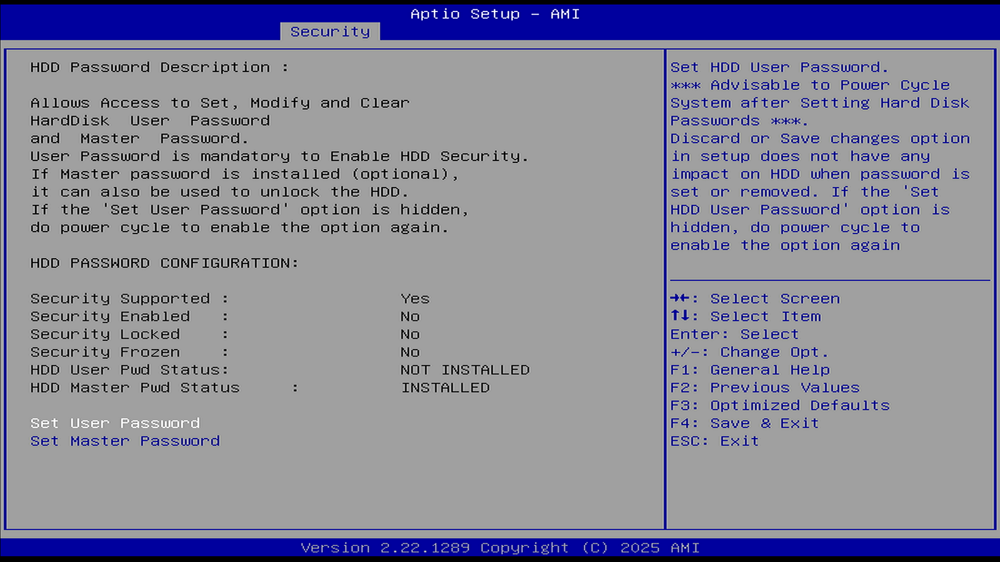

# HDD Security Configuration（硬盘安全配置）

本选项用于配置硬盘的安全保护功能，包括设置硬盘密码等。

此选项仅在检测到已连接硬盘时才会显示。此选项列出所有已连接的硬盘清单，并可针对选择的硬盘设定密码。若设置了 HDD 密码，启动设备或进入 BIOS 设置时，系统会要求输入 HDD 密码。只有在正确的密码输入后，硬盘才会解锁，允许设备正常启动或访问存储在硬盘上的数据。

注意：此硬盘锁会将密码直接写入硬盘的固件存储区域。即使将硬盘物理拆卸并连接到另一台计算机上，该硬盘也无法被正常识别与访问。

该功能适用于机械硬盘（HDD）和固态硬盘（SSD）两种存储介质，图中所示为固态硬盘。

HDD 密码说明：

可设置、修改和清除硬盘的用户密码和主密码。

用户密码是启用硬盘安全功能的前提条件。

如果已设置主密码（可选），也可用其解锁硬盘。

| 项目 | 状态 |
| ---- | ---- |
| 支持安全功能（Security Supported） | 是（Yes） |
| 安全功能启用（Security Enabled） | 否（No） |
| 安全锁定（Security Locked） | 否（No） |
| 安全冻结（Security Frozen） | 否（No） |
| 用户密码状态（HDD User Pwd Status） | 未安装（NOT INSTALLED） |
| 主密码状态（HDD Master Pwd Status） | 已安装（INSTALLED） |

设置硬盘密码后，建议重启系统以确保设置生效。

在 BIOS 中选择“放弃更改”或“保存更改”不会影响已经设置或清除的硬盘密码。

如果“设置用户密码”（Set User Password）选项被隐藏，请重启系统以重新启用该选项。

若要清除硬盘密码，只需将硬盘主密码的新密码设置为空（在输入密码的地方直接回车）。
