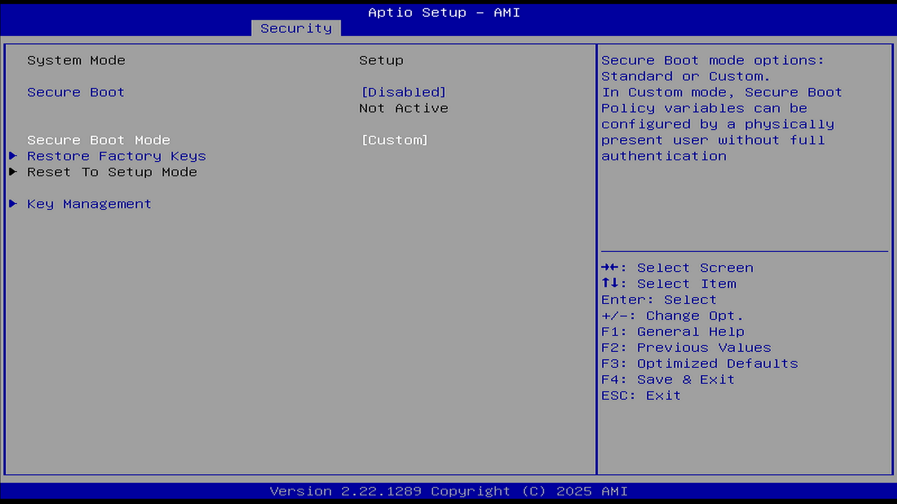
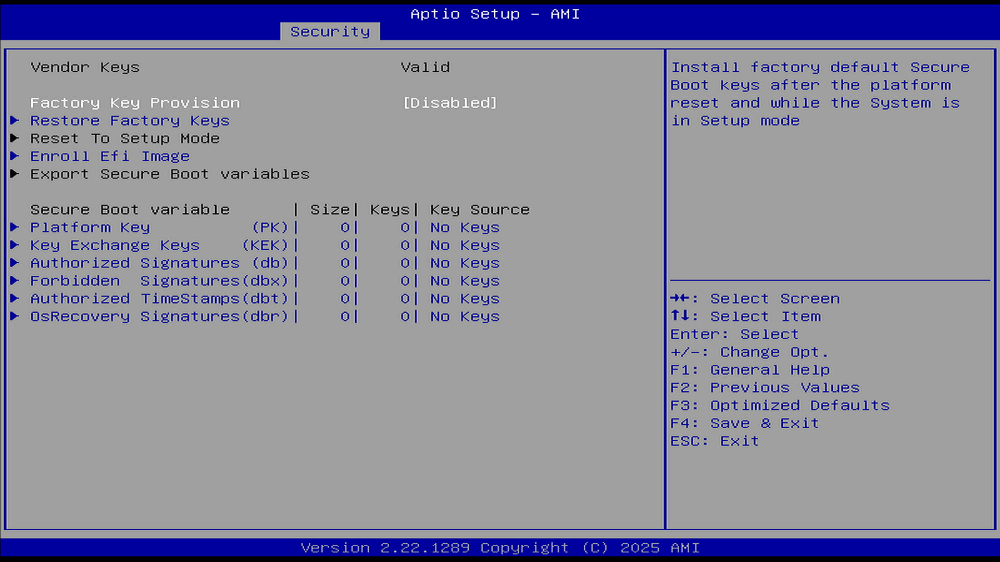

# Secure Boot（安全启动）

本小节用于配置安全启动参数。安全启动共有 4 种模式：Setup Mode、User Mode、Audit Mode 和 Deployed Mode。系统处于用户模式（User Mode）时，才能启用安全启动功能。

## Secure Boot（安全启动）

本选项用于启用或禁用安全启动功能。

选项：

Enabled（启用）

Disabled（禁用）

说明：

对于部分非 Windows 操作系统（如 FreeBSD 等），通常需要关闭此项才能被引导。不过，许多主流 Linux 发行版（如 Ubuntu、Fedora、Debian 等）已通过 Microsoft UEFI CA 签名的 shim 引导器支持安全启动，无需关闭即可正常引导。参见：Ubuntu 文档. UEFI Secure Boot[EB/OL]. [2026-04-17]. <https://documentation.ubuntu.com/security/docs/security-features/platform-protections/secure-boot/>。

当启用此选项、平台密钥（Platform Key，PK）已注册且系统处于用户模式时，安全启动功能将处于激活状态。更改模式需要重启。平台密钥（Platform Key，PK）用于在平台所有者与平台固件之间建立信任关系，平台所有者会将密钥的一部分注册到平台固件中。

当未注册 PK 时，安全启动在 Setup Mode 模式下运行，在修改 PK、KEK、db 和 dbx 变量时 BIOS 无需认证，此时可通过写入 PK、KEK、db 和 dbx 变量来配置安全启动策略。BIOS 可工作在 Setup Mode 和 Audit Mode 模式，且从 Setup Mode 可以直接切换为 Audit Mode。

当注册了 PK 后，且 BIOS 在 User Mode 模式下运行时，User Mode 模式要求所有可执行文件在运行之前都要经过认证。此时 BIOS 可工作在 User Mode 和 Deployed Mode 模式下，且从 User Mode 模式可以直接修改为 Deployed Mode。

Audit Mode 是 Setup Mode 的一种延伸，Deployed Mode 是 User Mode 的一种延伸。Audit Mode 和 User Mode 都可以直接转换到 Deployed Mode，但 Deployed Mode 转换到其他安全模式需要删除 PK 或通过特定安全转换方法。

注意：如果安全启动默认处于启用状态且无法关闭，可能需要先设置 Administrator Password（管理员密码）或 User Password（用户密码）才能进行关闭；在关闭安全启动后，可以再取消密码设置。同样地，如果无法开启安全启动，也可能需要先设置 Administrator Password（管理员密码）或 User Password（用户密码）。

## Secure Boot Mode（安全启动模式）

本选项用于选择安全启动的工作模式。

选项：

Standard（标准）

Custom（自定义）

说明：

用于选择安全启动模式。

在自定义模式下，物理存在的用户可以在无需完全认证的情况下配置安全启动策略变量。在自定义模式下，可以灵活使用多种指令。在自定义模式下更新 PK、KEK 变量不需要原始 PK 签署，且更新 Image signature database（db/dbx）或 Authorized Timestamp Database（dbt）也不需要 PK 或 KEK 的签署。

标准模式：UEFI 规范中定义的默认模式。

## Restore Factory Keys（恢复出厂密钥）

本选项用于恢复安全启动的出厂密钥。

选项：

Yes（是）

No（否）

说明：

强制系统进入用户模式。安装出厂默认的安全启动密钥数据库。

## Reset To Setup Mode（重置为设置模式）

本选项用于将安全启动重置为设置模式。

选项：

Yes（是）

No（否）

说明：

从 NVRAM（非易失性随机存取存储器，BIOS/UEFI 固件设置通常存储在里面）中删除所有安全启动密钥数据库。

## Key management（密钥管理）

本小节用于管理安全启动相关密钥，包括查看、添加、删除、授权以及恢复出厂设置等操作。

### Factory Key Provision（预置出厂密钥）

本选项用于配置是否预置出厂密钥。

选项：

Enabled（启用）

Disabled（禁用）

说明：

在平台重启后且系统处于设置模式时，安装出厂默认的安全启动密钥。

### Restore Factory Keys（恢复出厂密钥）

本选项用于恢复安全启动的出厂密钥。

选项：

Yes（是）

No（否）

说明：

强制系统进入用户模式。安装出厂默认的安全启动密钥数据库。

### Reset To Setup Mode（重置为设置模式）

本选项用于将安全启动重置为设置模式。

选项：

Yes（是）

No（否）

说明：

从 NVRAM 中删除所有安全启动密钥数据库。

### Enroll Efi Image（注册 EFI 映像）

本选项用于注册可信任的 EFI 映像文件。通过该功能，可以将特定的 EFI 映像添加到信任列表中。

文件系统中的映像文件。

允许该映像在安全启动模式下运行。将 PE 映像的 SHA256 哈希值注册到授权签名数据库（db）中。

### Remove ‘UEFI CA’ from DB（从数据库中删除 UEFI CA）

本选项用于从授权数据库中删除 UEFI CA 证书。

对于已启用 Device Guard（微软提供的一种增强系统安全性的技术）的系统，授权签名数据库（db）中不应包含“Microsoft UEFI CA”证书。

### Restore DB defaults（恢复默认数据库）

本选项用于将授权签名数据库恢复到出厂默认值。

将授权签名数据库（db）变量恢复到出厂默认值。

### PK（平台密钥）

本选项用于管理平台密钥。

Set New Var：设置新变量

Append Key：追加密钥

注册出厂默认值或从文件加载证书：

1. 公钥证书格式包括：

 a）EFI_SIGNATURE_LIST
 b）EFI_CERT_X509（DER 编码）
 c）EFI_CERT_RSA2048（二进制）
 d）EFI_CERT_SHAxxx

2. 经过认证的 UEFI 变量

3. EFI PE/COFF 映像（SHA256），密钥来源：出厂、外部、混合

### Key Exchange Keys（密钥交换密钥）

本选项用于管理密钥交换密钥。密钥交换密钥用于建立平台与操作系统之间的信任关系。

其操作方式与平台密钥类似。

### Authorized Signatures（授权签名）

本选项用于管理授权签名。授权签名数据库用于存储可信任的签名证书。

其操作方式与平台密钥类似。

### Forbidden Signatures（禁止签名）

本选项用于管理禁止签名。禁止签名数据库用于存储不可信任的签名证书。

其操作方式与平台密钥类似。

### Authorized Timestamps（授权时间戳）

本选项用于管理授权时间戳。授权时间戳用于验证签名的时间有效性。

其操作方式与平台密钥类似。

### OS Recovery Signatures（操作系统恢复签名）

本选项用于管理操作系统恢复签名。
