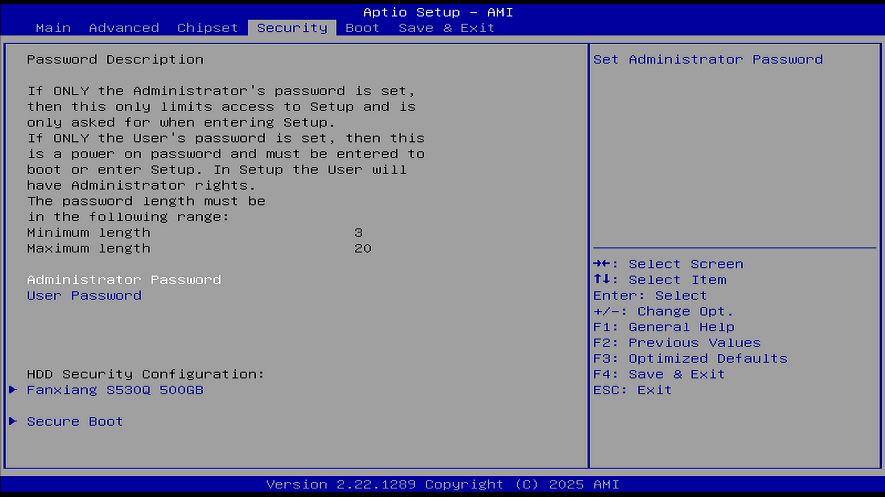

# Security 安全

本节介绍 BIOS 中与系统安全相关的设置选项，包括管理员密码、用户密码、安全启动、TPM（可信平台模块）等重要安全功能。

参见：华硕. 如何设置或解决忘记 BIOS 密码/UEFI 密码/开机密码[EB/OL]. [2026-03-26]. <https://www.asus.com.cn/support/faq/1046347/>。提供 BIOS/UEFI 密码设置与重置的详细指导。

参见：UEFI Forum. UEFI Specification[EB/OL]. [2026-04-17]. <https://uefi.org/specifications>. UEFI 规范是安全启动、密钥管理和平台安全机制的权威技术标准。

BIOS（基本输入输出系统，Basic Input/Output System）密码是一种固件层面的安全功能，用于阻止计算机在预启动阶段遭到未经授权的访问。BIOS 密码也常被称为系统设置密码、UEFI 密码、开机密码或安全密码。

当设备启动时，系统会提示用户输入 BIOS 密码，只有在输入正确密码后，才能访问和修改 BIOS 设置，并进入操作系统。这提供了一层额外的物理安全屏障，防止未经授权的人员更改硬件配置或篡改启动流程。

